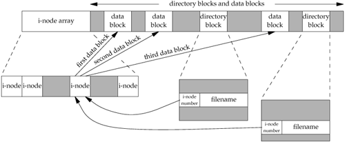
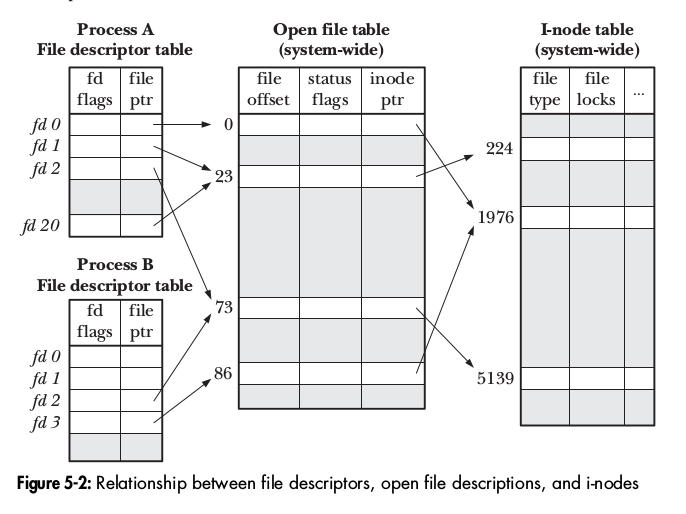
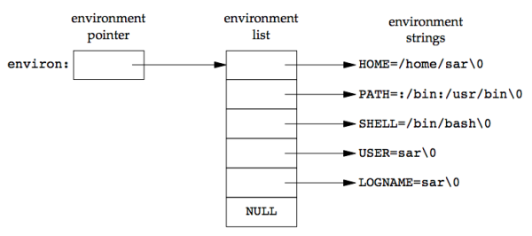
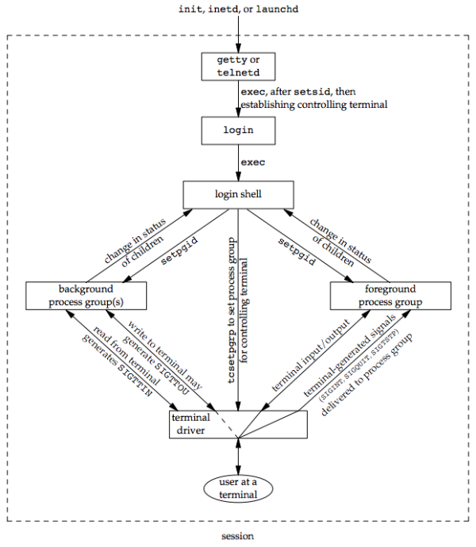

# Prep random questions


- why `buffer_head` and `dentry` are on top of the output of slabtop? this represents highly cached memory usually due to log files.

- `sudo ss -m --info` will provide you memory consumption of the socket.
- TLB usage here the **P** is divided in x86 architecture into multiple levels of PGD (page global dir), PUD (page upper dir), PMD (page middle dir) and lowest leve in PTE. This **PTE** is mapped to **Frame number** in TLB, if it is missed then it have to crawl through entire directory structure.  TLB flushing is initiated by OS 


- TLB flushing can be avoided by reducing size of the page table (especially PGD) entries by using huge pages.

- /proc/<PID>/numa_maps will provide you output like following which provides summary of which page mapped on which numa node.

  ```
  f9a58021000 default
  7f9a5c006000 default anon=632 dirty=632 N0=419 N1=213 kernelpagesize_kB=4
  7f9a5c286000 default
  7f9a5c287000 default anon=65 dirty=65 N0=46 N1=19 kernelpagesize_kB=4
  7f9a5cac7000 default
  7f9a5cac8000 default anon=130 dirty=130 N0=100 N1=30 kernelpagesize_kB=4
  7f9a5d348000 default
  7f9a5d349000 default anon=2 dirty=2 N0=2 kernelpagesize_kB=4
  7f9a5db49000 default
  7f9a5db4a000 default anon=2 dirty=2 N0=2 kernelpagesize_kB=4
  7f9a5e34a000 default
  7f9a5e34b000 default anon=2 dirty=2 N0=1 N1=1 kernelpagesize_kB=4
  7f9a5eb4b000 default
  7f9a5eb4c000 default anon=2 dirty=2 N1=2 kernelpagesize_kB=4
  7f9a5f34c000 default
  7f9a5f34d000 default anon=789 dirty=789 N0=481 N1=308 kernelpagesize_kB=4
  7f9a61e5e000 default
  7f9a71fde000 default anon=25 dirty=25 N0=19 N1=6 kernelpagesize_kB=4
  7f9a71ff7000 default
  7f9a83e8e000 default anon=4 dirty=4 N0=1 N1=3 kernelpagesize_kB=4
  7f9a83e92000 default
  7f9a86264000 default anon=1 dirty=1 N0=1 kernelpagesize_kB=4
  7f9a86265000 default
  7f9a8665e000 default file=/lib/x86_64-linux-gnu/libc-2.23.so mapped=242 mapmax=76 N0=242 kernelpagesize_kB=4
  7f9a8681e000 default file=/lib/x86_64-linux-gnu/libc-2.23.so
  7f9a86a1e000 default file=/lib/x86_64-linux-gnu/libc-2.23.so anon=4 dirty=4 N0=4 kernelpagesize_kB=4
  7f9a86a22000 default file=/lib/x86_64-linux-gnu/libc-2.23.so anon=2 dirty=2 N0=2 kernelpagesize_kB=4
  7f9a86a24000 default anon=3 dirty=3 N0=3 kernelpagesize_kB=4
  7f9a86a28000 default file=/lib/x86_64-linux-gnu/libpthread-2.23.so mapped=24 mapmax=61 N0=24 kernelpagesize_kB=4
  7f9a86a40000 default file=/lib/x86_64-linux-gnu/libpthread-2.23.so
  7f9a86c3f000 default file=/lib/x86_64-linux-gnu/libpthread-2.23.so anon=1 dirty=1 N0=1 kernelpagesize_kB=4
  7f9a86c40000 default file=/lib/x86_64-linux-gnu/libpthread-2.23.so anon=1 dirty=1 N0=1 kernelpagesize_kB=4
  7f9a86c41000 default anon=1 dirty=1 N0=1 kernelpagesize_kB=4
  7f9a86c45000 default file=/lib/x86_64-linux-gnu/ld-2.23.so mapped=38 mapmax=74 N0=38 kernelpagesize_kB=4
  7f9a86c6c000 default anon=144 dirty=144 N0=82 N1=62 kernelpagesize_kB=4
  7f9a86cfc000 default
  7f9a86d7c000 default anon=1 dirty=1 N0=1 kernelpagesize_kB=4
  ```

  - Command to know the state of memory 

    - `sar -R`  will give you idea of rate at which cache pages and free pages are addressed
    - `sar -r ALL`   will give you all the information about regualr memory statstics like active/inactive slab/annon/stack pages. 
    - `sar -S` will give you swap related activities. one of the interesting metrics `kbswpcad` which indicates amount of pages which are both in cache and it swap.
    - `sar -B` will give you infromation on state of page daemon activity 
      - pgscank/s - Kswapd scan which only happens if free list shrinks to certain level
      - pgscand/s  - blocking application thread to allocate required memory 
      - pgsteal/s - stealing page from the page cache itself as free memory is not availble 
      - pgpgin/s and pgpgout/s - number pages bround in the memory from the disk and pushed out to the disk
    - sar -B and sar -S shows how paging is different that swapping.

  - Vmstat with `-s` option can give you quick understand of the state of system.

  - ```
    pgscan_kswapd_*, pgsteal_kswapd_*
    
    These report respectively the number of pages scanned and reclaimed by kswapd since the system started. The ratio between these values can be interpreted as the reclaim efficiency with a low efficiency implying that the system is struggling to reclaim memory and may be thrashing. Light activity here is generally not something to be concerned with.
    
    pgscan_direct_*, pgsteal_direct_* (proactive reclaimation)
    These report respectively the number of pages scanned and reclaimed by an application directly. This is correlated with increases in the allocstall counter. This is more serious than kswapd activity as these events indicate that processes are stalling. Heavy activity here combined with kswapd and high rates of pgpgin, pgpout and/or high rates of pswapin or pswpout are signs that a system is thrashing heavily.
    
    More detailed information can be obtained using tracepoints.
    ```

  - VM's commited memory is something which process thinks it has for its disposal though it is not physically getting used. 

  - Debug DNS with ebpf? https://blog.cloudflare.com/revenge-listening-sockets/

  - Lmbench various micro benchmarking

  - Vsyscall or fast syscalls do not appear in `strace` output.
  
  - Where can I get sourcode for glibc 
  
    ```
    git clone git://sourceware.org/git/glibc.git
    ```
  
  - Generate core dump by setting up `ulimit -c unlimited` before crashing application. You can generate core file with `kill -s SIGSEGV $$`. Core file is nothing but the memory map of all instructions which get executed. 
  
  - Use Core file to analyze the dump using gdb , reference links [gdb example](https://gist.github.com/jarun/ea47cc31f1b482d5586138472139d090) and [debugging containers](https://sysdig.com/blog/troubleshooting-containers/). More [examples](https://www.dedoimedo.com/computers/gdb.html)
  
  - `debug.exception-trace` sysctl setting enables segfault messages.
  
  - Various legacy vsyscall execution mechanism , boot-time or compile-time params
  
    - CONFIG_LEGACY_VSYSCALL_NATIVE. - dangerous one - the vsyscall page contains native machine code that just calls the respective time()/getcpu()/… system calls and can be directly executed from a process.
    - CONFIG_LEGACY_VSYSCALL_EMULATE - generates page fault to move to kernel space - which will execute the page fault handler and then emulate the system call on behalf of the process, rather than letting it execute native machine code from the *vsyscall* page itself. 
    - CONFIG_LEGACY_VSYSCALL_NONE - calling process is sent a *SIGSEGV* signal
  
- Pipes 
  - They are the connectors where output of a process passes through kernel space buffer and fed into another process.
  - pipe buffer size `/proc/sys/fs/pipe-max-size`
  
- [Binary and Hex basic page](https://www.bottomupcs.com/chapter01.xhtml)
  
- [Numbers](https://www.bottomupcs.com/types.xhtml)
  
  - `char`  8bit (1 byte), `int` short 16bit (2 bytes), `int` long 32bit (4 bytes), int long long 64bit (8 bytes)
  - one's complement and two's complement.
  - In scientific notation the value `123.45` might commonly be represented as `1.2345x102`. We call `1.2345` the *mantissa* or *significand*, `10` is the *radix* and `2` is the *exponent*.
  
- CPU 
  - CPU loads data from the memory to registers and then does computation on those stored data. 
  
  - CPU keeps a track of next instruction and based on guesswork it modifies the pointer to next instruction significanly. This calls branching.
  
  - Executing a single instruction consists of a particular cycle of events
    - Fetch : get the instruction from memory into the processor.
    - Decode : internally decode what it has to do (in this case add).
    - Execute : take the values from the registers, actually add them together
    - Store : store the result back into another register. You might also see the term retiring the instruction.
    
  - Inside CPUure 3.2. Inside the CPU
  
    
  - To occupy all the above CPU components to raise efficiency, it uses pipelining. Sometimes pipeline can get flushed if branch predication fails. This is parallelized execution of various blocks called superscalar architecture.
  - Sorting of the data reduces branch predictions.
  - RISC has single instruction doing simple things vs CISC has single instruction doing multiple things. RISC compiler who generates code need to be smarter at the same time chip design for RISC becomes much simpler.


- Memory
The CPU can only directly fetch instructions and data from cache memory, located directly on the processor chip. Cache memory must be loaded in from the main system memory.

The reason caches are effective is because computer code generally exhibits two forms of locality
- Spatial locality suggests that data within blocks is likely to be accessed together.
- Temporal locality suggests that data that was used recently will likely be used again shortly.

**Cache replacement strategy** 


- Direct - only one place to place memory block, this forces other block in the same slot to be replaced.
- 4 - Way set associative - 4 possible places for given memory block, whichever is free can be utilized without eviction.
- Fully associative - put block anywhere, this might need some LRU managment.


- Type of files 
  - Regualr file
  - Directory file
  - Block Speical file
  - Character file 
  - FIFO
  - Socket
  - Symbolic link
  - With new posix standard following are represented as files
    - Message queues
    - Semaphore 
    - Shared memory object
- User ID of the process - it has real user id , saved user id and effective user id. This is a provision for working with set guid.
- Dir `+x` bit allows to `cd` in the directory. Dir `+r` will give you permission to read dir with `ls`. `+w` will allow you to create a file.
- user id of the file will be effective user ID of the process and group ID would be the same as process unless directory setGID bit is set.
- `umask` invert of the mask.
- `ls` command shows modification time in the output.
- `read` returns `0` for any holed area in the file.
- Files 
  
- Dirs
  

- Hard links to dir will cause loops

- Following symlink is an atomic operation - that is the reason we used it in our deployment mechanism. How it can be used for deployments? https://temochka.com/blog/posts/2017/02/17/atomic-symlinks.html

- each entry in dir has a fix size so it grows baed of number of entries in it.

- Stream IO with multiple byte read for each charater which is getting used for Unicodes.

- Buffering for file descritors 

  - Files are fully buffered 
  - STDIN and STDOUT are line buffered  (only when connected to tty device)
  - STDERR is unbuffered

- | **Storage Class**   | **Declaration**         | **Storage**   | **Default Initial Value** | **Scope**                                                    | **Lifetime**              |
  | ------------------- | ----------------------- | ------------- | ------------------------- | ------------------------------------------------------------ | ------------------------- |
  | **auto**            | Inside a function/block | Memory        | Unpredictable             | Within the function/block                                    | Within the function/block |
  | **register**        | Inside a function/block | CPU Registers | Garbage                   | Within the function/block                                    | Within the function/block |
  | **extern**          | Outside all functions   | Memory        | Zero                      | Entire the file and other files where the variable is declared as extern | program runtime           |
  | **Static (local)**  | Inside a function/block | Memory        | Zero                      | Within the function/block                                    | program runtime           |
  | **Static (global)** | Outside all functions   | Memory        | Zero                      | Global                                                       | program runtime           |

- Variables which are 

  - global and static are stored in the data segment. 
  - And constants are stored in the code segment.
  - Variables which are not initialized but statically declared as a part dynamically loaded libraries are stored in `bss` area. 

- `fsync()` systemcall to flush everything from memory to disk. `fflush` does something similar for streaming IO.

- File table entry 

  - stores the file offset. 
  - Each file table entry gets created upon creation of new File Descriptor. 
  - `fork()` and `dup()` will point to same file table entry through different file descriptors.

  

- [Standard IO library functions](https://en.wikipedia.org/wiki/C_file_input/output) which abstract underlying POSIX related details of the OS.

- user `nobody` - special user who can access files which are readable or writable for the world.

- `utmp` gives you existing user logins on the terminal, `wtmp` will provide historic information. `btmp` keeps track of failed logins.

- Environment variable is and pointer to the pointers

  

`NULL` pointer below is to extend that variable list. Initial pointer is stored on top of the stack.


- `setjmp` and `longjmp` to jump between functions. They clean all stack frames between functions while jumping. Effect of such jumps on various type of variables also depends on gcc optimization flags.

- `getrlimit` and `setrlimit` syscalls used to setup ulimit while spawning.  The `prlimit` allows to set and read the resource limits of a process specified by PID.  `struct rlimit` gets used to track various [limits](https://0xax.gitbooks.io/linux-insides/content/SysCall/linux-syscall-6.html). 

- `vfork()` gurantees that child will run before parent. This has some security issues.

- `exec()` file reads first line for `#!` and accordingly spawn the interprater of the script.

- `SIGCHLD` gets delivered to parent which get caught by `wait` functions to avoid zombies.

- Hash  `#`  has to be universal line commenter for every interprater language because the way `exec()` calls  processes shebang.

- Shell session 
  

- Signals 
  - they get generated 
  - they get delivered to the process
  - they stay pending till they get caught, most of them defaulted to be ignored.
  - process catches signal with the setup handlers.
  - signals can be blocked by process and some of the real time operating system they can be queued.
  
- looks like SIGNAL interrupted system calls never get restarted in linux by default.

- `/proc/stat` used by `vmstat` or `dstat`.

- Interrupts - why we have more than 255 interrupts on x86 architecture? That is because of IO-APIC , read this 

- debug symbol table maps compiled binary instructions to corrosponding variable functions or lines in the source code.  

- [TCP BBR experiment](https://medium.com/@atoonk/tcp-bbr-exploring-tcp-congestion-control-84c9c11dc3a9#:~:text=Bottleneck%20Bandwidth%20and%20Round%2Dtrip,developed%20at%20Google%20in%202016.&text=BBR%20tackles%20this%20with%20a,to%20determine%20the%20sending%20rate.) by creating delay and packet loss

  ```
  # introduce latency 
  tc qdisc replace dev enp0s20f0 root netem latency 70ms
  # introduce latency and pkt drop
  tc qdisc replace dev enp0s20f0 root netem loss 1.5% latency 70ms
  
  # start BBR
  sysctl -w net.ipv4.tcp_congestion_control=bbr
  
  
  # socket stats
  ss -tni
  ```

  

