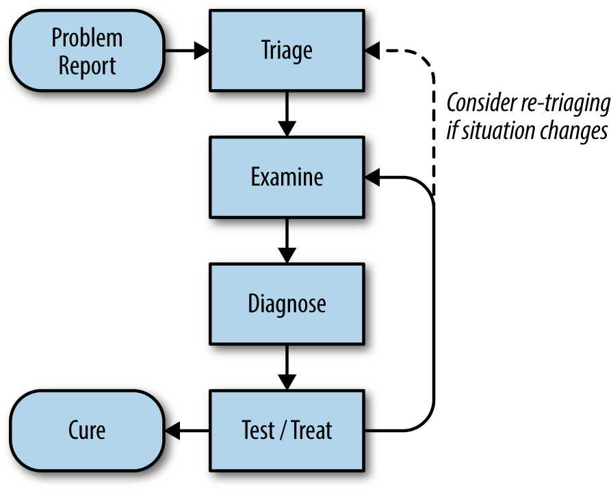

# Site Reliability Engineering

Who is SRE? Software development engineers managing operations.

Devops and SRE falls into the same category.

An SRE team is responsible for the 

#### availability, 

- Time based availability 

- Aggregate availability 
  

latency,

performance, 

efficiency, 

change management, 

monitoring, 

emergency response, 

and capacity planning of their service(s). 

Embracing risk

- Risk tolerance 
- Error budget 

- SLI - service level indicator 

- SLO - service level objective  - a target value or range of values for a service level that is measured by an SLI.

 lower bound ≤ SLI ≤ upper bound. 

- , SLAs are service level *agreements*: an explicit or implicit contract with your users that includes consequences of meeting (or missing) the SLOs they contain. 

possible indicators

- User-facing serving systems, such as the Shakespeare search frontends, generally care about availability, latency, and throughput
- Storage systems often emphasize latency, availability, and durability.
- Big data systems, such as data processing pipelines, tend to care about throughput and end-to-end latency.
- All systems should care about correctness: was the right answer returned, the right data retrieved, the right analysis done?

have few SLOs, perfection can wait, avoid absolutes.

Elimination of Toil 

- Toil is ok but it stangnats the progress and should be automated.
- O(n) growth 

Spotting toil 

- through process runbooks
- through oncall pages 

Monitoring 

- Whitebox monitoring  - internal service stats , logs ,  
- Blackbox monitoring - User side metrics 

Alert 

- page should be above noval problem 
- they should be actionable without know a root cause 

RCA - outages 

Long terms objectives

- trend analysis 
- retrospective and debugging

Golden metrics

- Latency 
- Traffic 
- Errors
- Saturation ( function of above three )

Performance and instrumentation is tail end of the work when comes to optimization of your system.

Automation 

- what to automate? how to identify 

Release engineering 

## Practices 

Service reliability 

### Monitoring

Prometheus - higher level language to manipulate monitoring collected data.

#### data collection

Hirerachical metrics collection in monitoring system.

Always try to collect readings in the counter form instead of guage form (spot value reading ) so it wont loose its meaning 

#### alerting practices

- Alerts can flap and you have to alert on the rate at which errors are happening. 

- Some how account for a time between two subsequent alerts
- higher level abstraction by labeling alerts and then alert according to occurance of alert labels

#### Blackbox monitoring 

User view of the product

Configuration management and genericness in it.

### Being On-call

##### uptime 

- 5.26 minutes 99.999%. / year
- 52.6 minutes 99.99. / year

Percent of time spent on oncall duties by the engineer.  (25% is a standard)

Environment for oncall should be safe

- Clear escalation paths
- Well-defined incident-management procedures
- A blameless postmortem culture 

Avoid operational overload 

- number of daily tickets < 5, paging events per shift < 2
- Paging alerts should be aligned with the symptoms that threaten a service’s SLOs. All paging alerts should also be actionable.
- avoid alert fanout 
- "giving back the pager" practice

Beware of operational Underload - Disaster recovery training

### Troubleshooting 

- Triage 
  - figure out severity
  - make system work under this circumstance - stop the bleeding 
  - possible responsible teams
- Examine 
  - look at the monitoring data 
  - log data
- Diagnose 
  - Build theory around problem  - what , where and why - queustion 
  - simplify and reduce 
  - what was touched last
- Test and treat 
  - Create solutions based on diagnostics 
  - test those solutions 
  - Value of negative results - how to not make a lightbulb knowledge is useful , publish collected data for understanding tried solutions
- Cure
  - release based solution 
  - reproducing that problem 

### Emergency Response 

- Test induced emergency 
- Change induced emrgency 
  - application change
  - user beahviour change 
- Process induced emergency 

- Keep outage history and create knowledge base 
- Ask bigger questions 
- do proavtive testing

### Incident management 

**Prioritize.**Stop the bleeding, restore service, and preserve the evidence for root-causing.

**Prepare.**Develop and document your incident management procedures in advance, in consultation with incident participants.

**Trust.**Give full autonomy within the assigned role to all incident participants.

**Introspect.**Pay attention to your emotional state while responding to an incident. If you start to feel panicky or overwhelmed, solicit more support.

**Consider alternatives.**Periodically consider your options and re-evaluate whether it still makes sense to continue what you’re doing or whether you should be taking another tack in incident response.

**Practice.**Use the process routinely so it becomes second nature.

**Change it around.**Were you incident commander last time? Take on a different role this time. Encourage every team member to acquire familiarity with each role.

### Software Engineering in SRE

- embedded SRE 
  - design moniorting or SLIs which signnals health of applicaiton 
  - health check endpoints
- Learn breadth first and depth - partner with TPM, PM and application developers

### Load balancing at the Frontend

Product requirement example

- search result - latency 
- video upload - throuhput and realiblity 

​	

