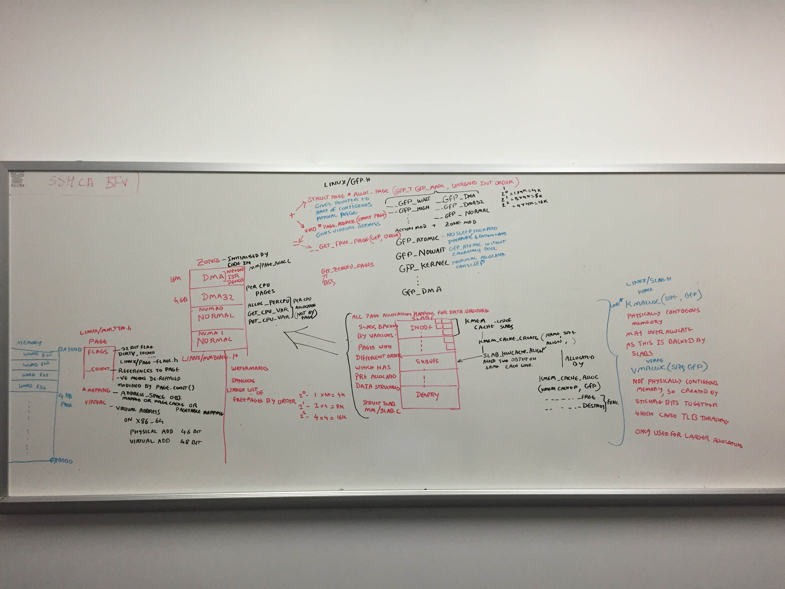
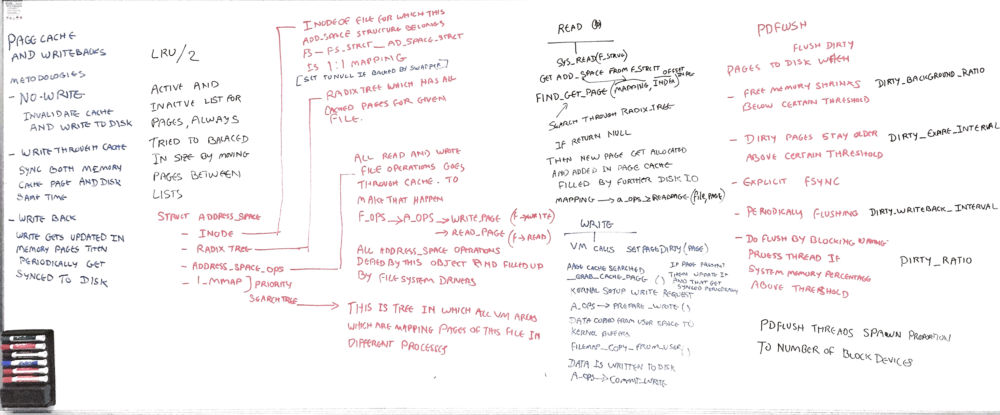

# Single systems page revision


## CPU 

- `-m` provides CPU package related information, many of them do not work as they are very platform dependent.
- `-P <ALL/CPU number>` will provide standard places for CPU utilization.
- `-u <ALL/CPU number>` will provide advance view of CPU utilization like 
  - `irq` and `softirq` handling 
  - `steal` is involuntery wait for virtual CPU availability


## Scheduler

Scheduling is another subsystem which reflects health of the system

`-q` is complimenty to what we get through load average, it also provides number of tasks in the tasklist in  `plist-sz` column. It also shows count of runnable and blocked processes. This also provides load avergaes numbers which is even [complicated in linux](http://www.brendangregg.com/blog/2017-08-08/linux-load-averages.html) where it considers `TASK_UNINTERRUPTIBLE` also in under consideration which include uninterruptable lock and disk io waiting along with CPU resources. That means load average more than CPU counts in Linux might include threads which are blocked on the non-CPU type of resources. It is very confusing in Linux to decide on load average.


Because linux load averages can includes more than CPU, to know specific CPU demands, you can run 

- `mpstat`  for per CPU utilization 
- `pidstat -p <ALL/PID> 1` for per process CPU utilization 
- `/proc/PID/schedstats` for per thread CPU timings where you will find 3 numbers 
  - time spent on CPU 
  - time spent waiting in a runqueue 
  - count of time slices run on the CPU
- `/proc/schedstat` CPU run queue latency 
- `vmstat 1` can provide you run queue length 


You can run a full debug of each processes allocated time in scheduling with folllowing one liner 

``` 
$ awk 'NF > 7 { if ($1 == "task") { if (h == 0) { print; h=1 } } else { print } }' /proc/sched_debug

 S           task   PID         tree-key  switches  prio     wait-time             sum-exec        sum-sleep
 I         rcu_gp     3        21.995531         2   100         0.000000         0.002975         0.000000 0 0 /
 I     rcu_par_gp     4        23.496139         2   100         0.000000         0.001857         0.000000 0 0 /
 I   kworker/0:0H     6      1187.772800         6   100         0.000000         0.036662         0.000000 0 0 /
 I   mm_percpu_wq     9        29.066425         2   100         0.000000         0.002497         0.000000 0 0 /
 S    ksoftirqd/0    10    128714.543436      4792   120         0.000000        33.758851         0.000000 0 0 /
 S    migration/0    12         0.000000    198777     0         0.000000      1763.040884         0.000000 0 0 /
 S        cpuhp/0    13      3586.151423         8   120         0.000000         0.193625         0.000000 0 0 /
 S     khugepaged    60    128714.543436     58304   139         0.000000       629.884360         0.000000 0 0 /
 I     scsi_tmf_1   178      1115.471018         2   100         0.000000         0.025049         0.000000 0 0 /
 I   kworker/0:1H   223    128714.543436     38621   100         0.000000       100.824080         0.000000 0 0 /
 I         cryptd   326      1845.269827         2   100         0.000000         0.022569         0.000000 0 0 /
 S     multipathd   416         0.000000     25929     0         0.000000       467.263788         0.000000 0 0 /system.slice/multipathd.service
 S     multipathd   419         0.000000         6     0         0.000000         0.183746         0.000000 0 0 /system.slice/multipathd.service
 S          loop3   428    127770.543906       520   100         0.000000         8.003048         0.000000 0 0 /
```

Rough diagramatic representation on how kernel space proc scheduling happens 


## Memory 

- `sar -B`
```
09:35:01 AM  pgpgin/s pgpgout/s   fault/s  majflt/s  pgfree/s pgscank/s pgscand/s pgsteal/s    %vmeff
09:45:01 AM    550.82    629.41  67380.81      0.00 182789.00      0.00      0.00      0.00      0.00
09:55:01 AM   3924.61   1557.42  67804.17      0.00 186321.15      0.00      0.00      0.00      0.00
10:05:01 AM    577.42    659.43  68622.82      0.00 187206.07      0.00      0.00      0.00      0.00
10:15:01 AM    590.52    663.89  70290.50      0.00 190128.47      0.00      0.00      0.00      0.00
10:25:01 AM    608.76    675.59  70878.25      0.00 193471.10      0.00      0.00      0.00      0.00
10:35:01 AM    615.69    702.96  71677.72      0.00 195602.52      0.00      0.00      0.00      0.00
10:45:01 AM    625.39    698.00  72230.19      0.00 199102.83      0.00      0.00      0.00      0.00
10:55:01 AM   4388.83   1865.92  73875.07      0.00 204701.71      0.00      0.00      0.00      0.00
11:05:01 AM    648.40    869.32  75274.57      0.00 207472.02      0.00      0.00      0.00      0.00
11:15:01 AM    660.22    729.57  76614.26      0.00 211789.20      0.00      0.00      0.00      0.00
11:25:01 AM    671.43    742.83  77571.92      0.00 215410.96      0.00      0.00      0.00      0.00
11:35:01 AM    679.13    752.46  78134.20      0.00 217607.37      0.00      0.00      0.00      0.00
11:45:01 AM    698.52    760.63  78790.67      0.00 221150.22      0.00      0.00      0.00      0.00
11:55:01 AM   4816.39   1620.73  80107.70      0.02 228635.72      0.00      0.00     77.29      0.00 <<

```
Pgscank - Number of pages scanned by the kswapd daemon per second.

Pgscand - Number of pages scanned directly per second.

pgsteal/s - Number of pages the system has reclaimed from cache (pagecache and  swapcache)  per  second  to satisfy its memory demands.

- `sar -S`
```
09:35:01 AM kbswpfree kbswpused  %swpused  kbswpcad   %swpcad
09:45:01 AM   7968508     30976      0.39      1000      3.23
09:55:01 AM   7968508     30976      0.39      1000      3.23
10:05:01 AM   7968508     30976      0.39      1000      3.23
10:15:01 AM   7968508     30976      0.39      1000      3.23
10:25:01 AM   7968508     30976      0.39      1000      3.23
10:35:01 AM   7968508     30976      0.39      1000      3.23
10:45:01 AM   7968508     30976      0.39      1000      3.23
10:55:01 AM   7968508     30976      0.39      1000      3.23
11:05:01 AM   7968508     30976      0.39      1000      3.23
11:15:01 AM   7968508     30976      0.39      1000      3.23
11:25:01 AM   7968508     30976      0.39      1000      3.23
11:35:01 AM   7968508     30976      0.39      1000      3.23
11:45:01 AM   7968508     30976      0.39      1000      3.23
11:55:01 AM   7967996     31488      0.39      1484      4.71 <<
12:05:01 PM   7967996     31488      0.39      1484      4.71
12:15:01 PM   7967996     31488      0.39      1484      4.71
12:25:01 PM   7967996     31488      0.39      1484      4.71
12:35:01 PM   7968508     30976      0.39      1168      3.77
12:45:01 PM   7968508     30976      0.39      1168      3.77
12:55:01 PM   7968508     30976      0.39      1168      3.77
Average:      7968482     31002      0.39      1030      3.32

```
kbswpcad : Amount of cached swap memory in kilobytes.  This is  memory  that  once  was  swapped  out,  is swapped  back  in but still also is in the swap area (if memory is needed it doesn't need to be swapped out again because it is already in the swap area. This saves I/O).

- `sar -R`
```
09:15:01 AM   frmpg/s   bufpg/s   campg/s
09:25:01 AM   -550.64      0.00    134.69
09:35:01 AM   -252.31      0.00    139.26
09:45:01 AM   -374.95      0.00    137.65
09:55:01 AM    776.30      0.00   -745.74
10:05:01 AM   -416.63      0.00    147.68
10:15:01 AM   -403.32      0.00    146.84
10:25:01 AM   -322.58      0.00    150.67
10:35:01 AM   -294.70      0.00    155.98
10:45:01 AM   -215.79      0.00    158.61
10:55:01 AM    477.34      0.00   -832.49
11:05:01 AM   -554.04      0.00    161.00
11:15:01 AM   -619.24      0.00    163.25
11:25:01 AM    -14.84      0.00    169.01
11:35:01 AM   -504.22      0.00    167.76
11:45:01 AM   -308.36      0.00    170.76
11:55:01 AM   3350.31      0.00  -3270.30 <<
12:05:01 PM   -580.81      0.00    174.54
12:15:01 PM   -385.49      0.00    177.57
12:25:01 PM    -51.66      0.00    179.94
12:35:01 PM   -244.81      0.00    154.52
12:45:01 PM   -415.27      0.00    181.85
12:55:01 PM   1036.26      0.00   -939.86
01:05:01 PM   -489.08      0.00    184.65
Average:       -64.85      0.00    -34.59
```
frmpg/s : Number of memory pages freed by the system per second.  A negative value represents a number of pages allocated by the system.  Note that a page has a size of 4 kiB or 8 kiB according to  the machine architecture.

bufpg/s: Number  of  additional memory pages used as buffers by the system per second.  A negative value means fewer pages used as buffers by the system.

campg/s : Number of additional memory pages cached by the system per  second.   A  negative  value  means fewer pages in the cache.

- `sar -W`
```
09:15:01 AM  pswpin/s pswpout/s
09:25:01 AM      0.00      0.00
09:35:01 AM      0.00      0.00
09:45:01 AM      0.00      0.00
09:55:01 AM      0.00      0.00
10:05:01 AM      0.00      0.00
10:15:01 AM      0.00      0.00
10:25:01 AM      0.00      0.00
10:35:01 AM      0.00      0.00
10:45:01 AM      0.00      0.00
10:55:01 AM      0.00      0.00
11:05:01 AM      0.00      0.00
11:15:01 AM      0.00      0.00
11:25:01 AM      0.00      0.00
11:35:01 AM      0.00      0.00
11:45:01 AM      0.00      0.00
11:55:01 AM      0.00      0.29 <<
12:05:01 PM      0.00      0.00
12:15:01 PM      0.00      0.00
12:25:01 PM      0.00      0.00
12:35:01 PM      0.00      0.00
12:45:01 PM      0.00      0.00
12:55:01 PM      0.00      0.00
01:05:01 PM      0.00      0.00
Average:         0.00      0.00
```
- `sar -r ALL`
```
09:15:01 AM kbmemfree kbmemused  %memused kbbuffers  kbcached  kbcommit   %commit  kbactive   kbinact   kbdirty  kbanonpg    kbslab  kbkstack   kbpgtbl  kbvmused
09:25:01 AM  12980848  52948860     80.31      5028  25506636  55404888     74.94  25443020  24851140       696  24781428   1438048     41920    116556         0
09:35:01 AM  12375540  53554168     81.23      5028  25840720  55436396     74.99  25709504  25185144       936  25046760   1438996     41840    116516         0
09:45:01 AM  11476032  54453676     82.59      5028  26170940  55421904     74.97  26273440  25515320       928  25610804   1439836     42336    116368         0
09:55:01 AM  13340976  52588732     79.76      5028  24379400  55405352     74.94  26210576  23722160       632  25544528   1434700     42400    116428         0
10:05:01 AM  12341488  53588220     81.28      5028  24733668  55400144     74.94  26849828  24076312       748  26185380   1433380     44208    116660         0
10:15:01 AM  11374176  54555532     82.75      5028  25085852  55369476     74.90  27465732  24428416       696  26800264   1434352     42800    115828         0
10:25:01 AM  10600268  55329440     83.92      5028  25447332  55401024     74.94  27879084  24789888       636  27214508   1433976     44208    116512         0
10:35:01 AM   9892100  56037608     85.00      5028  25822152  55445960     75.00  28209968  25164628       988  27544864   1434712     44416    116596         0
10:45:01 AM   9374384  56555324     85.78      5028  26202684  55483632     75.05  28338792  25545156       444  27674112   1433956     46016    116632         0
10:55:01 AM  10519384  55410324     84.04      5028  24205768  55494164     75.06  29205224  23546032       376  28536956   1424864     46176    116100         0
11:05:01 AM   9190216  56739492     86.06      5028  24592024  55473336     75.04  30146252  23925604       120  29472972   1426408     46976    117032         0
11:15:01 AM   7702160  58227548     88.32      5028  24984312  55499684     75.07  31241992  24317828       760  30568908   1426864     46736    117196         0
11:25:01 AM   7666564  58263144     88.37      5028  25389756  55474756     75.04  30874372  24723192       120  30199476   1426480     46640    116800         0
11:35:01 AM   6456904  59472804     90.21      5028  25792236  55454720     75.01  31678256  25125648       380  31004688   1427440     48512    116768         0
11:45:01 AM   5717096  60212612     91.33      5028  26201924  55502972     75.08  32013288  25535280       760  31338532   1427564     47904    116584         0
11:55:01 AM  13768296  52161412     79.12      5028  18343012  55483588     75.05  31808480  17815356       196  31273288   1299288     48048    117116         0 <<
12:05:01 PM  12374888  53554820     81.23      5028  18761736  55503776     75.08  32782104  18234068       444  32246992   1297996     48336    117560         0
12:15:01 PM  11450564  54479144     82.63      5028  19187524  55492768     75.06  33275684  18657884       320  32738344   1300296     49408    116800         0
12:25:01 PM  11326420  54603288     82.82      5028  19619916  55498792     75.07  32958776  19090260      1044  32421592   1300900     49088    117288         0
12:35:01 PM  10739144  55190564     83.71      5028  19990592  55440936     74.99  33188996  19456100       184  32647356   1298904     49568    117060         0
12:45:01 PM   9742864  56186844     85.22      5028  20426880  55428044     74.97  33754140  19891436       232  33212244   1299496     50048    117620         0
12:55:01 PM  12229056  53700652     81.45      5028  18171976  55468396     75.03  33534152  17640368      1020  32995332   1282328     49312    117744         0
01:05:01 PM  11053784  54875924     83.23      5028  18615696  55498824     75.07  34263104  18081252       708  33721924   1281624     49920    118664         0
01:15:01 PM  10636404  55293304     83.87      5028  19068160  55459132     75.02  34225696  18533624       404  33683420   1281744     50864    118152         0
Average:     17934645  47995063     72.80      5028  24888771  55471470     75.03  21092870  24263861       563  20460698   1425706     38693    116688         0
```

KbSlab - slab data structure

kbstack - stack structure in kernel

Kbpgtbl - kernel page table size 

Kbnonpg - Amount of non-file backed pages in kilobytes mapped into userspace page tables. 

Above scenario in sar outputs was happening due watermark exhaustion, 


Here is a white boarding session where how linux kernel maps its physical pages to various data structures.


And here is mapping of VM process space to physical space


Linux memory page life cycle is defined in following diagram 


Above digram in certain extent explained in following white boarding session 



## Network
Before exploring each network protocols, make sure that you remember these basic OSI layers


Network connection handling is done by following system calls

- Create a socket to get fd 

  ```
  #include        <sys/types.h>
  #include        <sys/socket.h>
  
  int socket(int family, int type, int protocol);
  
  The family is one of
  	AF_UNIX		-- Unix internal protocols
  	AF_INET		-- Internet protocols
  	AF_NS		-- Xerox NS Protocols
  	AF_IMPLINK	-- IMP link layer
  The AF_ prefix stands for "address family." In the first project, we are going to use AF_INET.
  
  The socket type is one of the following:
  	SOCK_STREAM	stream socket
  	SOCK_DGRAM	datagram socket
  	SOCK_RAW	raw socket
  	SOCK_SEQPACKET	sequenced packet socket
  	SOCK_RDM	reliably delivered message socket (not implemented yet)
  ```

- Then Bind it to IP Port tuples defined in `sockaddr` structure 

  ```
  int bind(int sockfd, struct sockaddr *myaddr, int addrlen);
  ```

- Connet to other end of the server , this is a part of active open where other end is defined by `sockaddr` structure.

  ```
  int connect(int sockfd, struct sockaddr *servaddr, int addrlen);
  ```

- Or Listen as a server and allow others to connect 

  ```
  int listen(int sockfd, int backlog);
  ```

- If you are a server in listening state then you can accept the connection 

  ```
  int accept(int sockfd, struct sockaddr *peer, int *addrlen);
  ```

- Data transfer can be done with following 

  ```
  int send(int sockfd, char *buff, int nbytes, int flags);
  
  int sendto(int sockfd, char *buff, int nbytes, int flags, struct sockaddr *to, int addrlen);
  
  int recv(int sockfd, char *buff, int nbytes, int flags);
  
  int recvfrom(int sockfd, char *buff, int nbytes, int flags, struct sockaddr *from, int *addrlen);
  ```

- Final close on the socket 

  ```
  int close(int fd);
  ```

  

This section also combines notes from TCP/IP illustrated 


### DNS

- DNS port 53
- DNS query is either UDP or TCP based depedning on the response size.
- `.` in the end indicates that name is complete and nothing more need to be appended. It is max 255 chars availble in the FQDN and 63 max chars per label.
- DNS does various kind of caching which can be controlled with TTL, it can also do negative caching means caching of the unsuccessful FQDN resolution. Some of the local caching services like NSCD (nssswitch.conf) can be used to improve performance.

Here are two DNS query types


- There are flags in DNS query which indicates if recursion desired or recursion is availble.
- DNS has various type of text based compression to optimize the response size.
- `TC` bit in response is set to switch from UDP to TCP as response got trucated.
- Every DNS response has TTL value for caching purposes and you can see TTL decreasing between consecutive queries.
-  RRs - Resource Records Types - it is field in response of DNS query indicates category of information returned like A, NS, SOA, CNAME, PTR, MX ... etc.
- DNS was meant to be a database to fetch various type of information associated with query strings.
- IXFR and AXFR - Increamental and Full zone tranfer triggered by UDP based notification
- Reverse DNS entries are stored under special TLD `in-addr.arpa.`  These are PTR records
- `TXT`record was getting used to fetch extra infroamtion about subnets of the given domain to fight spam. Framework called SPF - Sender Policy Network.
- `SRV`  DNS records are the records which provides various services related infromation hosted under that domain. This was used by jabber at one point.
- Finally multicase DNS for auto discovery.


### DHCP

- DHCP is UDP/IP based protocol which helps to maintain IP address assignements are related configurations. 
- DHCP goes through following stages
  - DHCPDISCOVER or DHCPREQUEST sent from address `0.0.0.0` port `68` to the limited broadcast address `255.255.255.255 ` port `67` 
  - Above request get responses in the form of DHCPOFFER.
  - Client selects one of the offer and does DHCPREQUEST which get acknoledged by DHCPACK with delivery of IP and related configuration items.
- DHCP leases are something created after above offering which are stored on the disk. 


### TCP 
TCP in the nutshell is displayed in this crude whiteboarding 


- TCP connection establishment 
  - 3-way handshake SYN , ACK+SYN, ACK  and closing sequence FIN, ACK, FIN, ACK
  - These connection attempts has exponential backoff setup
  - Active open/close (Client initiated) , Passive open/close (Server initiated)
- ISN (initial sequence number) which is randomly generated for each connection and incremented every 4us to avoid any overlaps. This is only protection against forgery outside of TLS.


Here are various TCP options

- TCP header size is 20 bytes and IP header size is 20 bytes. MSS is maximum TCP payload size on the ethernet is 1460 bytes.
- TCP Selective ACK is in extension headers can ask for retrasmission of particualr lost segments.
- TCP window size gets scaled from 16bit to 32bit by using multipliers and few additional header fields.
- TCP timestamp options to detemine clock on the otherside

TCP does path MTU discovery based on ICMP reponse like "Destination Unreachable" (Fragmentation Required) message. 

Here is TCP state diagram 


TIME_WAIT state 

- 2MSL - Maximum segment lifetime , in linux defined by `net.ipv4.tcp_fin_timeout` arbiterily setup for  1min.
- TIME_WAIT state only happens in Active close when after sending of the last ACK to make sure there are not steal segments lurking around.
- This make sures last ACK reches to the passive end or it will resend the FIN.
- SO_REUSEADDR is using timestamp and seqence number combination to figure out steal segments.
- There is something called Quiet time after host crash/reboot which is set to MSL.


Incoming connections 

- `tcp_max_syn_backlog` keeps queue for SYN_RCVD connections 
- `net.core.somaxconn` keeps queue for 3-way handshake completed connections


TCP retrasmissions 

- Retrasmissions happens 
  - due to ACK timeout 
  - due to occurance of duplicate ACKs exceeding `dupthresh`, this is called fast retransmission.
-  This happens in exponential back off fashion
- Retransmission has two configuratble params 
  - R1 - `tcp_retries1`  this indicates number of retires before TCP will make to resend a segment before passing "negative advice" to IP layer to change routes.
  - R2 - `tcp_retries2` this indicates the point at which TCP should abandon the connection.
  - There are separate `syn` and `synack` retries settings.


TCP data flow and window management 

- over ssh each keystroke generates new TCP packet and `PSH` flag set on it to let other side know that buffer on sender side is empty.
- Delayed ACKs help to piggy back retrasmissions.
- Nagle avoids congestion due to tiny packets by creating a rule that small segments can not be sent until all outstanding data is acknowledged. It creates stop n wait behaviour.
- Nagle makes sender to wait one RTT before sending which increases overall time for completion but you can increase size of each packet.
- Delayed ACK and Nagle creates transmissions idle states because both sides are waiting other side to respond which eventually get removed due to delay ack time expiration. `TCP_NODELAY` disables Nagle.


Window size indicates how much data reciver is ready to accept from sender.

- Window size determined by reciever by looking at empty TCP recieve buffer.
- sometimes window size set to zero due to slow reciever to stop any more data send. There is time based window probe happens from sender side to know if window got opened or not.
- Window size field is offset relative to ACK number.
- Silly window syndrome where sender and reciever tried to reduce number of packets sent on the wire by controlling advertizement of window size until enough data get accumulated on both ends exceeding MSS or half of the TCP buffer. 
- TCP window sizes are auto tunned for the performance reason.
- URG bit for urgency , causes a confusion.


TCP Congestion control is divided into two phases, TCP Slow Start and Congestion Avoidance.

- SlowStart phase  where sender's TCP starts with 10 packets (initial congestion window `cwd`) and then scale up exponentially to receiver's advertize window size (`ssthresh`).  
- Congestion Avoidance starts after above criteria reached. After this point TCP window opens linearly and keeps a track of amount of unacknowledged data which is new `ssthresh`.
- Whenever TCP connection percieves the packet loss it will drop back to `ssthresh` to `max(flight size/2, 2*MSS)`. 
- Then congestion window `cwd` starts with `ssthresh + 10*MSS`  , increased by 1 for every good ACK.
- Once  `cwd` == `ssthresh` this single increment restriction has been removed and linear increase begins. 

All above is based on the simple TCP implementation and it gets more complicated with varoius TCP congestion avoidance algorithm.


- TCP BBR works with TCP pacing which is a technique which makes packet transmission on each socket less bursty by using qdiscs.
- TCP BBR is dependent on the RTT more than the packet loss.


### UDP


- UDP is packet based vs TCP which is continues stream protocol. Which makes application to be aware of packet boundries. It has no congestion or a flow control.

- UDP header is 8 bytes 

  - 2 bytes source port and destination port each
  - 2 bytes length 
  - 2 bytes checksum

- UDP checksum is calculated at sender's end with pseudo header which incorporates dst and src IP information. This gets checked at the recieive end.

- This pseudo header makes NAT more challenging where UDP packet modification is involved along with IP header modification.

-  UDP-lite is something which provides you flexibility of having checksum for the limited are of the packet header.

- IP determines the need for the fragmentation based on availbile information of the path towards destination. IP starts a timer on the arrival of first fragment to assemble packet within that time. 

- UDP application has to do PMTU discovery by using ICMP to avoid fragmentation. Maximum size of UDP is limited by max IPv4 packet size which is 16bit (65,535 bytes) (same for TCP).

- UDP packet do not have destination IP, so server receiving UDP packet need to fetch this infromation from the  IP layer. This is true for DNS server.

- With above logic, you can start multiple UDP services attached to the same port number using `SO_REUSEADDR` and still known to which service UDP datagram inteneded for looking at the IP layer infromation.

- Linux while opening IPv4:PORT socket it also provides you IPV6:PORT socket.


### ICMP

- ICMP protocol provides dignostics and control information for IP transport. ICMP is a part of extension headers in IPv6.

- IPv4 payload has no protection. Upper layer protocols has to manage their checksums.

- Some of the IPv4 messages 

  - Echo and Echo Reply (Ping Pong)
  - Destination Unreachable (this helps updating routes entry when last hop router fails to do ARP on the destination IP)
  - Time Exceeded (TTL exhausted)
  - Redirect (use alternate router)
  - Packet too big (used for Path MTU discovery)
  - Port not rechable (due to firewall blocking the port)

- Systems provide limited response to repeated ICMP query messages, it also uses bucket token to control flow of ICMP messages to avoid any abuse. `icmp_ratemask` and `icmp_ratelimit` are two linux sysctl params to control the flow.

- ICMP error packets contain fragment of original datagram which can be used to keep a track of path for which error has happened. 

- ICMP ECHO message also includes PID of sender process to identify Reply packet came for that particualr `ping`. This is because ICMP do not have any port like other protocols and it get responded by OS layer.     

- `connect()` has to be called on the socket for it to know incoming ICMP error messages for sent UDP packets.

- Traceroute got implemented based on ICMP message `TIme Exceeded` which gets generated when TTL count gets exhausted.

  
### IP


### Linux kernel packet traverse    


#### TLS

TLS performace [compare by Intel](https://software.intel.com/content/www/us/en/develop/articles/improving-openssl-performance.html)

Kernel level TLS performance aka [ktls](https://www.kernel.org/doc/html/latest/networking/tls-offload.html)


#### CPU

Turbo 

```
$ sudo cpupower frequency-info
analyzing CPU 0:
  driver: intel_pstate
  CPUs which run at the same hardware frequency: 0
  CPUs which need to have their frequency coordinated by software: 0
  maximum transition latency:  Cannot determine or is not supported.
  hardware limits: 1.20 GHz - 3.10 GHz
  available cpufreq governors: performance powersave
  current policy: frequency should be within 1.20 GHz and 3.10 GHz.
                  The governor "powersave" may decide which speed to use
                  within this range.
  current CPU frequency: Unable to call hardware
  current CPU frequency: 1.20 GHz (asserted by call to kernel)
  boost state support:
    Supported: yes
    Active: yes
```

Monitor CPU freq shift

```
turbostat --debug
```

Learn more about [Busy Polling](https://netdevconf.info/2.1/papers/BusyPollingNextGen.pdf) for network sockets.

Reduce effect of CPU power management on 

```shell
# kernel cmdline options


#https://gist.github.com/Brainiarc7/8dfd6bb189b8e6769bb5817421aec6d1
processor.max_cstates=1 
intel_idle.max_cstate=0

#https://www.kernel.org/doc/html/v5.0/admin-guide/pm/cpuidle.html
idle=poll 
```

CPU affinity and negative effect on `runqlat`


#### Memory 

`vm.zone_reclaim_mode`

NUMA commands 

```shell
numactl --interleave=all
numactl --hardware
numastat -n -c
numastat -m -c
```

FB platform [single NUMA](https://engineering.fb.com/data-center-engineering/facebook-s-new-front-end-server-design-delivers-on-performance-without-sucking-up-power/)


NUMA related kernel activities

```shell
perf stat -e sched:sched_stick_numa,sched:sched_move_numa,sched:sched_swap_numa,migrate:mm_migrate_pages,minor-faults -p PID
```


#### PCI

PCIE troubleshooting [101](https://intrepid.warped.com/~scotte/OldBlogEntries/web/index-5.html)

Disable PCIe power management 

```
# kernel commandline
pcie_aspm=off
```

source: https://en.wikipedia.org/wiki/PCI_Express#History_and_revisions

[PCIe tunig guide](https://community.mellanox.com/docs/DOC-2496)


#### NIC


##### BQL

This is accomplished by adding a layer which enables and disables queuing to the driver queue (qdiscs) based on calculating the minimum buffer size required to avoid starvation under the current system conditions.

This creates back pressure on the qdiscs.

 The BQL algorithm is self tuning so you probably don’t need to mess with this too much.  But you can tune it with values in dir `/sys/devices/pci0000:00/0000:00:14.0/net/eth0/queues/tx-0/byte_queue_limits`


##### Ethtool and softstat

To find pkt drop in device driver space

```shell
ethtool -S eth0 | egrep 'miss|over|drop|lost|fifo'
```

Look for CPU squeezes and collisions in OS softirq space with `/proc/net/softnet_stat` Tune time and packet budget.


Enable Coalescing on NIC to reduce interrupt volume 

```shell
ethtool -c eth0
```

Tune RSS and RFS (needs CPU affinity)


##### OS network stack

- Collect system-wide TCP metrics via `/proc/net/snmp` and `/proc/net/netstat`.
- Aggregate per-connection metrics obtained either from `ss -n --extended --info`, or from calling `getsockopt(TCP_INFO)`/`getsockopt(TCP_CC_INFO)` inside your webserver.
- [tcptrace](https://linux.die.net/man/1/tcptrace)(1)’es of sampled TCP flows.
- Analyze RUM metrics from the app/browser.


##### TCP tunes


- Pacing - Fair queing with qdisc 
- TSO - TCP Segment Offload - `net.ipv4.tcp_min_tso_segs`.
- TSQ - TCP small queues - `net.ipv4.tcp_limit_output_bytes`
-  Congension control - BBR (througput remains higher during packet loss )
-  [TLP](https://lwn.net/Articles/542642/) and [RACK](https://git.kernel.org/pub/scm/linux/kernel/git/torvalds/linux.git/commit/?id=eb9fae328faff9807a4ab5c1834b19f34dd155d4) to work on ACK processing and loss detection.


Some tcp optimization 

- `net.ipv4.tcp_notsent_lowat`   apprently useful for HTTP2
- `net.ipv4.tcp_tw_recycle=1` DO NOT USE - broken in kernel
- `net.ipv4.tcp_timestamps=0` DO NOT USE - timestamp allows various SACK and window scaling functionlity which we will loose.


As for sysctls that you should be using:

- `net.ipv4.tcp_slow_start_after_idle=0`—the main problem with slowstart after idle is that “idle” is defined as one RTO, which is too small.
- `net.ipv4.tcp_mtu_probing=1`—[useful if there are ICMP blackholes between you and your clients](https://blog.cloudflare.com/ip-fragmentation-is-broken/) (most likely there are).
- `net.ipv4.tcp_rmem`, `net.ipv4.tcp_wmem`—should be tuned to fit BDP, just don’t forget that [bigger isn’t always better](https://blog.cloudflare.com/the-story-of-one-latency-spike/).
- `echo 2 > /sys/module/tcp_cubic/parameters/hystart_detect`—if you are using fq+cubic, this [might help with tcp_cubic exiting the slow-start too early](https://groups.google.com/forum/#!topic/bbr-dev/g1tS1HUcymE).

It also worth noting that there is an RFC draft (though a bit inactive) from the author of curl, Daniel Stenberg, named [TCP Tuning for HTTP](https://github.com/bagder/I-D/blob/gh-pages/httpbis-tcp/draft.md), that tries to aggregate all system tunings that may be beneficial to HTTP in a single place.


#### Flamegraph and perf optimization 

Check performance of following library calls

-  Zlib - compression 

- Malloc

- PCRE

  ```
  funclatency /srv/nginx-bazel/sbin/nginx:ngx_http_regex_exec -u
  ```


#### TLS

Reference 

Most of the optimizations I’ll be mentioning are covered in the [High Performance Browser Networking](https://hpbn.co/)’s “ [Optimizing for TLS](https://hpbn.co/transport-layer-security-tls/#optimizing-for-tls)” section and [Making HTTPS Fast(er)](https://www.youtube.com/watch?v=iHxD-G0YjiU) talk at nginx.conf 2014. 

Tunings mentioned in this part will affect both performance and security of your web server, if unsure, please consult with [Mozilla’s Server Side TLS Guide](https://wiki.mozilla.org/Security/Server_Side_TLS) and/or your Security Team.

- TLS connection resume without handshake - TLS session tickets or TLS session cache
- OSCP stapling 
- TLS record size 


20KB of application payload will get divided into 1400 bytes of ~15 TCP segments which are more than TCP congestion window. 


[Overall reference post](https://dropbox.tech/infrastructure/optimizing-web-servers-for-high-throughput-and-low-latency)


# Troubleshooting

USE - Utilization - Saturation - Errors

| resource           | type        | metric                                                       |
| ------------------ | ----------- | ------------------------------------------------------------ |
| CPU                | utilization | CPU utilization (either per-CPU or a system-wide average),   |
| CPU                | saturation  | run-queue length or scheduler latency(aka                    |
| Memory capacity    | utilization | available free memory (system-wide)                          |
| Memory capacity    | saturation  | anonymous paging or thread swapping (maybe "page scanning" too) |
| Network interface  | utilization | RX/TX throughput / max bandwidth,                            |
| Storage device I/O | utilization | device busy percent                                          |
| Storage device I/O | saturation  | wait queue length                                            |
| Storage device I/O | errors      | device errors ("soft", "hard", ...)                          |


Scheduler latency 

```shell
perf sched record -a sleep 6
perf sched latency -s max
```

[Run queue latency](http://www.brendangregg.com/blog/2016-10-08/linux-bcc-runqlat.html) 

```shell
runqlat
```


Now for some harder combinations (again, try to think about these first!):


| resource            | type        | metric                                                       |
| ------------------- | ----------- | ------------------------------------------------------------ |
| CPU                 | errors      | eg, correctable CPU cache ECC events or faulted CPUs (if the OS+HW supports that) |
| Memory capacity     | errors      | eg, failed malloc()s (although this is usually due to virtual memory exhaustion, not physical) |
| Network             | saturation  | saturation related NIC or OS events; eg "dropped", "overruns" |
| Storage controller  | utilization | depends on the controller; it may have a max IOPS or throughput that can be checked vs current activity |
| CPU interconnect    | utilization | per port throughput / max bandwidth (CPU performance counters) |
| Memory interconnect | saturation  | memory stall cycles, high CPI (CPU performance counters)     |
| I/O interconnect    | utilization | bus throughput / max bandwidth (performance counters may exist on your HW; eg, Intel "uncore" events) |


# Kernel Tracing

Ftrace is setup with debug fs, where you can start tracing functions with following steps

```
cd /sys/kernel/debug/tracing
echo function > current_tracer
echo do_page_fault > set_ftrace_filter
cat trace
```

You can achieve same with CLI frontend tool `trace-cmd`

```
sudo trace-cmd record -p function -l do_page_fault
sudo trace-cmd report
```

Tracer has few areas 

- `/sys/kernel/debug/tracing/available_events` 
  These are various events which happens inside kernel.
- `/sys/kernel/debug/tracing/available_filter_functions`  (Need to figure out need of this part)
- `/sys/kernel/debug/tracing/available_tracers` , this is type of tracers


### Kernel Function Tracing 

#### Tracing kernel function

```
sudo trace-cmd record -p function -l net_rx_action

sudo trace-cmd report
            sshd-1683  [001]  1071.332350: function:             net_rx_action
       trace-cmd-2836  [001]  1071.332562: function:             net_rx_action
          <idle>-0     [001]  1072.201165: function:             net_rx_action
          <idle>-0     [001]  1072.718105: function:             net_rx_action
            sshd-1683  [001]  1072.718340: function:             net_rx_action
       trace-cmd-2836  [001]  1072.718434: function:             net_rx_action

```

This is how you can figure out which process on which CPU is calling the function

You can run same command on given process 

```
sudo trace-cmd record -p function  -l net_rx_action  -P 1683

sudo trace-cmd report  
version = 6
CPU 0 is empty
cpus=2
            sshd-1683  [001]  1289.622913: function:             net_rx_action
            sshd-1683  [001]  1289.623100: function:             net_rx_action
            sshd-1683  [001]  1289.623346: function:             net_rx_action
            sshd-1683  [001]  1289.623599: function:             net_rx_action
            sshd-1683  [001]  1298.013018: function:             net_rx_action
```


#### Tracing with function graph 

```
sudo trace-cmd record -p function_graph   -P 1683

sudo trace-cmd report 


e1000_unmap_and_free_tx_resource.isra.45();
            sshd-1683  [001]  2005.132080: funcgraph_entry:                   |                                              e1000_unmap_and_free_tx_resource.isra.45() {
            sshd-1683  [001]  2005.132081: funcgraph_entry:                   |                                                __dev_kfree_skb_any() {
            sshd-1683  [001]  2005.132081: funcgraph_entry:                   |                                                  consume_skb() {
            sshd-1683  [001]  2005.132082: funcgraph_entry:                   |                                                    skb_release_all() {
            sshd-1683  [001]  2005.132082: funcgraph_entry:                   |                                                      skb_release_head_state() {
            sshd-1683  [001]  2005.132083: funcgraph_entry:                   |                                                        tcp_wfree() {
            sshd-1683  [001]  2005.132084: funcgraph_entry:        0.105 us   |                                                          sk_free();
            sshd-1683  [001]  2005.132084: funcgraph_exit:         1.222 us   |                                                        }
            sshd-1683  [001]  2005.132084: funcgraph_exit:         1.754 us   |                                                      }
            sshd-1683  [001]  2005.132084: funcgraph_entry:        0.339 us   |                                                      skb_release_data();
            sshd-1683  [001]  2005.132085: funcgraph_exit:         2.759 us   |                                                    }
            sshd-1683  [001]  2005.132085: funcgraph_entry:        0.051 us   |                                                    kfree_skbmem();
            sshd-1683  [001]  2005.132086: funcgraph_exit:         4.029 us   |                                                  }
            sshd-1683  [001]  2005.132086: funcgraph_exit:         4.385 us   |                                                }
            sshd-1683  [001]  2005.132086: funcgraph_exit:         5.263 us   |                                              }
            sshd-1683  [001]  2005.132088: funcgraph_entry:        1.156 us   |                                              e1000_clean_rx_irq();
            sshd-1683  [001]  2005.132090: funcgraph_entry:        0.283 us   |                                              e1000_update_itr();
            sshd-1683  [001]  2005.132091: funcgraph_entry:        0.047 us   |                                              e1000_update_itr();
            sshd-1683  [001]  2005.132091: funcgraph_entry:        0.086 us   |                                              napi_complete_done();
            sshd-1683  [001]  2005.132110: funcgraph_exit:       + 30.888 us  |                                            }
            sshd-1683  [001]  2005.132110: funcgraph_exit:       + 33.046 us  |                                          }
            sshd-1683  [001]  2005.132111: funcgraph_entry:        0.475 us   |                                          rcu_bh_qs();
            sshd-1683  [001]  2005.132112: funcgraph_entry:        0.038 us   |                                          __local_bh_enable();
            sshd-1683  [001]  2005.132112: funcgraph_exit:       + 35.683 us  |                                        }
            sshd-1683  [001]  2005.132112: funcgraph_exit:       + 36.975 us  |                                      }
            sshd-1683  [001]  2005.132113: funcgraph_exit:       + 37.544 us  |                                    }
            sshd-1683  [001]  2005.132113: funcgraph_exit:       ! 325.208 us |                                  }
            sshd-1683  [001]  2005.132113: funcgraph_exit:       ! 325.910 us |                                }
            sshd-1683  [001]  2005.132113: funcgraph_exit:       ! 326.474 us |                              }
            sshd-1683  [001]  2005.132114: funcgraph_exit:       ! 327.608 us |                            }
            sshd-1683  [001]  2005.132114: funcgraph_exit:       ! 329.819 us |                          }
            sshd-1683  [001]  2005.132114: funcgraph_exit:       ! 335.245 us |                        }
```


In above timing information 

- `+` indicates the function lasted longer than 10 microseconds
- `!` indicates the function lasted longer than 100 microseconds
- space (or nothing) - the function executed in less than 10 microseconds


Following command will provide list of kernel functions which can be trace

```
vagrant@ubuntu-xenial:~$ sudo trace-cmd list -f | grep ^skb_copy
skb_copy_ubufs
skb_copy_bits
skb_copy
skb_copy_expand
skb_copy_and_csum_bits
skb_copy_and_csum_dev
skb_copy_datagram_iter
skb_copy_datagram_from_iter
skb_copy_and_csum_datagram
skb_copy_and_csum_datagram_msg
```


### Kenel Event Tracing

There are events in kernel which does not map to particualr function calls and can be traced differently

Following way you can find events availble for tracing 

```
vagrant@ubuntu-xenial:~$ sudo cat /sys/kernel/debug/tracing/available_events | grep ^sched
sched:sched_wake_idle_without_ipi
sched:sched_swap_numa
sched:sched_stick_numa
sched:sched_move_numa
sched:sched_process_hang
sched:sched_pi_setprio
sched:sched_stat_runtime
sched:sched_stat_blocked
sched:sched_stat_iowait
sched:sched_stat_sleep
sched:sched_stat_wait
sched:sched_process_exec
sched:sched_process_fork
sched:sched_process_wait
sched:sched_wait_task
sched:sched_process_exit
sched:sched_process_free
sched:sched_migrate_task
sched:sched_switch
sched:sched_wakeup_new
sched:sched_wakeup
sched:sched_waking
sched:sched_kthread_stop_ret
sched:sched_kthread_stop
```


You can record kernel events like following 

```
sudo trace-cmd record -e 'sched:sched_switch'


sudo trace-cmd report | head -10
version = 6
cpus=2
       trace-cmd-2931  [001]  3171.776631: sched_switch:         trace-cmd:2931 [120] S ==> trace-cmd:2933 [120]
       trace-cmd-2932  [000]  3171.776783: sched_switch:         trace-cmd:2932 [120] S ==> swapper/0:0 [120]
          <idle>-0     [000]  3171.776795: sched_switch:         swapper/0:0 [120] R ==> trace-cmd:2932 [120]
       trace-cmd-2932  [000]  3171.776798: sched_switch:         trace-cmd:2932 [120] S ==> swapper/0:0 [120]
       trace-cmd-2933  [001]  3171.776840: sched_switch:         trace-cmd:2933 [120] S ==> swapper/1:0 [120]
          <idle>-0     [001]  3171.778542: sched_switch:         swapper/1:0 [120] R ==> rcu_sched:7 [120]
       rcu_sched-7     [001]  3171.778549: sched_switch:         rcu_sched:7 [120] S ==> swapper/1:0 [120]
          <idle>-0     [001]  3171.782964: sched_switch:         swapper/1:0 [120] R ==> rcu_sched:7 [120]

```


Like above you can also track migration of `ls` command 

```
sudo trace-cmd record -e 'sched_wakeup*' -e sched_switch -e 'sched_migrate*' ls


vagrant@ubuntu-xenial:~$ sudo trace-cmd report
version = 6
cpus=2
              ls-2952  [001]  3343.171802: sched_wakeup:         migration/1:12 [0] success=1 CPU:001
              ls-2952  [001]  3343.171813: sched_wakeup:         trace-cmd:2951 [120] success=1 CPU:001
              ls-2952  [001]  3343.171814: sched_switch:         trace-cmd:2952 [120] R ==> migration/1:12 [0]
     migration/1-12    [001]  3343.171816: sched_migrate_task:   comm=trace-cmd pid=2952 prio=120 orig_cpu=1 dest_cpu=0
     migration/1-12    [001]  3343.171823: sched_switch:         migration/1:12 [0] S ==> trace-cmd:2951 [120]
       trace-cmd-2951  [001]  3343.171829: sched_switch:         trace-cmd:2951 [120] S ==> swapper/1:0 [120]
          <idle>-0     [000]  3343.171864: sched_switch:         swapper/0:0 [120] R ==> trace-cmd:2952 [120]
              ls-2952  [000]  3343.171928: sched_switch:         trace-cmd:2952 [120] D|W ==> swapper/0:0 [120]
          <idle>-0     [001]  3343.171936: sched_wakeup:         trace-cmd:2950 [120] success=1 CPU:001
          <idle>-0     [001]  3343.171938: sched_switch:         swapper/1:0 [120] R ==> trace-cmd:2950 [120]
       trace-cmd-2950  [001]  3343.171944: sched_switch:         trace-cmd:2950 [120] S ==> swapper/1:0 [120]
          <idle>-0     [000]  3343.173992: sched_wakeup:         trace-cmd:2952 [120] success=1 CPU:000
          <idle>-0     [000]  3343.174009: sched_switch:         swapper/0:0 [120] R ==> trace-cmd:2952 [120]
              ls-2952  [000]  3343.174227: sched_switch:         ls:2952 [120] D|W ==> swapper/0:0 [120]
          <idle>-0     [001]  3343.174358: sched_wakeup:         rcu_sched:7 [120] success=1 CPU:001
          <idle>-0     [001]  3343.174366: sched_switch:         swapper/1:0 [120] R ==> rcu_sched:7 [120]
       rcu_sched-7     [001]  3343.174372: sched_switch:         rcu_sched:7 [120] S ==> swapper/1:0 [120]
          <idle>-0     [000]  3343.175044: sched_wakeup:         ls:2952 [120] success=1 CPU:000
          <idle>-0     [000]  3343.175062: sched_switch:         swapper/0:0 [120] R ==> ls:2952 [120]
          <idle>-0     [001]  3343.176360: sched_wakeup:         kworker/u4:0:6 [120] success=1 CPU:001
          <idle>-0     [001]  3343.176365: sched_switch:         swapper/1:0 [120] R ==> kworker/u4:0:6 [120]
    kworker/u4:0-6     [001]  3343.176371: sched_wakeup:         sshd:1683 [120] success=1 CPU:001
    kworker/u4:0-6     [001]  3343.176373: sched_switch:         kworker/u4:0:6 [120] S ==> sshd:1683 [120]
              ls-2952  [000]  3343.176392: sched_wakeup:         trace-cmd:2949 [120] success=1 CPU:000
              ls-2952  [000]  3343.176396: sched_switch:         ls:2952 [120] x ==> trace-cmd:2949 [120]

```


You can also have function timing graph of an event inside given function like 


`trace-cmd record -p function_graph -e irq_handler_entry  -l do_IRQ sleep 10` will create a graph for `irq_handler_entry` events called inside `do_IRQ` function.


#### Documentation 

- https://www.kernel.org/doc/Documentation/trace/ftrace.txt
- https://jvns.ca/blog/2017/07/05/linux-tracing-systems/
- https://elinux.org/images/0/0c/Bird-LS-2009-Measuring-function-duration-with-ftrace.pdf
- https://static.lwn.net/images/conf/rtlws11/papers/proc/p02.pdf
- https://lwn.net/Articles/425583/


# Linux Kernel Perf analysis 

Laymans notes on Brendan Gregg's [perf post](http://www.brendangregg.com/perf.html).

### Installation 

I am using ubuntu based system on which `perf` comes as a part of package, in reality it is a part of [the kernel source](https://github.com/torvalds/linux/tree/master/tools/perf). At some point you will also need kernel debug symbols and kernel source code to be installed on the same host to do some advance experimentation.

- Install `perf`

  ```
  sudo apt-get install   linux-tools-`uname -r` -y
  ```

- Install kernel debug symbols on Ubuntu 

  ```
  echo "deb http://ddebs.ubuntu.com $(lsb_release -cs) main restricted universe multiverse
  deb http://ddebs.ubuntu.com $(lsb_release -cs)-updates main restricted universe multiverse
  deb http://ddebs.ubuntu.com $(lsb_release -cs)-proposed main restricted universe multiverse" | sudo tee -a /etc/apt/sources.list.d/ddebs.list
  
  
  sudo apt install ubuntu-dbgsym-keyring
  
  sudo apt-get update
  
  sudo apt-get install linux-image-$(uname -r)-dbgsym
  ```

- Install kernel source 

  ```
  # following command should usually work but you might want to do apt-cache search for linux-source and map for the version manually.
  
  sudo apt-get install linux-source-$(uname -r)
  
  # Kernel source gets dropped in /usr/src/linux-$(version) directory in the form of tar.bz2, you have to extract that source code from where your booted kernel got built.
  
  
  ```

- remove symbol restriction

  ```
  echo 0 | sudo tee /proc/sys/kernel/kptr_restrict
  ```

- install BCC tools in the mix 
```
# ubuntu focal 
sudo apt-get install -y bpfcc-tools

# other ubuntus 

sudo apt-key adv --keyserver keyserver.ubuntu.com --recv-keys 4052245BD4284CDD
echo "deb https://repo.iovisor.org/apt/$(lsb_release -cs) $(lsb_release -cs) main" | sudo tee /etc/apt/sources.list.d/iovisor.list
sudo apt-get update
sudo apt-get install bcc-tools libbcc-examples linux-headers-$(uname -r)


```


### Analysis 

Perf can act  on exported kernel function symbols which you can find in `/proc/kallsyms` and marked with `T` in front of it. Look for `man nm` to understand meaning of that notation.


Julia Evan's blog post about [tracing](https://jvns.ca/blog/2017/07/05/linux-tracing-systems/) does a good categorization in digramatic fashion about linux tracing systems. There are following type of tracing support 

-  kprobes is mechanism which injects assembly code in its runtime image and allow you to fetch various kinds of data. This is lightwight and can allow you to do production monitoring. You need to do some code reading to create a safe probing mechanism. Looks for simple kprobe injection [script.](https://github.com/brendangregg/perf-tools/blob/master/kernel/kprobe)
   - kprobe executes `do_init3` which causes SIGTRAP whose handler is setup by kprobe handler function.
   - There are some performance implication due to the way interrupt handler get executed and needs serialization in this execution through single mutex on SMP systems.
- tracepoint is the mechanism where provision for tracing of certain function of kernel is already written and it need to be externally activiated. Here is a [script](https://github.com/brendangregg/perf-tools/blob/master/kernel/functrace) in simialr fashion. In kernel, you can find trace events defined by  `TRACE_EVENT` macro. This also relies on ring buffer size which can be overrrun with too much of data.
- uprobe is simialr to kprobes but for userspace functions, especially `malloc()` in libc. There uprobe event [tracing](https://www.kernel.org/doc/html/latest/trace/uprobetracer.html) or another [example](https://opensource.com/article/17/7/dynamic-tracing-linux-user-and-kernel-space)
- UDST has something to do with DTrace and userspace probing which I did not explore, apparently this is possible with python and other scripting languages.
- LTTNG never even bothered to look up 


Kernel probing and tracing difference 

- kprobes/uprobes are dynamic and you can extract various values for the function, any function for that matter. 
- tracers have a static defination on what information they can publish


 

Above mechanisms can be used to collect data by using frameworks like perf, eBPF, ftrace, systemtap with tools like perf, bcc, ftrace, trace-cmd, kernelshark and many more.


  ### Perf

Perf is a mechansim which relies on system call `perf_event_open` is used to make kernel to write a data in ring buffer and read during this call execution. I am very unclear about the mechanism. You can inject trace, kprobes and uprobes through perf.


#### Tracing 

Here you can find trace points 

```
sudo perf list 2>&1 | grep Tracepoint
```

Here you can trace some of the events 

```
# list processes which are hitting trace point
sudo perf trace -e   kmem:kmalloc

# number of counts 
sudo perf stat -a -e   kmem:kmalloc -I 1000
```


Perf is a tool which allows you to sample particualr event and collect realted data while collecting a sample.

The perf_events interface allows two modes to express the sampling period:

- number of occurrences of the event (period)
- average rate of samples/sec (frequency) - this is a default set to 1000Hz, or 1000 samples/sec


#### Various types of tracer apart from just functions 

```
~/sys/kernel/debug/tracing#: cat available_tracers
blk mmiotrace function_graph wakeup_rt wakeup function nop
```

- `mmiotrace` - PCIe bus IO map
- `wakeup_rt` - CPU activity tracing 
- `blk` - block device tracing


#### Probing

This is also refered as Dynamic tracing where you attach a probe to particular kernel funciton 

```
# kernel probe
sudo perf probe --add clear_huge_page

# count of a probe got hit
sudo perf stat -a -e probe:clear_huge_page -I 10000

sudo perf probe --del=probe:clear_huge_page


# User probe
sudo perf probe --exec=/lib/x86_64-linux-gnu/libc.so.6 --add malloc

# print count of malloc calls
sudo perf stat -a -e probe_libc:malloc -I 10000

# trace system wide malloc 
sudo perf record -e probe_libc:malloc -a
sudo perf report -n


sudo perf probe --exec=/lib/x86_64-linux-gnu/libc.so.6  --del malloc

```


Here it get more interesting  where you can probe function definations if you have access to kernel source code on the same host

```
perf probe -V tcp_sendmsg
Available variables at tcp_sendmsg
        @<tcp_sendmsg+0>
                int     ret
                size_t  size
                struct msghdr*  msg
                struct sock*    sk

# probe for a size param value above  
sudo perf probe --add 'tcp_sendmsg size’
sudo perf trace  -e probe:tcp_sendmsg -a  (show you the process and the call to tcp_sendmsg)
sudo perf probe --del probe:tcp_sendmsg


You can also look at the place this symbol has exported 

$  perf probe -L tcp_sendmsg
<tcp_sendmsg@/build/linux-aws-9iwObr/linux-aws-5.4.0/net/ipv4/tcp.c:0>
      0  int tcp_sendmsg(struct sock *sk, struct msghdr *msg, size_t size)
      1  {
      2         int ret;


      4         lock_sock(sk);
      5         ret = tcp_sendmsg_locked(sk, msg, size);
      6         release_sock(sk);


      8         return ret;
         }
         EXPORT_SYMBOL(tcp_sendmsg);

```


Some interesting commands 

#### CPU cache hit rate 

```
$ sudo llcstat-bpfcc | egrep -e 'xlinpack|MISS'
PID      NAME             CPU     REFERENCE         MISS    HIT%
25368    xlinpack_xeon64  7          723800       446300  38.34%
25362    xlinpack_xeon64  1          769300       131500  82.91%
25376    xlinpack_xeon64  15         528600            0 100.00%
25367    xlinpack_xeon64  6          730600          200  99.97%
25363    xlinpack_xeon64  2           68400       394800   0.00%
25364    xlinpack_xeon64  3          773900       145700  81.17%
25365    xlinpack_xeon64  4         1120900       147500  86.84%
25373    xlinpack_xeon64  12        1006900          700  99.93%
25377    xlinpack_xeon64  16         737100            0 100.00%
25366    xlinpack_xeon64  5           63400       399600   0.00%
25371    xlinpack_xeon64  10         703600       148400  78.91%
25372    xlinpack_xeon64  11         657000          500  99.92%
25374    xlinpack_xeon64  13         632900            0 100.00%
25369    xlinpack_xeon64  8         1052900         1700  99.84%
25361    xlinpack_xeon64  18        1339700         1700  99.87%
25378    xlinpack_xeon64  17         546400            0 100.00%
25370    xlinpack_xeon64  9          796800       149000  81.30%
25375    xlinpack_xeon64  14         556000       148300  73.33%
25376    xlinpack_xeon64  33          35700          100  99.72%
```


#### Instructions per cycle 

Simple CPUs can process single instruction per cycle and if it is taking multiple cycles then is blocked on some external resources. Todays multiscalar processors can do more than 1 instruction per cycle.  This can be observed as a part of PMU perf stat 

```
$ sudo perf stat -C 10   -- sleep 5

 Performance counter stats for 'CPU(s) 10':

           5001.57 msec cpu-clock                 #    1.000 CPUs utilized
                 2      context-switches          #    0.000 K/sec
                 0      cpu-migrations            #    0.000 K/sec
                 0      page-faults               #    0.000 K/sec
       13579218554      cycles                    #    2.715 GHz
       32896171252      instructions              #    2.42  insn per cycle
         246551416      branches                  #   49.295 M/sec
            367615      branch-misses             #    0.15% of all branches

       5.001763686 seconds time elapsed

```


Running this stat with NOP cycles, you can find out max this CPU can do 

```
$ sudo perf stat -ddd ./noploop

 Performance counter stats for './noploop':

       1987.561576      task-clock (msec)         #    1.000 CPUs utilized
                 2      context-switches          #    0.001 K/sec
                 0      cpu-migrations            #    0.000 K/sec
                39      page-faults               #    0.020 K/sec
     5,037,506,873      cycles                    #    2.535 GHz                      (30.71%)
    20,043,572,014      instructions              #    3.98  insn per cycle           (38.56%)
        10,600,102      branches                  #    5.333 M/sec                    (38.76%)
            31,028      branch-misses             #    0.29% of all branches          (38.82%)
        21,060,842      L1-dcache-loads           #   10.596 M/sec                    (38.82%)
            37,500      L1-dcache-load-misses     #    0.18% of all L1-dcache hits    (38.70%)
             7,415      LLC-loads                 #    0.004 M/sec                    (30.65%)
             4,361      LLC-load-misses           #   58.81% of all LL-cache hits     (30.59%)
   <not supported>      L1-icache-loads
            42,357      L1-icache-load-misses                                         (30.59%)
        20,842,244      dTLB-loads                #   10.486 M/sec                    (30.59%)
             1,295      dTLB-load-misses          #    0.01% of all dTLB cache hits   (30.59%)
               562      iTLB-loads                #    0.283 K/sec                    (30.59%)
                 0      iTLB-load-misses          #    0.00% of all iTLB cache hits   (30.59%)
   <not supported>      L1-dcache-prefetches
   <not supported>      L1-dcache-prefetch-misses

       1.988068021 seconds time elapsed
```

And then push your processor to achieve that


#### Snoop syscall
Here is easy of way to snoop on `open()` syscall in realtime

```
sudo perf probe --add 'do_sys_open filename:string'
sudo perf record --no-buffering -e probe:do_sys_open -o - -a | PAGER=cat perf script -i -
sudo perf probe --del do_sys_open
```
So here is the `exec()` syscall to monitor small lived processes 

```
perf probe --add 'do_execve +0(+0(%si)):string +0(+8(%si)):string +0(+16(%si)):string +0(+24(%si)):string'
perf record --no-buffering -e probe:do_execve -a -o - | PAGER="cat -v" stdbuf -oL perf script -i -
perf probe --del do_execve
```

#### Rudimentry syscall tracing
Strace command to know how much time spent in which system call 

```
$ sudo strace   -c -f find / (you can replace this with PID)
<OUTPUT of the command>
% time     seconds  usecs/call     calls    errors syscall
------ ----------- ----------- --------- --------- ----------------
 40.23    3.557542           6    613413         1 write
 22.84    2.019646           4    540898           fcntl
 10.68    0.944289           4    238782           close
 10.04    0.887954           7    121824           newfstatat
  9.16    0.809689           7    120312           getdents
  4.28    0.378801           6     61544           openat
  2.76    0.244169           4     61556           fstat
  0.01    0.001220          11       108           brk
  0.00    0.000020           1        23           mmap
  0.00    0.000011           6         2           munmap
  0.00    0.000010           0        24        12 open
  0.00    0.000009           5         2           fstatfs
  0.00    0.000006           6         1           futex
  0.00    0.000000           0        10           read
  0.00    0.000000           0        14           mprotect
  0.00    0.000000           0         2           rt_sigaction
  0.00    0.000000           0         1           rt_sigprocmask
  0.00    0.000000           0         2           ioctl
  0.00    0.000000           0         8         8 access
  0.00    0.000000           0         1           execve
  0.00    0.000000           0         1           uname
  0.00    0.000000           0         1           fchdir
  0.00    0.000000           0         1           getrlimit
  0.00    0.000000           0         2         2 statfs
  0.00    0.000000           0         1           arch_prctl
  0.00    0.000000           0         1           set_tid_address
  0.00    0.000000           0         1           set_robust_list
------ ----------- ----------- --------- --------- ----------------
100.00    8.843366               1758535        23 total
```


You can look for errors while doing system calls.


We have something strace similar tool for manage user space function 

```
sudo ltrace    -c -f find /

% time     seconds  usecs/call     calls      function
------ ----------- ----------- --------- --------------------
 50.32   42.448145          57    733693 free
 49.68   41.906170          57    733690 malloc
  0.00    0.000074          74         1 realloc
------ ----------- ----------- --------- --------------------
100.00   84.354389               1467384 total
```


When certain process is not performaning well

- check for CPU utilization, user space or kernel space 
- if it is kernel space then look for which systemcall is being expensive 
- Run these tracing only for non-prod process because it does SIGSTOP and SIGCONT to the process 


# Control Groups aka CGroups

What are the containers

Namspace and Cgroups mismash 


Controlling of process is a very old problem, it has been tackled

- Having parent and child process relationship where all children belongs to a parent.
- TTY terminal based groups based on session ID. This has some limitations.
- All has a limitation where you can join group but you can not exit group.


Old resource limiting was with `ulimit` and `setrlimit`  which worked only on individual processes and not on the group.


Net_CLS and Net_Prio

- `net_prio` get used for a queue selection in the qdisc layer. This priority can be set at the socket level with `SO_PRIORITY` . A new net_prio cgroup inherits the parent's configuration. doc](https://www.kernel.org/doc/Documentation/cgroup-v1/net_prio.txt)
- `net_cl` marks the packet with the id which can be used in traffic shaping with `tc` and `iptables`  . This class id is attached to each network packet. There is some issue with the inheritance of these marking in the child cgourp which is I am unclear of. [doc](https://www.kernel.org/doc/Documentation/cgroup-v1/net_cls.txt)


Devices cgroup

- permissions for read/write to particualr device by the process and its children 
- /dev/random - fed with entrophy  in linux 
- /dev/net/tune - /dev/kvm and /dev/dri 


Freeze cgroup

This is a little bit like sending `SIGSTOP` or `SIGCONT` to one of the process groups. 

Freezing is arranged by sending a **virtual signal to each process**, since the signal handling code does check if the cgroup has been marked as frozen and acts accordingly. In order to make sure that no process escapes the freeze, **freezer requests notification** when a process forks, so it can catch newly created processes — it is the only subsystem that does this.


`cgroup_is_descendant` function which simply walks up the` ->parent` links until it finds a match or the root. Networking subsystem do not use this function for performance reason.


### CPU

#### CPUset cgroup 
This allows you to create CPU and memory grouping based on its NUMA topology. This avoids bouncing of pages and other stuff.

Here are key files
```
/sys/fs/cgroup/cpuset/cpuset.cpus
/sys/fs/cgroup/cpuset/cpuset.mems
/sys/fs/cgroup/cpuset/cgroup.procs
/sys/fs/cgroup/cpuset/tasks


# create a new set
sudo mkdir /sys/fs/cgroup/cpuset/set1
```
Populate values in the new set directory to attach process to that set.


#### CPUacct 
Accounting purpose.

```
ls /sys/fs/cgroup/cpuacct/
mkdir /sys/fs/cgroup/cpuacct/set1
# add process in this set
```

#### CPU
`struct sched_entity` keeps a track of scheduling information by proportional weights and virtul runtime. Cloning of this scheduling structure hierarchy is refered by `res_counter` to keep the track of every processes runtime without locking.

This strucutre then get used to put a quota on group's runtime.

Quota restrictions are often pushed down the hierarchy while accounting data is often propagated up a parallel hierarchy.


### Memory 
- For record keeping on various resources, kernel uses `res_counter` declared in  `include/linux/res_counter.h` and implemented in `kernel/res_counter.c`. 

- In case of memory there are four counters, three for userspace and kernel space, sum of total memory + swap usage. For `hugetlb` there is a single counter tracking huge pages.

- `res_counter` uses spinlock to manage concurrency and every process will have pointer to its parent's strucutre. When update happens you have to take a spinlock which is expensive. So spinlock guarded counter gets updated by 32 pages and excess quota gets tracked.


### BlockIO
- `blockio` alllows to apply various scheduling policies like `throttle` and `cfq-iosched`.
- it uses non-reusable internal 64bit for various tracking `blkcg` along with its container ID.

this cgroup can
- throttle bytes per second ``
- follow weight of device `blkio.weight*`
- allocate disk time `blkio.time`
- quota on sectors `blkio.sectors`
- quota on various timings `blkio.io_service_time`, `blkio.io_wait_time` and many other timings.


### Other notes on CGroups
- `systemd` creates in own process hierarchy under `/sys/fs/cgroup/systemd`
- there is the one unified hierarchy on the system with all cgroups.\
- `net_cl` just mark the packets but their administrative control managed by `tc` 
- but here is a problem, if memory page `mmapped` then modified and flushed to the disk. It generates memory IO and Block IO in two different contexts. Which part of cgroup this should get accounted to what granularity.
-  cgroups are groups of threads, rather than groups of processes. This means that when a process is added to a cgroup, each individual thread must be added separately, and it is necessary to keep the list of threads stable while they are being removed from one cgroup and added to another.
-  Each thread's cgroup is defined by `struct css_set` and these cgroups are matchined to different hierarchy through a hash table. This was threads or process can move around between cgroups. `cgrp_cset_link` is the hashtable which keeps track of all cgroups to its hierarchy.
-  cgroupv2 has unified hierarchy which encapsualte all the cgroups underneath.  CGroup controllers are getting used to apply policies to the trees of cgroups.


Use of cgroup

- you can slice a machine resources with the cgroup.
- cgroupv2 provides unified hierarchy where resource comes under tree of the cgroup and applied with `subtree_contol` file.
- [Presentation](https://chrisdown.name/talks/cgroupv2/cgroupv2-fosdem.pdf) which compares cgroupv1 to v2


Control Groups - 

- meatring 
- group CPUs
- crowd control 


Each subsystem has its own hirarchy 

each process is part of different cgroups hierarchy 

whole system is a cgroups 


Memory cgroup : account 

- memory page granularity 
- file backed and anon pages 
- active and inactive memory 
- each page charged to one cgroup - sharing page and charging has discrepency 
- soft and hard limit - limits physical, total and kernel memory 
- notification - oom-notiifcation - freeze cgroup and let program deal with it
- there are some overheads for managing memory pages 


HugeTLB cgroup 

- process can be gridy to use huge pages 


CPU cgroups 

- allows track CPU usage in terms of time.  Per CPU track 
- Allows you to set weights - what are those weight?
- you can not set limit 


BlockIO

- keeps track of IO for each group
- read and write , sync and async IO
- throtlles 


- 


Freezer cgroup 

- sigSTOP 
- freeze entire container 
- move the container and unfreeze it 


Subtles

- top cgroup by systemd
- top level control 


# [Namespace](https://lwn.net/Articles/531114/) 

The purpose of each namespace is to wrap a particular global system resource in an abstraction that makes it appear to the processes within the namespace that they have their own isolated instance of the global resource. It provides a group of processes with the illusion that they are the only processes on the system.


each process in one namespace of each kind  (similar to cgroup)

MNT NS `mnt_namespace`

- mount of file system 
- each user has /tmp
- `CLONE_NEWNS`


`unshare()` system call which allows calling process to be a part of the namespace.


`setns()`  this disaasoaciates one namespace to get attached to another namespace.


`struct nsproxy` in the `struct task_struct` holds information about process's namespaces. The pid namespace is an exception -- it's accessed using `task_active_pid_ns`.  The pid namespace here is the namespace that tasks's children will use. `/include/linux/nsproxy.h` for more code reading.


How mount works

- mount does check user permission who called the comand 
- kernel check if you have implementation for given filesystem on the device
- VFS abstracted call for that file system will get called `mount_bdev`
- superblock structure get created in memory by VFS. Fill in superblock structure by calling filesystem related functions.
- The specific filesystem fills the in-memory superblock with all the relevant information in disk (e.g., blocksize, what capabilities are available, check for corruption, etc..). Most of the times the in-memory superblock is very similar to the one in disk.


Various mount NS [use cases](https://www.ibm.com/developerworks/linux/library/l-mount-namespaces/index.html)

- per user mount
- mount sharing


UTS NS `uts_namespace`

- own hostname
- `CLONE_NEWUTS`


IPC NS `ipc_namespace`

- semaphore , shared memory and message queue
- `CLONE_NEWIPC`


PID NS `pid_namespace` `task_active_pid_ns` `CLONE_NEWPID`

- restrict PID
- One of the main benefits of PID namespaces is that containers can be migrated between hosts while keeping the same process IDs for the processes inside the container. 
- From the point of view of a particular PID namespace instance, a process has two PIDs: the PID inside the namespace, and the PID outside the namespace on the host system. PID namespaces can be nested: a process will have one PID for each of the layers of the hierarchy starting from the PID namespace in which it resides through to the root PID namespace. 


Network NS `CLONE_NEWNET`

- own Localhost
- iptables , routing rable , sockets 
- you can move network interface 
- various functions does skb mapping to particualr device namespace.
- `possible_net_t	 nd_net` in the `net_device` holds the namespace for that device.
- Usually network namespaces are managed by virutal network interface which present inside and outside of the container environment.
- physical hardware remains in the root namespace.


User namsespace `CLONE_NEWUSER`

- UID and GID namespace map 
- usable security 
- root inside the namespace


Namespace manipulation 

- clone() accept flag for NS 
- bind mount 


Copy-on-Write storage 

- layered file system 
- docker storage drivers 


SELinux/AppArmor inside docker 

what is [CAP_SYS_ADMIN](https://lwn.net/Articles/486306/)  


Container runtimes 

- LXC 
- Systemd-nspawn
- docker 
- runC - stripped down docker - uses libcontainer - just to start - live migration 


No depneds on NS and Cgrou 

- OpenVZ - actively maitained 
- Jails and zones - bsd and solaris 


# Linux Block Layer

Understanding extracted from Neil Brown's LWN [article](https://lwn.net/Articles/736534/) 

![[Block layer diagram]](/Users/abhsawan/git/tech_notes/images/lwn-neil-blocklayer.png)

- Block devices maps to `S_IFBLK` inodes in the kernel which keeps track of major and minor numbers. Internally `i_bdev` field in the inode is mapped to [`struct block_device`](https://git.kernel.org/pub/scm/linux/kernel/git/torvalds/linux.git/tree/include/linux/fs.h?h=v4.13#n415) which maps to `block_device->bd_inode` which involved in actually IO of the device. 
  (what other type of inodes are there and what about network socket inodes?)

- `block_device->bd_inode` provides page cache implementation defined in  [`fs/block_dev.c`](https://git.kernel.org/pub/scm/linux/kernel/git/torvalds/linux.git/tree/fs/block_dev.c?h=v4.13), [`fs/buffer.c`](https://git.kernel.org/pub/scm/linux/kernel/git/torvalds/linux.git/tree/fs/buffer.c?h=v4.13).

- Block IO involves `read`, `write` and nowadays `discard`.

- All block devices in Linux are represented by [`struct gendisk`](https://git.kernel.org/pub/scm/linux/kernel/git/torvalds/linux.git/tree/include/linux/genhd.h?h=v4.13#n171) — a "generic disk" which can be associated with multiple block devices which are part of the same physical device with logical partitioning.

- A  data structure ([`struct bio`](https://git.kernel.org/pub/scm/linux/kernel/git/torvalds/linux.git/tree/include/linux/blk_types.h?h=v4.14-rc1#n46)) that carries read and write requests and other control requests, from the `block_device` (previously  `struct gendisk` ).   [`generic_make_request()`](https://git.kernel.org/pub/scm/linux/kernel/git/torvalds/linux.git/tree/block/blk-core.c?h=v4.13#n2114) or, equivalently, [`submit_bio()`](https://git.kernel.org/pub/scm/linux/kernel/git/torvalds/linux.git/tree/block/blk-core.c?h=v4.13#n2228) get called to submit `bio`. Both of these calls can be blocked for short time.

- Above `submit_bio()` or `generic_make_request()` calls function pointed `make_request_fn()` setup by `blk_queue_make_request()` during registration time.

- Recursion Avoidance

  - `md` used for software RAID and `dm` used for LVM which can stack up the devices.
  - to avoid recursion in the request due to above stacking `current->bio_list` get attached to  in the [`struct task_struct`](https://git.kernel.org/pub/scm/linux/kernel/git/torvalds/linux.git/tree/include/linux/sched.h?h=v4.13#n519) for the current process. 
  - there is get split with the help of  [`bio_split()`](https://git.kernel.org/pub/scm/linux/kernel/git/torvalds/linux.git/tree/block/bio.c?h=v4.13#n1843) and [`bio_chain()`](https://git.kernel.org/pub/scm/linux/kernel/git/torvalds/linux.git/tree/block/bio.c?h=v4.13#n326) functions and then one half of it submitted in time to   [`generic_make_request()`](https://git.kernel.org/pub/scm/linux/kernel/git/torvalds/linux.git/tree/block/blk-core.c?h=v4.13#n2114).
  - `mempool` is used to allocate bios.

- Device queue plugging

  - so it can be more efficient to gather a batch of requests together and submit them as a unit.
  - plugging happens only to an empty queue. 
  - plugging happens when `schedule()` is called on the process which gives it enough async opportunity to batch all `bio`s.
  - With per-process plugging, it is often possible to create a per-process list of `bio`s, and then take the spinlock just once to merge them all into the common queue.

- It also performs some other simple tasks such as updating the `pgpgin` and `pgpgout` statistics in `/proc/vmstat`.

- Merged `bio`s are held togethere as a part of [`struct request`](https://git.kernel.org/pub/scm/linux/kernel/git/torvalds/linux.git/tree/include/linux/blkdev.h?h=v4.13#n134) and this structure sits in the queue defined by  [`struct request_queue`](https://git.kernel.org/pub/scm/linux/kernel/git/torvalds/linux.git/tree/include/linux/blkdev.h?h=v4.13#n386) for each device represeted by  [`struct gendisk`](https://git.kernel.org/pub/scm/linux/kernel/git/torvalds/linux.git/tree/include/linux/genhd.h?h=v4.13#n171). Various part of above structures is exposed in `/sys/block/*/queue/` sysfs directories.

- All these requests are either sit in single queue or multiple queues depedning on support provided by underlying hardware.

- Single queues are designed orginally for spinning disk which had a seek time as queue component of access latency.

- A driver registers a `request_fn()` using `blk_init_queue_node()` and this function is called whenever there are new requests on the queue that can usefully be processed. 

-   Single-queue schedulers

  - `noop` - does [simple sorting](https://git.kernel.org/pub/scm/linux/kernel/git/torvalds/linux.git/tree/block/elevator.c?h=v4.13#n371) where never allowing a read to be moved ahead of a write or vice-versa. And do first in first out queuing.
  - `deadline` - This algorithm tries to put an upper limit on the delay imposed on any request while retaining the possibility of forming large batches.
  - `cfq` - more complex, It aims to provide fairness between different processes, and, when configured with control groups, between different groups of processes as well. It has queue for each process (and/or group of processes) with timeslice assigned to it like process scheduling queue.

- Technique of `tagging` get used to tag a request before sending it to hardware device and notification is sent back to software layer upon the completion of request.

- Multiple-queue 

  - This benefitted largly when hardware can support multiple read/write/other operations in parallel.

  - two layers of queue exists, one in the software staging layer and another in hardware layer govern by device driver.

  - software layer queues are defined per-CPU and/or per-NUMA node basis. So merging can happen on these levels. Represented by  ([`struct blk_mq_ctx`](https://git.kernel.org/pub/scm/linux/kernel/git/torvalds/linux.git/tree/block/blk-mq.h?h=v4.13#n8)) 

  - hardare dispatch queues are allocated by on device driver layer represented by  ([`struct blk_mq_hw_ctx`](https://git.kernel.org/pub/scm/linux/kernel/git/torvalds/linux.git/tree/include/linux/blk-mq.h?h=v4.13#n10)). 

  - In this setup, tagging is used to track the request.

  - The pluggable multi-queue schedulers have [22 entry points](https://git.kernel.org/pub/scm/linux/kernel/git/torvalds/linux.git/tree/include/linux/elevator.h?h=v4.13#n95), used by insert_requests() and dispatch_request()

  - along with mq-noop and mq-deadline, bfq is Budget Fair Queueing has been introduced.

    


# Linux Kernel notes


### Process


`include/linux/sched.h`

```C
struct task_struct {

...

  // -1 unrunnable , 0 runnable , >0 stopped:
	volatile long 							state;

	// Current CPU:
	unsigned int 								cpu;
	cpumask_t 									cpus_allowed;

	const struct sched_class 		*sched_class;
	struct sched_entity 				se;
	int 												prio;

	pid_t 											pid;


	// Real parent process:
	struct task_struct __rcu 		*real_parent;
	struct list_head 						children;


	// Filesystem information:
	struct fs_struct						*fs;

	// Open file information:
	struct files_struct 				*files;


	...
}
```

- Above get manged in doublly linked `task_list`

- When a process makes a `clone()` syscall, `_do_fork()` is executed due to system call definitions of clone in `kernel/fork.c.` call reached to `copy_process()` which does most of the intersting parts like

  - error handling and the duplicate task with `dup_task_struct()`

  - scheduling specific work done by `sched_fork()`

  - based on the clone flag parent's resource get copied, this is important while forking for a thread because linux treats thread as a process with some additional resource sharing with the parent. Thread cloning flags

    ```
    clone(CLONE_VM | CLONE_FS | CLONE_FILES | CLONE_SIGHAND, 0);
    ```

  - `alloc_pid()` gives a pid to the process.

- `_do_fork()` wakes up newly created task with `wake_up_new_task()`

- Note about golang subroutine - they do not translate into OS threads.


#### Exercise

- look at `pidstat` cheat sheets to know more information about process
- `execsnoop` is the only efficient way to track past spawned processes.


### Scheduling

There are scheduling classes

- **SCHED NORMAL** - normal process class
- **SCHED FIFO ** - this is the class which run in the real time priority without any time slice, that means it process with this class of scheduling runs till it is finished or interrupted by other process with the higher priority.
- **SCHED RR** - this is the real time priority with the time slice. This process gets preempted.


O(1) scheduler was the old scheduler where according to nice value attached to each process there was a fixed time slice given to process. It is assumed, that the scheduler assigns timeslices of 100ms to processes with default priority (nice value 0) and timeslices of 5ms to processes with the least priority (nice value 19). Process priorities between 0 and 19 are also mapped to fixed timeslices. This had a lot of inefficencies and got replaced in `2.6` kernel with CFS.


#### CFS

This algorithm try to be fair with the scheduling prioirites of the task. Amount of time can be taken by a process depends on

- niceness
- amount of time spent by a process on the CPU

This also manages real-time priority tasks.


Configuration param `sched_latency_ns` which defines targeted preemption latency for CPU bound tasks. That means, it defines timeslice for each tasks based on number tasks in the run queue.

```
timeslice for the task = sched_latency_ns * (task's weight/total weight of tasks in the run queue)
```

There is a complimentry param `sched_min_granularity_ns` which governs minimum value of the `timeslice` of the task to reduce OS's preempting overheads.

When number of tasks becomes more than the ratio of `sched_latency_ns/sched_min_granularity_ns` then `sched_latency_ns`  value get replaced by ` sched_min_granularity_ns * total tasks`.


Once above timeslice is assigned to the process it get scheduled for a run on the CPU and accounted its CPU execution time as process's runtime. This process runtime is abstracted in the form of `vruntime` based on priority of the process. Higher priority process are recorded for lesser than their actual runtime on the CPU. This enabled them to have more CPU time.

`vruntime` is a part of the `sched_entity` struct, which itself is referenced in the `task_struct` of a process. This update is done by `update_curr` which get invovked periodically and adds value of `calc_delta_fair` to task's `curr->vruntime` in the weighted form.


sched/fair.c

```C
//Update the current task’s runtime statistics.
static void update_curr(struct cfs_rq *cfs_rq)
{
	struct sched_entity *curr = cfs_rq ->curr;
  u64 now = rq_clock_task(rq_of(cfs_rq));
  u64 delta_exec;
...
  delta_exec = now - curr->exec_start;
  curr->exec_start = now;
...
//statistics
  schedstat_set(curr->statistics.exec_max,
  max(delta_exec, curr->statistics.exec_max));

  curr->sum_exec_runtime += delta_exec;
  schedstat_add(cfs_rq->exec_clock, delta_exec);

  curr->vruntime += calc_delta_fair(delta_exec, curr);     
  update_min_vruntime(cfs_rq);
}
```


`sched_migration_cost_ns` is reference number to determine the cache hotness and to void its migration.

Now, processes are sorted based on the `vruntime` in the form of red-black balanced binary tree. Any insert, update and delete can be made in O(log(n)). This tree's leftmost node is always with the least runtime which becomes the next runnable process. This happens with the `pick_next_task`.


IO bound tasks get removed from the above RB tree with the `dequeue_entity` while getting marked as a NONRUNNABLE. Task marks itself as sleeping and puts itself on the **wait queue**. , calls `schedule()` to select next process to run. When such tasks wakes up and get added back into the run queue, it will have vruntime setup to 0 which makes it most runnable task.


Preemption of the task can only happen when it is not holding any locks and kernel keeps track of the count of locks by the task in the form of `preempt_count`.  Task will only get preempted if that count is zero. Sometimes higher priority task sets up `need_resched` on currently blocked task to get rescheduled immidiately once it comes out of interrupt handler.


- WatchDog and migration has real time priority.
- How sleep() systemcall is scheduled on CPUs? Answers is that there is seperate `timerqueue` managed by `__hrtimer_run_queues` which runs on softirq to check the expired timers. 


#### Perf command for sched

```shell
 sudo perf sched record -- sleep 1
 sudo perf sched latency

 -----------------------------------------------------------------------------------------------------------------
  Task                  |   Runtime ms  | Switches | Average delay ms | Maximum delay ms | Maximum delay at       |
 -----------------------------------------------------------------------------------------------------------------
  perf:(2)              |      1.759 ms |        4 | avg:    0.037 ms | max:    0.126 ms | max at:    234.604618 s
  gmain:814             |      0.128 ms |        2 | avg:    0.016 ms | max:    0.017 ms | max at:    234.691133 s
  kworker/0:1-eve:7     |      0.047 ms |        2 | avg:    0.009 ms | max:    0.012 ms | max at:    235.366863 s
  rcu_sched:11          |      0.013 ms |        4 | avg:    0.006 ms | max:    0.009 ms | max at:    235.606850 s
  sleep:3313            |      0.982 ms |        4 | avg:    0.005 ms | max:    0.010 ms | max at:    235.606672 s
  ksoftirqd/0:10        |      0.016 ms |        2 | avg:    0.005 ms | max:    0.006 ms | max at:    234.606816 s
 -----------------------------------------------------------------------------------------------------------------
  TOTAL:                |      2.945 ms |       18 |
 ---------------------------------------------------
```


#### Exercise

- confirm SCHD_FIFO behaviour

- what are kernel watchdogs?

- this [doc](https://doc.opensuse.org/documentation/leap/archive/42.1/tuning/html/book.sle.tuning/cha.tuning.taskscheduler.html)

- how perf tool works

- Nice time shown in the top output?


# Interrrupts

- Interrupt processing is done while normal scheduling is halted.
- Interrupt execution is divided into
  - Top Halves
  - Bottom Halves (softirqs, tasklets and work queues)
- Interrupt Descriptor Table (IDT) which stores ISR and an entry for each interrupt is called a gate.
- PCI-MSI - Message Signaled Interrupts are different PCI beast
- `/proc/interrupts`


#### Bottom Halves

This section of the code carried out by following

- Softirq : these are the actions setup during compile time of the kernel and get triggered by various IRQs as apart of bottom halves processing. Multiple sofirq instances can run in parallel. This get scheduled in the IRQ context.
- Tasklet: these are implemented on top of softirq and defined at the runtime. It has a serial execution.
- Workqueue:  this is a worker thread attached per processor. These usually get scheduled outside of the irq context so they can be blocked or sleep and has less memory allocation restirctions. Kworker process can be seen in `kworker/%u:%d%s (cpu, id, priority)` format.


Softirqs are used generally for urgent execution like netowrk traffic handling. Various other work actions implemented through softirq can be found `/proc/softirqs`


#### do_int3() - TRAP

This is a debug interrupt which is used in [kprobe implementation](https://vjordan.info/log/fpga/how-linux-kprobes-works.html).


####Exercise

- MSI read up
- get some examples which uses tasklet and workqueue for  process
- how you monitor performance of the above?


# Kernel Synchronization Methods


##### Atomic

Atomic data types and operations will safeguard updates and reads inside the kernel.


##### Spinlock

Simple synchronization which lock the access for single process who acquires the lock and all other process keeps spinning around the lock untill it gets released.

- It can not be blocked for long time because spinning processes consumes CPU.
- this mechanism is much cheaper to implement


##### Semaphore

A semaphore is like waiting queue attached to a spin lock where processes will be waiting on the queue instead of spinning.

Semaphore also allows multiple threads to acquire a lock.


Exercise

- what is this IPCS based semaphore, I guess they are different than kernel space.


##### Mutex

Mutex is the semaphore with only one thread/process allowing to acquire lock on the resource.

- Mutex has to be released in same context
- this does not allow recursive locking, that means same thread can not lock on same mutex again.
- look the following where mutex is based on spin lock


 linux/kernel/locking/mutex.c

```C
void __sched mutex_unlock(struct mutex *lock) {
	#ifndef CONFIG_DEBUG_LOCK_ALLOC
	if (__mutex_unlock_fast(lock)) return;
	#endif
__mutex_unlock_slowpath(lock, _RET_IP_);
}
```

```C
static noinline void __sched __mutex_unlock_slowpath( struct mutex *lock , unsigned long ip)
{
	struct task_struct *next = NULL; DEFINE_WAKE_Q(wake_q);
	unsigned long owner;
	mutex_release(&lock->dep_map, 1, ip);
/*
* Release the lock before (potentially) taking the spinlock such that * other contenders can get on with things ASAP.
*
* Except when HANDOFF, in that case we must not clear the owner field, * but instead set it to the top waiter.
*/

owner = atomic_long_read(&lock->owner);

  for (;;) {
		unsigned long old;
		#ifdef CONFIG_DEBUG_MUTEXES
    DEBUG_LOCKS_WARN_ON(__owner_task(owner) != current); 		        
    DEBUG_LOCKS_WARN_ON(owner & MUTEX_FLAG_PICKUP);
    #endif
		if (owner & MUTEX_FLAG_HANDOFF) break;
		old = atomic_long_cmpxchg_release(&lock->owner, owner, 		
                                      __owner_flags(owner));
		if (old == owner) {
			if (owner & MUTEX_FLAG_WAITERS)
				break;

      return;
		}
		owner = old;
  }

  spin_lock(&lock->wait_lock);
  debug_mutex_unlock(lock);
	if (!list_empty(&lock->wait_list)) {
		/* get the first entry from the wait-list: */
    struct mutex_waiter *waiter = list_first_entry(&lock->wait_list,
				struct mutex_waiter , list);

    next = waiter ->task;

    debug_mutex_wake_waiter(lock, waiter);
    wake_q_add(&wake_q, next);
  }

  if (owner & MUTEX_FLAG_HANDOFF)
    __mutex_handoff(lock, next);

  spin_unlock(&lock->wait_lock);

  wake_up_q(&wake_q);
}
```


##### Others

- There are other special locks like Read/Write lock where two activities are separated out for locking.

- There is something called RCU which is another synchronization mechanism in place.

- There is `sequential lock` which is like semaphore with the ordered queue.

- There usued to be `Big Kernel lock` which has been phased out.

- `Completion variable` is a simple solution to use of the semaphore where thread will wait to let complete variable value updates.

- Interrupt disabling in IRQ context and bottom haves

  ```C
  spin_lock_irqsave(&lock, flags);
  spin_unlock_irqrestore(&lock, flags);
  
  spin_lock_bh ();
  spin_unlock_bh ();
  ```

- Preemption disabling - this is available , how?


# System calls

Regarding implementatoin of the system calls (weekend)

https://blog.packagecloud.io/eng/2016/04/05/the-definitive-guide-to-linux-system-calls/

Dump VDSO and play with it

https://stackoverflow.com/questions/17157820/access-vdsolinux


#### Exercise

- go through coreutils
- how [linking](https://www.gnu.org/software/libc/manual/html_node/Auxiliary-Vector.html) of the vDSO happens in linux
- The address of the `__kernel_vsyscall` function is written into an [ELF auxilliary vector](https://www.gnu.org/software/libc/manual/html_node/Auxiliary-Vector.html) where a user program or library (typically `glibc`) can find it and use it.
- how linking of libraries happen in general


# Timer


#### Exercise

- how sleep functionality is implemneted using timer.


  =======

# Timer

Some information about timer https://blog.packagecloud.io/eng/2017/03/08/system-calls-are-much-slower-on-ec2/

https://0xax.gitbooks.io/linux-insides/content/Timers/linux-timers-1.html


```shell
$ dmesg | grep "clocksource:"
[    0.000000] clocksource: refined-jiffies: mask: 0xffffffff max_cycles: 0xffffffff, max_idle_ns: 7645519600211568 ns
[    0.000000] clocksource: hpet: mask: 0xffffffff max_cycles: 0xffffffff, max_idle_ns: 79635855245 ns
[    0.832521] clocksource: jiffies: mask: 0xffffffff max_cycles: 0xffffffff, max_idle_ns: 7645041785100000 ns
[    2.236031] clocksource: Switched to clocksource hpet
[    2.451204] clocksource: acpi_pm: mask: 0xffffff max_cycles: 0xffffff, max_idle_ns: 2085701024 ns
[    4.550832] clocksource: tsc: mask: 0xffffffffffffffff max_cycles: 0x24093d6e846, max_idle_ns: 440795249997 ns
[    5.564342] clocksource: Switched to clocksource tsc
```


kthread lauched by `rest_init()`

```shell
$ ps ax |grep kthreadd | grep -v grep
    2 ?        S      0:00 [kthreadd]
```


# Booting


#### BIOS and pre-BIOS

- Computer wakes up 

- wakes up CPU 

- default values in CPU registers 

- kicks in real mode 

- 20 bit address bus has capability to address 1MB of memory but CPU registers are 16bit then it has ability address 64KB at once. So 1MB memory divided into 64KB segments. those will be 16 segments.

- Physical address (20bit) = Segment selection * 16 + offset.  (CS:IP)

- Maximum theorotical addressable memory in this setting will be 64KB above 1MB. 

  ```assembly
  >>> hex((0xffff << 4) + 0xffff)
  '0x10ffef'  <- 1MB + 64KB - 16bytes
  ```

  

- In practise it becomes `0x00ffef` with the [A20 line](https://en.wikipedia.org/wiki/A20_line) disabled.

- With all the initial values in `CS` there is the address `0xfffffff0`, which is 16 bytes below 4GB called reset vector position.

- Reset vector where CPU finds its first instruction to execute which points to BIOS.

- BIOS selects boot device then continue booting 

- worth looking at  [coreboot](https://www.coreboot.org/Developer_Manual/Memory_map) documentation where BIOS ROM get mapped to address location.

  ```
  0xFFFE_0000 - 0xFFFF_FFFF: 128 kilobyte ROM mapped into address space
  ```

- after this BIOS selects boot device which loads boot loader

#### Boot loader

- boot loader split between MBR and first sector  of the booting device
- Boot loader fill in some headers in the linker code and loads kernel boot sector market with magic header `MZ`
  - Jump to this magic address which know as `start_of_setup`
    - Make sure that all segment register values are equal
    - Set up a correct stack, if needed
    - Set up [bss](https://en.wikipedia.org/wiki/.bss)
    - Jump to the C code `main()` in [arch/x86/boot/main.c](https://github.com/torvalds/linux/blob/v4.16/arch/x86/boot/main.c)

#### Protected mode (before long mode)

- protected mode moved from 20 bit addressing (1MB) to 32 bit addressing (4GB)
- this mode also supports segmentation and paging. Previously memory segments were 64KB size but in protected mode they are different. 
- In protected mode size and location of each segment descriebd by data structure `Segment Descriptor` which is 64-bit in size. These segment descritors are stored in a data structure called the `Global Descriptor Table (GDT)`.
- GDT addressed stored in CPU 48 bit register called GDTR and can be retrived by `lgdt gdt` instruction. 
- 

Index can come from either GDT or LDT. GDT is to store kernel related addresses and LDT is created for each process. 

GDT or LDT plus offset will give you physical location of the memory.
**Logical Address = Segment Selector (16 bit) + Offset (13 bit)**


checkout Privillage level in RPL

 The following steps are needed to get a physical address in protected mode:

- The segment selector must be loaded in one of the segment registers.

- The CPU tries to find a segment descriptor at the offset `GDT address + Index` from the selector and then loads the descriptor into the *hidden* part of the segment register.

- If paging is disabled, the linear address of the segment, or its physical address, is given by the formula: Base address (found in the descriptor obtained in the previous step) + Offset.

- In short, it **initializes GDT** because kernel needs to start addressing memory.

- `boot_params` structure gets populated with `copy_boot_params(void)` in `main.c` , reading them from location where boot loader has stored them.

- `biosregs` structure gets populated and **serial console gets initialized**. Interrupt 0x10 gets called to print very first charater and later serial console method get used. tty.C

- **Heap gets initalized.** 

- Checking CPU for its flags and **presense for a long mode**. BIOS 0x15 interrupt used to inform BIOS about switch into that mode.  CPU validation through the `validate_cpu` function from [arch/x86/boot/cpu.c](https://github.com/torvalds/linux/blob/v4.16/arch/x86/boot/cpu.c) source code file.

- **BIOS  0xE820 memory reporting** to the operating system using interrupt 0x15. We can see that as first line in dmesg.Ultimately, this function collects data from the address allocation table and writes this data into the `e820_entry` array:

  - start of memory segment
  - size of memory segment
  - type of memory segment (whether the particular segment is usable or reserved)

- **Initialization of the keyboard** with a call to the [`keyboard_init`](https://github.com/torvalds/linux/blob/v4.16/arch/x86/boot/main.c) calls 0x16 interrupt.

- Query various BIOS functions like APM and Disk drives.

- Setup a video mode.  `vid_mode=ask` in grub which usually set to vga or vesa.

- Transition to **protected mode**.

  - function call - `go_to_protected_mode` - in [arch/x86/boot/main.c](https://github.com/torvalds/linux/blob/v4.16/arch/x86/boot/main.c). 
  - it disables NMI, try to enable A20, resets match processor, masks all programmable interrupt controllers except IRQ2 (i think its a keyboard)
  - Sets up Interrupt Discriptor Table. `setup_idt` 
  - Sets up GDT `setup_gdt`
  - jump with  `protected_mode_jump`  in [arch/x86/boot/pmjump.S](https://github.com/torvalds/linux/blob/v4.16/arch/x86/boot/pmjump.S) to enable  `PE` (Protection Enable) bit in the `CR0` control register:

  

#### Journey towards long mode - 64 bit

- [x86 boot protocol](https://www.kernel.org/doc/Documentation/x86/boot.txt) 

- `bzimage` is a gzipped package consisting of `vmlinux`, `header` and `kernel setup code` and job of `kernel setup code` is to prepare to enter into a long mode with `vmlinux` execution after its decompression. So far we have been executing `kernel setup code`.

- [head_64.S](https://github.com/torvalds/linux/blob/v4.16/arch/x86/boot/compressed/head_64.S) will decompress the kernel and enter the long mode. 

- **Setup a stack space** and verification of CPU for long mode support.  Push `startup_64` function to the stack which then CPU extracts from the stack while shifting to long mode. 

- Move processor into long mode or straight in 64 bit mode

  - 8 new general purpose registers from `r8` to `r15`
  - All general purpose registers are 64-bit now
  - A 64-bit instruction pointer - `RIP`
  - A new operating mode - Long mode;
  - 64-Bit Addresses and Operands;
  - RIP Relative Addressing (we will see an example of this in the coming parts).
  - Enable [PAE](https://en.wikipedia.org/wiki/Physical_Address_Extension);
  - Build page tables and load the address of the top level page table into the `cr3` register
  - Enable `EFER.LME` in the MSR to  `0xC0000080`
  - Enable paging ( just for 4G memory )

- Linux addresses – Virtual address to linear address to physical address
  

  - ***Virtual addresses\*** are used by an application program. They consist of a 16-bit selector and a 32-bit offset. In the flat memory model, the selectors are preloaded into segment registers CS, DS, SS, and ES, which all refer to the same linear address. They need not be considered by the application. Addresses are simply 32-bit near pointers.
  - ***Linear addresses\*** are calculated from virtual addresses by segment translation. The base of the segment referred to by the selector is added to the virtual offset, giving a 32-bit linear address. Under RTTarget-32, virtual offsets are equal to linear addresses since the base of all code and data segments is 0.
  - ***Physical addresses\*** are calculated from linear addresses through paging. The linear address is used as an index into the Page Table where the CPU locates the corresponding physical address.

  

- The Linux kernel uses `4-level` paging, and we generally **build 6 page tables**:

  - One `PML4` or `Page Map Level 4` table with one entry;
  - One `PDP` or `Page Directory Pointer` table with four entries;
  - Four Page Directory tables with a total of `2048` entries.

- Enable paging and execute `lret` instuction which will start executing  `startup_64` function from the stack. 

- That should put system into 64 bit more which is a native mode for x86_64.


#### Decompress the kernel

-  from the `64-bit` entry point - `startup_64` which is located in the [arch/x86/boot/compressed/head_64.S](https://github.com/torvalds/linux/blob/v4.16/arch/x86/boot/compressed/head_64.S) 

- The `extract_kernel` function is defined in the [arch/x86/boot/compressed/misc.c](https://github.com/torvalds/linux/blob/v4.16/arch/x86/boot/compressed/misc.c) source code file and takes six arguments:

  - `rmode` - a pointer to the [boot_params](https://github.com/torvalds/linux/blob/v4.16/arch/x86/include/uapi/asm/bootparam.h) structure which is filled by either the bootloader or during early kernel initialization;
  - `heap` - a pointer to `boot_heap` which represents the start address of the early boot heap;
  - `input_data` - a pointer to the start of the compressed kernel or in other words, a pointer to the `arch/x86/boot/compressed/vmlinux.bin.bz2` file;
  - `input_len` - the size of the compressed kernel;
  - `output` - the start address of the decompressed kernel;
  - `output_len` - the size of the decompressed kernel;

  All arguments will be passed through registers as per the [System V Application Binary Interface](http://www.x86-64.org/documentation/abi.pdf). We've finished all the preparations and can now decompress the kernel.

-  [boot_params](https://github.com/torvalds/linux/blob/v4.16/arch/x86/include/uapi/asm/bootparam.h) structure holds arguments which are passed to kernel image executable after its decompression.

- After we initialize the heap pointers, the next step is to call the `choose_random_location` function from the [arch/x86/boot/compressed/kaslr.c](https://github.com/torvalds/linux/blob/v4.16/arch/x86/boot/compressed/kaslr.c) source code file. kASLR  which allows decompression of the kernel into a random address, for security reasons..

-  `Decompressing Linux...`

- Kernel is an ELF executable.

- sections of linux kernel 

  ```  
   readelf -l vmlinux
  
  Elf file type is EXEC (Executable file)
  Entry point 0x1000000
  There are 5 program headers, starting at offset 64
  
  Program Headers:
    Type           Offset             VirtAddr           PhysAddr
                   FileSiz            MemSiz              Flags  Align
    LOAD           0x0000000000200000 0xffffffff81000000 0x0000000001000000
                   0x000000000144c000 0x000000000144c000  R E    0x200000
    LOAD           0x0000000001800000 0xffffffff82600000 0x0000000002600000
                   0x0000000000257000 0x0000000000257000  RW     0x200000
    LOAD           0x0000000001c00000 0x0000000000000000 0x0000000002857000
                   0x000000000002d000 0x000000000002d000  RW     0x200000
    LOAD           0x0000000001c84000 0xffffffff82884000 0x0000000002884000
                   0x0000000000d7c000 0x0000000000d7c000  RWE    0x200000
    NOTE           0x0000000001000e84 0xffffffff81e00e84 0x0000000001e00e84
                   0x00000000000001ec 0x00000000000001ec         0x4
  
   Section to Segment mapping:
    Segment Sections...
     00     .text .notes __ex_table .rodata .pci_fixup .tracedata __ksymtab __ksymtab_gpl __ksymtab_strings __init_rodata __param __modver
     01     .data __bug_table .vvar
     02     .data..percpu
     03     .init.text .altinstr_aux .init.data .x86_cpu_dev.init .parainstructions .altinstructions .altinstr_replacement .iommu_table .apicdrivers .exit.text .smp_locks .data_nosave .bss .brk .init.scratch
     04     .notes
  ```

These segments of elf binaries will get loaded.

After the kernel is relocated, we return from the `extract_kernel` function to [arch/x86/boot/compressed/head_64.S](https://github.com/torvalds/linux/blob/v4.16/arch/x86/boot/compressed/head_64.S).

The address of the kernel will be in the `rax` register and we jump to it:

```assembly
jmp    *%rax
```


#### Booting

- Initialize memory map for memory above 4G. `initialize_identity_maps`
- choose andom memory location to extract kernel without abstructing memory occupied by `initrd`.


So far we are doing just a preparation for execution of the first Kernel code.

That's all. Now we are in the kernel! Executing..... Booting....


# Kernel Initialization

This is kernel's first byte execution onwards 


#### Before `start_kernel` execution

- Allocate address for paging - FIX base address for all tables.
- Enable [SME](https://en.wikipedia.org/wiki/Zen_(microarchitecture)#Enhanced_security_and_virtualization_support) 
-  `__START_KERNEL_map` is a base virtual address of the kernel text, so if we subtract `__START_KERNEL_map`, we will get physical addresses of the `level2_kernel_pgt` and `level2_fixmap_pgt`.
- `*_kernel_pgt` pointing to regualr pages and  `*_fixmap_pgt` will point to VDSO syscalls mappings.
- There are something called `early_dynamic_pgts` which holds pages for initial kernel execution.
- read MSR for CPU features like [NX](https://en.wikipedia.org/wiki/NX_bit) support availble then write MSR.
- Also update bit in control register 
  - `X86_CR0_PE` - system is in protected mode;
  - `X86_CR0_MP` - controls interaction of WAIT/FWAIT instructions with TS flag in CR0;
  - `X86_CR0_ET` - on the 386, it allowed to specify whether the external math coprocessor was an 80287 or 80387;
  - `X86_CR0_NE` - enable internal x87 floating point error reporting when set, else enables PC style x87 error detection;
  - `X86_CR0_WP` - when set, the CPU can't write to read-only pages when privilege level is 0;
  - `X86_CR0_AM` - alignment check enabled if AM set, AC flag (in EFLAGS register) set, and privilege level is 3;
  - `X86_CR0_PG` - enable paging.
- Initialize thread structure which is required to start a process with `thread_info` which for x86 becomes a part of `task_struct` structure .
- Very first thread gets initialized by `INIT_TASK_DATA(THREAD_SIZE)` in [arch/x86/kernel/vmlinux.lds.S](https://github.com/torvalds/linux/blob/master/arch/x86/kernel/vmlinux.lds.S) and this macro is defined in [include/asm-generic/vmlinux.lds.h](https://github.com/torvalds/blob/master/include/asm-generic/vmlinux.lds.h)
- Reload GDT 
- Create GDT page for `per-cpu` variable which gets created with `INIT_PER_CPU_VAR` , You can read in details about `per-CPU` variables in the [Concepts/per-cpu](https://0xax.gitbook.io/linux-insides/summary/concepts/linux-cpu-1) post.
- Initialize IRQ stack with its handlers with MSRs.
- jump to execution of `x86_64_start_kernel` through`initial_code` pointer.


#### `x86_64_start_kernel`  from the [init/main.c](https://github.com/torvalds/linux/blob/master/init/main.c).


#### Early interrupt and exception handling

Total interrupt vector numbers `0-255` , multiplying vector with 16 will give you an IDT entry for that vector.  CPU uses special register `IDTR` for Interrupt Descriptor Table and `lidt` instruction for loading base address of the table into this register.

Type of interrupts 

- Software interrupts - when a software signals CPU that it needs kernel attention. These interrupts are generally used for system calls;
- Hardware interrupts - when a hardware event happens, for example button is pressed on a keyboard;
- Exceptions - interrupts generated by CPU, when the CPU detects error, for example division by zero or accessing a memory page which is not in RAM. `0-31` are assigned for this exception handling.


Following table shows `0-31`exceptions:

```
----------------------------------------------------------------------------------------------
|Vector|Mnemonic|Description         |Type |Error Code|Source                   |
----------------------------------------------------------------------------------------------
|0     | #DE    |Divide Error        |Fault|NO        |DIV and IDIV                          |
|---------------------------------------------------------------------------------------------
|1     | #DB    |Reserved            |F/T  |NO        |                                      |
|---------------------------------------------------------------------------------------------
|2     | ---    |NMI                 |INT  |NO        |external NMI                          |
|---------------------------------------------------------------------------------------------
|3     | #BP    |Breakpoint          |Trap |NO        |INT 3                                 |
|---------------------------------------------------------------------------------------------
|4     | #OF    |Overflow            |Trap |NO        |INTO  instruction                     |
|---------------------------------------------------------------------------------------------
|5     | #BR    |Bound Range Exceeded|Fault|NO        |BOUND instruction                     |
|---------------------------------------------------------------------------------------------
|6     | #UD    |Invalid Opcode      |Fault|NO        |UD2 instruction                       |
|---------------------------------------------------------------------------------------------
|7     | #NM    |Device Not Available|Fault|NO        |Floating point or [F]WAIT             |
|---------------------------------------------------------------------------------------------
|8     | #DF    |Double Fault        |Abort|YES       |An instruction which can generate NMI |
|---------------------------------------------------------------------------------------------
|9     | ---    |Reserved            |Fault|NO        |                                      |
|---------------------------------------------------------------------------------------------
|10    | #TS    |Invalid TSS         |Fault|YES       |Task switch or TSS access             |
|---------------------------------------------------------------------------------------------
|11    | #NP    |Segment Not Present |Fault|NO        |Accessing segment register            |
|---------------------------------------------------------------------------------------------
|12    | #SS    |Stack-Segment Fault |Fault|YES       |Stack operations                      |
|---------------------------------------------------------------------------------------------
|13    | #GP    |General Protection  |Fault|YES       |Memory reference                      |
|---------------------------------------------------------------------------------------------
|14    | #PF    |Page fault          |Fault|YES       |Memory reference                      |
|---------------------------------------------------------------------------------------------
|15    | ---    |Reserved            |     |NO        |                                      |
|---------------------------------------------------------------------------------------------
|16    | #MF    |x87 FPU fp error    |Fault|NO        |Floating point or [F]Wait             |
|---------------------------------------------------------------------------------------------
|17    | #AC    |Alignment Check     |Fault|YES       |Data reference                        |
|---------------------------------------------------------------------------------------------
|18    | #MC    |Machine Check       |Abort|NO        |                                      |
|---------------------------------------------------------------------------------------------
|19    | #XM    |SIMD fp exception   |Fault|NO        |SSE[2,3] instructions                 |
|---------------------------------------------------------------------------------------------
|20    | #VE    |Virtualization exc. |Fault|NO        |EPT violations                        |
|---------------------------------------------------------------------------------------------
|21-31 | ---    |Reserved            |INT  |NO        |External interrupts                   |
----------------------------------------------------------------------------------------------
```


64-bit mode IDT entry has following structure:

```
127                                                                             96
 --------------------------------------------------------------------------------
|                                                                               |
|                                Reserved                                       |
|                                                                               |
 --------------------------------------------------------------------------------
95                                                                              64
 --------------------------------------------------------------------------------
|                                                                               |
|                               Offset 63..32                                   |
|                                                                               |
 --------------------------------------------------------------------------------
63                               48 47      46  44   42    39             34    32
 --------------------------------------------------------------------------------
|                                  |       |  D  |   |     |      |   |   |     |
|       Offset 31..16              |   P   |  P  | 0 |Type |0 0 0 | 0 | 0 | IST |
|                                  |       |  L  |   |     |      |   |   |     |
 --------------------------------------------------------------------------------
31                                   16 15                                      0
 --------------------------------------------------------------------------------
|                                      |                                        |
|          Segment Selector            |                 Offset 15..0           |
|                                      |                                        |
 --------------------------------------------------------------------------------
```

Where:

- `Offset` - is offset to entry point of an interrupt handler;
- `DPL` - Descriptor Privilege Level;
- `P` - Segment Present flag;
- `Segment selector` - a code segment selector in GDT or LDT
- `IST` - provides ability to switch to a new stack for interrupts handling.

And the last `Type` field describes type of the `IDT` entry. There are three different kinds of gates for interrupts:

- Task gate
- Interrupt gate
- Trap gate

Interrupt and trap gates contain a far pointer to the entry point of the interrupt handler. Interrupt gates clears `IF` bit above to disables all the interrupt during its execution and set it back on upon completion of execution.


`    idt_setup_early_handler()` in [arch/x86/kernel/idt.c](https://github.com/torvalds/linux/blob/master/arch/x86/kernel/idt.c)  populates exception handling interrupt routines in `early_idt_handler_array`.

After that we push `vector number` on the stack and jump on the `early_idt_handler_common` which is generic interrupt handler for now. After all, every nine bytes of the `early_idt_handler_array` array consists of optional push of an error code, push of `vector number` and jump instruction to `early_idt_handler_common`.


you can see refereces to above functionality in the `objdump -D vmlinux`


- Most common exception handled in this stage is page fault with   in [arch/x86/kernel/head64.c](https://github.com/torvalds/linux/blob/master/arch/x86/kernel/head64.c)

- For more information about exception table, you can refer to [Documentation/x86/exception-tables.txt](https://github.com/torvalds/linux/blob/master/Documentation/x86/exception-tables.txt).

- Traps are handled  by  `fixup_bug` function is defined in [arch/x86/kernel/traps.c](https://github.com/torvalds/linux/blob/master/arch/x86/kernel/traps.c).

  

#### Retriving boot params and other 

- we stored boot params of the kernel during real mode which will get retrieved with `copy_bootdata(__va(real_mode_data))`
- reserve memory for Extended BIOS Data Area located in the top of conventional memory and contains data about ports, disk parameters and etc...
- call the `start_kernel`

All above steps done by following 

```C
void __init x86_64_start_reservations(char *real_mode_data)
{
    if (!boot_params.hdr.version)
        copy_bootdata(__va(real_mode_data));

    reserve_ebda_region();

    start_kernel();
}
```


# Kernel entry point `start_kernel`

The main purpose of the `start_kernel` is to launch the first `init` process and do following initilization to do that launch 

-  to enable [lock validator](https://www.kernel.org/doc/Documentation/locking/lockdep-design.txt), 
- to initialize processor id, 
- to enable early [cgroups](http://en.wikipedia.org/wiki/Cgroups) subsystem, 
- to setup per-cpu areas, 
- to initialize different caches in [vfs](http://en.wikipedia.org/wiki/Virtual_file_system), 
- to initialize memory manager, rcu, vmalloc, scheduler, IRQs, ACPI and many many more.


Begning of `start_kernel` you get kernel command lines and parsed arguments (result of the `parse_args` function). 


Very first canary task is getting defined in the form of `tast_struct`  by following

```
struct task_struct init_task = INIT_TASK(init_task);
```

and `set_task_stack_end_magic` is the function ( defined in the [kernel/fork.c](https://github.com/torvalds/linux/blob/16f73eb02d7e1765ccab3d2018e0bd98eb93d973/kernel/fork.c#L297) ) which marks the end of the stack of this task. This canary stack is special so we have to call this function to avoid stack overflow for this task.

`task_struct` defination can be found  in [include/linux/sched.h](https://github.com/torvalds/linux/blob/16f73eb02d7e1765ccab3d2018e0bd98eb93d973/include/linux/sched.h#L1278)

You can see the definition of the `INIT_TASK` macro in [include/linux/init_task.h](https://github.com/torvalds/linux/blob/16f73eb02d7e1765ccab3d2018e0bd98eb93d973/include/linux/init_task.h) 

`thread_info` structure for this canary task written manually at the bottom of its stack. Process stack in linux is 4 memory pages long which is 4 * 4KB = 16KB. `thread_info` structure size is 62 bytes and that is how its location gets calculated. Note that `thread_union` represented as the [union](http://en.wikipedia.org/wiki/Union_type) and not structure, it means that `thread_info` and stack share the memory space ([why?](http://www.quora.com/In-Linux-kernel-Why-thread_info-structure-and-the-kernel-stack-of-a-process-binds-in-union-construct) ). 


we fill the `stack_canary` field of `task_struct` with random value collected from  [TSC](http://en.wikipedia.org/wiki/Time_Stamp_Counter) and write it on the top of the IRQ stack (I DO NOT know why?). Now time for processor activation but before that it disables all the local IRQs for the current CPU and calls  `boot_cpu_init`.


 `boot_cpu_init` initializes various CPU masks for the bootstrap processor which is running our cannary task by setting up its CPU variables and setting up bitmap mask.


The [per-cpu](https://0xax.gitbook.io/linux-insides/summary/concepts/linux-cpu-1) variables manupulation done by `this_cpu` macros which are defined in defined in the [include/linux/percpu-defs.h](https://github.com/torvalds/linux/blob/16f73eb02d7e1765ccab3d2018e0bd98eb93d973/include/linux/percpu-defs.h). More on CPU bit mask at  [cpumask](https://0xax.gitbook.io/linux-insides/summary/concepts/linux-cpu-2) or [documentation](https://www.kernel.org/doc/Documentation/cpu-hotplug.txt).


Print a banner 

```C
#define pr_notice(fmt, ...) \
    printk(KERN_NOTICE pr_fmt(fmt), ##__VA_ARGS__)


/* 
Linux version 4.0.0-rc6+ (alex@localhost) (gcc version 4.9.1 (Ubuntu 4.9.1-16ubuntu6) ) #319 SMP
*/
```


Reserve memory for the kernel  `_text` and `_data` segments. This is done by `memblock_reserve` function called with address params like 

```C
memblock_reserve(__pa_symbol(_text), (unsigned long)__bss_stop - (unsigned long)_text);
```


Then reserves the memory for the ramdisk image whose location can be fetched by reading `boot_params` with following function 

```C
static u64 __init get_ramdisk_image(void)
{
        u64 ramdisk_image = boot_params.hdr.ramdisk_image;

        ramdisk_image |= (u64)boot_params.ext_ramdisk_image << 32;

        return ramdisk_image;
}
```


Why  `boot_params` and shift left it on `32` ?  [Documentation/x86/zero-page.txt](https://github.com/0xAX/linux/blob/0a07b238e5f488b459b6113a62e06b6aab017f71/Documentation/x86/zero-page.txt)


Reserve memory for ramdisk with following 

```C
memblock_reserve(ramdisk_image, ramdisk_end - ramdisk_image);
```


above two steps happens in the begining of the `setup_arch` function which starts `architecture-specific` bootstrapping defined under `arch/` directory.  We are executing  `setup_arch` function defined in the [arch/x86/kernel/setup.c](https://github.com/torvalds/linux/blob/16f73eb02d7e1765ccab3d2018e0bd98eb93d973/arch/x86/kernel/setup.c)


# architecture-specific initialization

We are entring into  `setup_arch`  which is called by `start_kernel`

#### Debug and exception handling

- setup breakpoints - ability to debug kernel and exception handlers. In x86 architecture `INT` , `INTO` and

  `INT3` are special instructions which allow a task to explicitly call an interrupt handler. The `INT3` instruction calls the breakpoint ( `#BP` ) handler.
   `early_trap_init` defined in the [arch/x86/kernel/traps.c](https://github.com/torvalds/linux/blob/16f73eb02d7e1765ccab3d2018e0bd98eb93d973/arch/x86/kernel/traps.c). This functions sets `#DB` and `#BP` handlers and reloads [IDT](http://en.wikipedia.org/wiki/Interrupt_descriptor_table)

- In addition to per-thread stacks, there are a couple of specialized stacks associated with each CPU. [Kernel stacks](https://www.kernel.org/doc/Documentation/x86/kernel-stacks)   `x86_64` provides feature which allows to switch to a new `special` stack for during any events as non-maskable interrupt and etc... And the name of this feature is - `Interrupt Stack Table`. These are useful for exception handling and debugging

- Implementation of the `#DB` handler as other handlers is in this [arch/x86/entry/entry_64.S](https://github.com/torvalds/linux/blob/16f73eb02d7e1765ccab3d2018e0bd98eb93d973/arch/x86/entry/entry_64.S) and defined with the `idtentry` assembly macro `idtentry debug do_debug has_error_code=0 paranoid=1 shift_ist=DEBUG_STACK` 

- During interrupt handling all CPU registers are backed up on the stack and that take 120 bytes of space.

#### ioremap initialization 

This is where initialization of the pages for IO memory mapped and port based communication.    in the [arch/x86/mm/ioremap.c](https://github.com/torvalds/linux/blob/16f73eb02d7e1765ccab3d2018e0bd98eb93d973/arch/x86/mm/ioremap.c) . Memory map setup with the call of the `setup_memory_map` function. 

* /proc/ioports - provides a list of currently registered port regions used for input or output communication with a device;
* /proc/iomem   - provides current map of the system's memory for each physical device.

Entire hirarchey of devices captured in the tree like structure where parent has siblings and children devices.

**NOTE**: `EXPORT_SYMBOL` macro exports the given symbol for dynamic linking or in other words it makes a symbol accessible to dynamically loaded modules.

#### obtain major and minor for root device (device for ramdisk to mount)

```
ROOT_DEV = old_decode_dev(boot_params.hdr.root_dev);
```


#### Setup memory map

 call of the `setup_ memory_map` function and kernel message like following 

```C
[    0.000000] e820: BIOS-provided physical RAM map:
[    0.000000] BIOS-e820: [mem 0x0000000000000000-0x000000000009d7ff] usable
[    0.000000] BIOS-e820: [mem 0x000000000009d800-0x000000000009ffff] reserved
[    0.000000] BIOS-e820: [mem 0x00000000000e0000-0x00000000000fffff] reserved
[    0.000000] BIOS-e820: [mem 0x0000000000100000-0x00000000be825fff] usable
[    0.000000] BIOS-e820: [mem 0x00000000be826000-0x00000000be82cfff] ACPI NVS
...
...
```

initialization of the `x86_init` is in the [arch/x86/kernel/x86_init.c](https://github.com/torvalds/linux/blob/16f73eb02d7e1765ccab3d2018e0bd98eb93d973/arch/x86/kernel/x86_init.c) which will hold information to print above message.


#### parsing BIOS Enhanced Disk Device information

Parsing of the `setup_data` with `parse_setup_data` function and copying BIOS EDD to the safe place. 


#### Memory discriptor for kernel

Every process has its own memory structure (`struct mm_struct`  in the  [include/linux/mm_types.h](https://github.com/torvalds/linux/blob/16f73eb02d7e1765ccab3d2018e0bd98eb93d973/include/linux/mm_types.h)) attached to its own task structure (`struct task_struct`). `mm` points to the process address space and `active_mm` points to the active address space

If process with the no address space that means it is a kernel thread  (more about it you can read in the [documentation](https://www.kernel.org/doc/Documentation/vm/active_mm.txt)).

Here  kernel's text, data and brk gets initiated.


#### NX bit

 `x86_configure_nx` function which sets the `_PAGE_NX` flag depends on support of [NX bit](http://en.wikipedia.org/wiki/NX_bit).

#### parsing of the kernel params

 `parse_early_param` which internally calls  `early_param` which calls ` __setup_param` which eventually uses `struct obs_kernel_param` pointers to do relevent parsing for particular params. This functionality provides code the ability to conduct various kernel related tasks 

After this, quick call to

-  `x86_report_nx`
- `memblock_x86_reserve_range_setup_data` to do some more memory remmaping 
- collect multi processor specifications with  `acpi_mps_check` function from the [arch/x86/kernel/acpi/boot.c](https://github.com/torvalds/linux/blob/16f73eb02d7e1765ccab3d2018e0bd98eb93d973/arch/x86/kernel/acpi/boot.c)  It checks the built-in `MPS` or [MultiProcessor Specification](http://en.wikipedia.org/wiki/MultiProcessor_Specification) table.
- `pcibios_setup`  from the [drivers/pci/pci.c](https://github.com/torvalds/linux/blob/16f73eb02d7e1765ccab3d2018e0bd98eb93d973/arch) for early scan of these devices.
- and  `e820_reserve_setup_data` for E820 memory area sanitization.


#### DMI scanning -  [Desktop Management Interface](http://en.wikipedia.org/wiki/Desktop_Management_Interface) 

```C
dmi_scan_machine();
dmi_memdev_walk();
```

defined in the [drivers/firmware/dmi_scan.c](https://github.com/torvalds/linux/blob/16f73eb02d7e1765ccab3d2018e0bd98eb93d973/drivers/firmware/dmi_scan.c)

`dmi_scan_machine` function goes through the [System Management BIOS](http://en.wikipedia.org/wiki/System_Management_BIOS) structures and extracts information.

 `dmi_memdev_walk` goes over memory devices mapped area.

#### SMP

 Parsing of the  configuration with  `find_smp_config` function.  [MultiProcessor Specification](http://www.intel.com/design/pentium/datashts/24201606.pdf)


#### Some more memory shuffling 

-  call of the `early_alloc_pgt_buf` function which allocates the page table buffer for early stage. 
-  `reserve_real_mode` - reserves low memory from `0x0` to 1 megabyte for the trampoline to the real mode.
-  `setup_real_mode` function setups trampoline to the [real mode](http://en.wikipedia.org/wiki/Real_mode) code.

 

#### Kernel log buffer

The `setup_log_buf` function setups kernel cyclic buffer, call the `log_buf_add_cpu` function which increase size of the buffer for every CPU


#### initrd memory space reserve

print information about the `initrd` size. We can see the result of this in the `dmesg` output:

```C
[0.000000] RAMDISK: [mem 0x36d20000-0x37687fff]
```

and relocate `initrd` to the direct mapping area with the `relocate_initrd` function.  


#### io_delay_init

 `io_delay_init` from the [arch/x86/kernel/io_delay.c](https://github.com/torvalds/linux/blob/16f73eb02d7e1765ccab3d2018e0bd98eb93d973/arch/x86/kernel/io_delay.c). This function allows to override default I/O delay `0x80` port.


#### Allocate area for DMA

with the `dma_contiguous_reserve` function which is defined in the [drivers/base/dma-contiguous.c](https://github.com/torvalds/linux/blob/16f73eb02d7e1765ccab3d2018e0bd98eb93d973/drivers/base/dma-contiguous.c).  DMA needs CMA aka contiguous memory allocations.


#### Initialization of the sparse memory (NUMA aware paging)

The `Sparsemem` is a special foundation in the linux kernel memory manager which used to split memory area into different memory banks in the [NUMA](http://en.wikipedia.org/wiki/Non-uniform_memory_access) systems. Let's look on the implementation of the `paginig_init` function


Every `NUMA` node is divided into a number of pieces which are called - `zones`. So, `zone_sizes_init` function from the [arch/x86/mm/init.c](https://github.com/torvalds/linux/blob/16f73eb02d7e1765ccab3d2018e0bd98eb93d973/arch/x86/mm/init.c) initializes size of zones.


#### vsyscall

Setting of the `trampoline_cr4_features` which must contain content of the `cr4` [Control register](http://en.wikipedia.org/wiki/Control_register) . This CR4 register is going to use in the execution of vsyscalls.

 `map_vsyscal` from the [arch/x86/kernel/vsyscall_64.c](https://github.com/torvalds/linux/blob/16f73eb02d7e1765ccab3d2018e0bd98eb93d973/arch/x86/kernel/vsyscall_64.c). This function maps memory space for [vsyscalls](https://lwn.net/Articles/446528/)

We can see definition of the `__vsyscall_page` in the [arch/x86/kernel/vsyscall_emu_64.S](https://github.com/torvalds/linux/blob/16f73eb02d7e1765ccab3d2018e0bd98eb93d973/arch/x86/kernel/vsyscall_emu_64.S).  The `__vsyscall_page` symbol points to the aligned calls of the `vsyscalls` as `gettimeofday`, etc.


Other steps

-  `mcheck_init` function initializes `Machine check Exception` 
-  `register_refined_jiffies` which registers [jiffy](http://en.wikipedia.org/wiki/Jiffy_%28time%29) 


# Back to `start_kernel`

- call of the `mm_init_cpumask` function. This function sets the [cpumask](https://0xax.gitbook.io/linux-insides/summary/concepts/linux-cpu-2) pointer to the memory descriptor `cpumask`.
- setup the CPU memory areas `setup_per_cpu_areas`  this will require to save CPU specific `GDT` segments for the tasks which are running on that CPU.
- `get_cpu_gdt_table` used to get CPU specific GDT.
- Then build zones for each NUMA node represented by `struct pglist_data` and `zone`
- `page_alloc_init` function call and parse kernel arguments.
- `setup_log_buf` for kernel log buffer.
- start up PID management tree `pidhash_init`
- Initialize VFS related data structure `vfs_caches_init_early`
- then start `mm_init`


#### **Scheduler initialization**

- `sched_init` which initiate this process
- It will initialize array of `waitqueues` which is necessary for processes which are not runnable.
-  Special `sched_entity` structure that is used by the Linux kernel scheduler as scheduling unit for each process instead of `task_struct`
- look for structures `cfs_rq` and `rt_rq` both represents run queues per CPU for regular and realtime priority processes. These get initialized for each CPU.
-  real-time scheduler requires global resources to make scheduling decision , to create scalable solution for such access kernel has `root_domain` structure.


#### RCU (Read-Copy Update ) initialization 

The RCU technique is designed for rarely-modified data structures. 

If somebody wants to change this data structure, we make a copy of this data structure and make all changes in the copy. In the same time all other users of the data structure use old version of it. Next, we need to choose safe moment when original version of the data structure will have no users and update it with the modified copy.


Related params

- `rcu_read_lock` and `rcu_read_unlock` to mark critical section.
-  `quiescent state` called - `grace period` which provides window for the update.


Steps towards initialization

- disable preemptiveness of the kernel with `preempt_disable` which updates `__preempt_count` which is per-CPU variable.
- above operations has to be done with the optimization `barrier` setup. 
- In the processors with x86_64 architecture independent memory access operations can be performed in any order. That's why we need the opportunity to point compiler and processor on compliance of order. This mechanism is **memory barrier**.
- memory barrier optiomization insures that order or execution of functions will be maintained.
- Disable IRQs
- Initialize ID management framework with `idr_init_cache`.  The `idr` library is used in a various places in the linux kernel to manage assigning integer IDs to objects and looking up objects by id.   

Call `rcu_init`.


RCU utilizaes softirqs

```C
open_softirq(RCU_SOFTIRQ, rcu_process_callbacks);
```


#### Other initialization 

- `trace_init` to initialize perf tracing and other profiling with `profile_init`
- `console_init` to start terminals
- debugging memory init `debug_objects_mem_init`
- kernel memory leak `kmemleak_init` 
- per CPU page sets `setup_per_cpu_pageset`
- NUMA policy  `numa_policy_init`
- Scheduling time `sched_clock_init`
- PID `pidmap_init`
- kernel private VM areas `anon_vma_init`
- initialization of the ACPI with the `acpi_early_init`.


#### prepare to spawn `init` process

- To spawn a process we need to have `thread info` struct which need a CPU cache allocated by `thread_info_cache_init`  called in  kernel/fork.c

  ```C
  thread_info_cache = kmem_cache_create("thread_info", THREAD_SIZE,
                                                THREAD_SIZE, 0, NULL);
  ```

  

- Then need a cache for `credentials` like uid, did .. etc. which done with `cred_init` in kernel/cred.c

  ```C
  cred_jar = kmem_cache_create("cred_jar", sizeof(struct cred),
                              0, SLAB_HWCACHE_ALIGN|SLAB_PANIC, NULL);
  ```


##### Next function is **`fork_init`**

- Then `fork_init` allocates cache for the `task_struct` in kernel/fork.c.

  ```C
  task_struct_cachep =
                  kmem_cache_create("task_struct", sizeof(struct task_struct), ARCH_MIN_TASKALIGN, SLAB_PANIC | SLAB_NOTRACK, NULL);
  ```

- In the end of the `fork_init` function we initialize signal handler. We built `init_task` in the past which is an instance of `task_struct` structure which will get populated with these handlers and `rlimits`.

-  `proc_caches_init` is next which will initialize following caches

  - sighand_cachep - manage information about installed signal handlers;
  - signal_cachep - manage information about process signal descriptor;
  - files_cachep - manage information about opened files;
  - fs_cachep -  manage filesystem information.

- After this `proc_caches_init` will allocate SLAB cache for the `mm_struct` structures:

  ```C
  mm_cachep = kmem_cache_create("mm_struct",
                           sizeof(struct mm_struct), ARCH_MIN_MMSTRUCT_ALIGN,
                           SLAB_HWCACHE_ALIGN|SLAB_PANIC|SLAB_NOTRACK, NULL);
  ```

- `called buffer_init`  which is defined in the `fs/buffer.c` source code file and allocate cache for the `buffer_head`. The `buffer_head` is a special structure which defined in the include`/linux/buffer_head.h` and used for managing buffers. 

- `vfs_caches_init`  to initiate inode and dcache location.


##### create procfs with `proc_root_init`

 This will also call `proc_sys_init` to create `/proc/sys`


**THIS IS THE END OF THE start_kernel**


#### After start_kernel

- `rest_init` gets called which does RCU startup and CPU wake up.

- Then it creates two kernel threads `kernel_init` and `kthreadd`

  ```C
  kernel_thread(kernel_init, NULL, CLONE_FS);  /* PID 1 */
  pid = kernel_thread(kthreadd, NULL, CLONE_FS | CLONE_FILES);  /* PID 2 */
  ```

- `kernel_thread` is defined in kernel/fork.c

- Then `rest_init` creates idle loop for CPU to run on them when they are idle with `init_idle_bootup_task(current);` . `cpu_idle_loop` is the  ```PID 0``` and part of the idle scheduling class.


##### call to `init`

then `do_basic_setup` get called which 

-  reinitialize cpuset to the active CPUs
- initialize the khelper - which is a kernel thread which used for making calls out to userspace from within the kernel
-  initialize tmpfs
-  initialize drivers subsystem,
- Enable the user-mode helper workqueue
- Post-early call of the initcalls


Then it opens `init` process file descritors attached to `/dev/console`

```C
if (sys_open((const char __user *) "/dev/console", O_RDWR, 0) < 0)
  pr_err("Warning: unable to open an initial console.\n");
(void) sys_dup(0);
(void) sys_dup(0);
```

 

Once that is done it looks for `init` executable 

- pointed by `rdinit=` kernel param 

- if failed to find then look for `init=` kernel param

- if failed to find then execute following 

  ```C
  if (!try_to_run_init_process("/sbin/init") ||
      !try_to_run_init_process("/etc/init") ||
      !try_to_run_init_process("/bin/init") ||
      !try_to_run_init_process("/bin/sh"))
  return 0;
  ```


# Cgroups 

- `Cgroups` are special mechanism provided to allocate various system resources.  Defined in the [kernel/cgroup.c](https://github.com/torvalds/linux/blob/16f73eb02d7e1765ccab3d2018e0bd98eb93d973/kernel/cgroup.c)
-  Linux kernel provides support for following twelve `control group subsystems`:

  * `cpuset` - assigns individual processor(s) and memory nodes to task(s) in a group;
  * `cpu` - uses the scheduler to provide cgroup tasks access to the processor resources;
  * `cpuacct` - generates reports about processor usage by a group;
  * `io` - sets limit to read/write from/to [block devices](https://en.wikipedia.org/wiki/Device_file);
  * `memory` - sets limit on memory usage by a task(s) from a group;
  * `devices` - allows access to devices by a task(s) from a group;
  * `freezer` - allows to suspend/resume for a task(s) from a group;
  * `net_cls` - allows to mark network packets from task(s) from a group;
  * `net_prio` - provides a way to dynamically set the priority of network traffic per network interface for a group;
  * `perf_event` - provides access to [perf events](https://en.wikipedia.org/wiki/Perf_\(Linux\)) to a group;
  * `hugetlb` - activates support for [huge pages](https://www.kernel.org/doc/Documentation/vm/hugetlbpage.txt) for a group;
  * `pid` - sets limit to number of processes in a group.
-  The `task_struct` does not contain direct link to a `cgroup` but it has connection via `css_set` structure pointer.


#### Related Proc files and commands

- `/sys/fs/cgroup`

- Adding porocess to cgroup example 

  ```
  echo $(pidof -x cgroup_test_script.sh) > /sys/fs/cgroup/devices/cgroup_test_group/tasks
  ```


# 


 #Userspace process startup 

Fork clones the parent process's resources and calls `exec` family of functions which gets transalated into single system call

```C
SYSCALL_DEFINE3(execve,
		const char __user *, filename,
		const char __user *const __user *, argv,
		const char __user *const __user *, envp)
{
	return do_execve(getname(filename), argv, envp);
}
```

It does many checks like 

- `filename` is valid, 
- limit of launched processes is not exceed in our system and etc. 

After all of these checks, this function 

- parses our executable file which is represented in [ELF](https://en.wikipedia.org/wiki/Executable_and_Linkable_Format) format, 
- creates memory descriptor for newly executed executable file and fills it with the appropriate values like area for the stack, heap and etc. 
- Then `start_thread` function will set up one new process by 
  - by setting up new value to [segment registers](https://en.wikipedia.org/wiki/X86_memory_segmentation)
  - and program execution address.
  - context switch is achieved and control passed to userspace.


#### In user space


This execution happens via glibc glue code which helps to reach to `main()` of your function.

You see various sections of this diagram in `objdump -d` output of any binary.

These dynamically linked libraries has opportunity to execute their  `init` and `exit` handlers before and after running `main`.


Reference links 

- [Linux x86 Program Start Up](http://dbp-consulting.com/tutorials/debugging/linuxProgramStartup.html)
- [Linux inside - program startup](https://0xax.gitbooks.io/linux-insides/content/Misc/linux-misc-4.html)


# Linker

 The main purpose of the linker is collect/handle the code and data of each object file, turning it into the final executable file or library. In this post we will try to go through all aspects of this process.


Check output for following commmands 

- `nm -A main.o`
- `objdump -S -r main.o`
- ` readelf -d factorial`
- `/usr/lib/gcc/x86_64-linux-gnu/4.9/collect2 --version`

And refer this [link](https://0xax.gitbooks.io/linux-insides/content/Misc/linux-misc-3.html) 


- - The address space in `x86_64` is `2^64` wide, but it's too large, that's why a smaller address space is used, only 48-bits wide. So we have a situation where the physical address space is limited to 48 bits, but addressing still performs with 64 bit pointers. How is this problem solved? Look at this diagram:

    ```
    0xffffffffffffffff  +-----------+
                        |           |
                        |           | Kernelspace
                        |           |
    0xffff800000000000  +-----------+
                        |           |
                        |           |
                        |   hole    |
                        |           |
                        |           |
    0x00007fffffffffff  +-----------+
                        |           |
                        |           |  Userspace
                        |           |
    0x0000000000000000  +-----------+
    ```

    Memor areas fitted in above structure

    ```
    0000000000000000 - 00007fffffffffff (=47 bits) user space, different per mm
    hole caused by [48:63] sign extension
    ffff800000000000 - ffff87ffffffffff (=43 bits) guard hole, reserved for hypervisor
    ffff880000000000 - ffffc7ffffffffff (=64 TB) direct mapping of all phys. memory
    ffffc80000000000 - ffffc8ffffffffff (=40 bits) hole
    ffffc90000000000 - ffffe8ffffffffff (=45 bits) vmalloc/ioremap space
    ffffe90000000000 - ffffe9ffffffffff (=40 bits) hole
    ffffea0000000000 - ffffeaffffffffff (=40 bits) virtual memory map (1TB)
    ... unused hole ...
    ffffec0000000000 - fffffc0000000000 (=44 bits) kasan shadow memory (16TB)
    ... unused hole ...
    ffffff0000000000 - ffffff7fffffffff (=39 bits) %esp fixup stacks
    ... unused hole ...
    ffffffff80000000 - ffffffffa0000000 (=512 MB)  kernel text mapping, from phys 0
    ffffffffa0000000 - ffffffffff5fffff (=1525 MB) module mapping space
    ffffffffff600000 - ffffffffffdfffff (=8 MB) vsyscalls
    ffffffffffe00000 - ffffffffffffffff (=2 MB) unused hole
    ```

- Usually kernel's `.text` starts here with the `CONFIG_PHYSICAL_START` offset. We have seen it in the post about [ELF64](https://github.com/0xAX/linux-insides/blob/master/Theory/ELF.md):

  ```
    readelf -s vmlinux | grep ffffffff81000000
       1: ffffffff81000000     0 SECTION LOCAL  DEFAULT    1 
   65099: ffffffff81000000     0 NOTYPE  GLOBAL DEFAULT    1 _text
   90766: ffffffff81000000     0 NOTYPE  GLOBAL DEFAULT    1 startup_64
  ```

  Here I check `vmlinux` with `CONFIG_PHYSICAL_START` is `0x1000000`. So we have the start point of the kernel `.text` - `0xffffffff80000000` and offset - `0x1000000`, the resulted virtual address will be `0xffffffff80000000 + 1000000 = 0xffffffff81000000`.

  After the kernel `.text` region there is the virtual memory region for kernel module, `vsyscalls` and an unused hole of 2 megabytes.

- ELF (Executable and Linkable Format) is a standard file format for executable files, object code, shared libraries and core dumps. An ELF object file consists of the following parts:

  - ELF header - describes the main characteristics of the object file: type, CPU architecture, the virtual address of the entry point, the size and offset of the remaining parts, etc...;
  - Program header table - lists the available segments and their attributes. Program header table need loaders for placing sections of the file as virtual memory segments;
  - Section header table - contains the description of the sections.

  Try `readelf -h <bin>` to read header section of the file.

- As we know `__START_KERNEL_map` is a base virtual address of the kernel text, so if we subtract `__START_KERNEL_map`, we will get physical addresses of the `level2_kernel_pgt` and `level2_fixmap_pgt`.

- 


Here is [Kernel virtual map](https://www.kernel.org/doc/Documentation/x86/x86_64/mm.txt)


- Various IO strategies 

  - IO mapped IO 

    Memory regions and various registers on the device can be seen /proc/ioports.

    ```
    0000-03af : PCI Bus 0000:00
      0000-001f : dma1
      0020-0021 : pic1
      0040-0043 : timer0
      0050-0053 : timer1
      0060-0060 : keyboard
      0061-0061 : PNP0800:00
      ...
      
    ```

    <Start address>-<length of the region> : <device>
    Functions used to perform IO 

    - `request_region()`
    - `struct resource`

  - Memory mapped IO
    Many devices maps their register and buffers into memory, so writing into that memory will perform IO on the device.

    ```
    e6000000-eb7fffff : PCI Bus 0000:80
      eb700000-eb700fff : 0000:80:05.4
      eb7fc000-eb7fcfff : dmar0
    eb800000-f0ffffff : PCI Bus 0000:85
      ee000000-f0afffff : PCI Bus 0000:86
        ee000000-eeffffff : 0000:86:00.1
          ee000000-eeffffff : i40e
        ef000000-efffffff : 0000:86:00.0
          ef000000-efffffff : i40e
        f0000000-f03fffff : 0000:86:00.1
        f0400000-f07fffff : 0000:86:00.0
        f0800000-f0807fff : 0000:86:00.1
          f0800000-f0807fff : i40e
        f0808000-f080ffff : 0000:86:00.0
          f0808000-f080ffff : i40e
        f0810000-f090ffff : 0000:86:00.1
        f0910000-f0a0ffff : 0000:86:00.0
      f0e00000-f0efffff : PCI Bus 0000:86
        f0e00000-f0e7ffff : 0000:86:00.1
        f0e80000-f0efffff : 0000:86:00.0
      f0f00000-f0f00fff : 0000:85:05.4
      f0ffc000-f0ffcfff : dmar1
    ```

    The I/O memory mapping API provides functions to check, request and release memory regions as I/O memory. There are three functions for that:

    ```
      request_mem_region
      release_mem_region
      check_mem_region
    ```


# Linux or any OS booting

#### Booting

- Flow looks like BIOS -> Grub stage1 -> Grub stage2 -> OS loading
- BIOS POST
- Boot loaders are divided into two stages - GRUB 
- GRUB will using area below 1MB so OS code need to be loaded above `0x00100000` memory location.
- What linker does it to tell code where itself to get loaded? Something which it does for ordinary programs where linker will add things related vdso and other stuff.


#### Setting up Stack

Needing a Stack is the basic requirement to execute any C code.

- Stack size has to be defined.

- Program space has to be initialized with `.bss` portion of the area. (Block Started by Symbols). BSS segment length is defined but no data has been stored. BSS segment gets used to store  statically-allocated variables that are declared but have not been assigned a value yet. In linux this section is initialized to 0. 

  ```assembly
    KERNEL_STACK_SIZE equ 4096                  ; size of stack in bytes
  
      section .bss
      align 4                                     ; align at 4 bytes
      kernel_stack:                               ; label points to beginning of memory
          resb KERNEL_STACK_SIZE                  ; reserve stack for the kernel
  ```

  

- Stack is pointed by `esp` register value. 

  ```assembly
      mov esp, kernel_stack + KERNEL_STACK_SIZE   ; point esp to the start of the
                                                  ; stack (end of memory area)
  ```

- At this stage loader should be able to call C code and execute it. Which will be our kernel.


#### IO

- Framebuffer - screen divided in to 80 cols and 25 rows. Framebuffer start with memory address `0x000B8000`. This memory is divided in 16bit cells to represent each pixel with char, fg and bg. Writing specific values will display things on the screen.
- Cursor position is pointed by serial representation of above pixels. It does IO mapped IO.
- Serial port IO 
  - Configuration of this involves 
    - The speed used for sending data (bit or baud rate) - This is frequency at which serial port runs in HZ for example 115200. Setting up speed means setting up divisor. 
    - If any error checking should be used for the data (parity bit, stop bits)
    - The number of bits that represent a unit of data (data bits)
- Setup serial communication buffers
- Set Ready To Transmit (RTS) and Data Terminal Ready (DTR) pins and start writing data on the serial port.


#### Segmentation 

- First create GDT (used by kernel) then IDT for interrupt handling.
- LDT is required for userspace programs.
- 64 bit architecture does not require task segments strucutre above though it still exists during booting of the kernel.


#### Interrupts 

Divided into 3 sections according to Intel.

- Exceptions - interrupts generated by CPU, when the CPU detects error, for example division by zero or accessing a memory page which is not in RAM. `0-31` are assigned for this exception handling.
- Hardware interrupts - when a hardware event happens, for example button is pressed on a keyboard. These are managed by PIC (Programmable Interrupt Controller) 
- Software interrupts - when a software signals CPU that it needs kernel attention. These interrupts are generally used for system calls like signals in OS.


How interrupt get handled ?

- CPU pushes interrupt related information onto the stack.
- then look up the interrupt handler 
- save all CPU register values  
- execute the interrupt handler
- jump out of interrupt by restoring CPU registers


IO-APIC get used for hardware interrupts.


#### Paging 

- Segments define logical address which get converted into linear address which then turns into Physical address.
- 4KB page frames in x86-64
- CR registers used for page directories.
- TLB shootdown happens when PTE gets updated
- Kernel reservers physical memory for pagetables before hand without depending on virtual memeory address
- Every process has its own page table.


#### Usermode

- `EFLAGS` register on CPU get used to keep a track of user mode or previllage levels.
- What usermode takes
  - eip on the stack point to the entry point for user mode
  - esp on the stack point to stack for the user mode
  - cs on the stack points to user code
  - ss on the stack points to user data
  - RPL - segment selector bits set 
  - `iret. - move to usermode


#### System calls and scheduling 

- implementing system calls 
- context switching
- 


  


