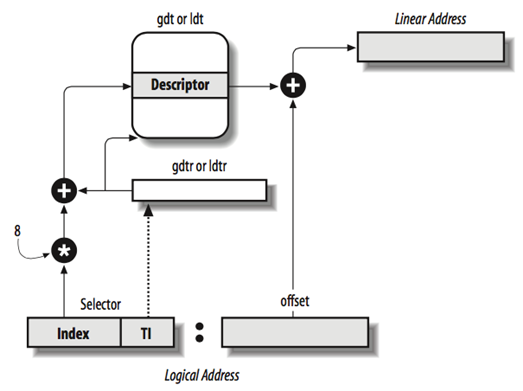
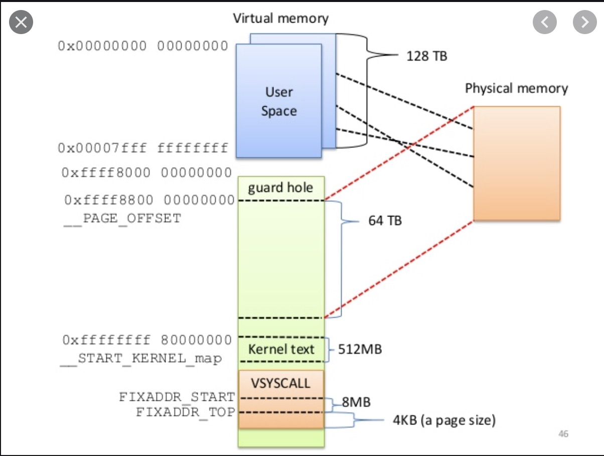

### Process


`include/linux/sched.h`

```C
struct task_struct {

...

  // -1 unrunnable , 0 runnable , >0 stopped:
	volatile long 							state;

	// Current CPU:
	unsigned int 								cpu;
	cpumask_t 									cpus_allowed;

	const struct sched_class 		*sched_class;
	struct sched_entity 				se;
	int 												prio;

	pid_t 											pid;


	// Real parent process:
	struct task_struct __rcu 		*real_parent;
	struct list_head 						children;


	// Filesystem information:
	struct fs_struct						*fs;

	// Open file information:
	struct files_struct 				*files;


	...
}
```

- Above get manged in doublly linked `task_list`

- When a process makes a `clone()` syscall, `_do_fork()` is executed due to system call definitions of clone in `kernel/fork.c.` call reached to `copy_process()` which does most of the intersting parts like

  - error handling and the duplicate task with `dup_task_struct()`

  - scheduling specific work done by `sched_fork()`

  - based on the clone flag parent's resource get copied, this is important while forking for a thread because linux treats thread as a process with some additional resource sharing with the parent. Thread cloning flags

    ```
    clone(CLONE_VM | CLONE_FS | CLONE_FILES | CLONE_SIGHAND, 0);
    ```

  - `alloc_pid()` gives a pid to the process.

- `_do_fork()` wakes up newly created task with `wake_up_new_task()`

- Note about golang subroutine - they do not translate into OS threads.


#### Exercise

- look at `pidstat` cheat sheets to know more information about process
- `execsnoop` is the only efficient way to track past spawned processes.


### Scheduling

There are scheduling classes

- **SCHED NORMAL** - normal process class
- **SCHED FIFO ** - this is the class which run in the real time priority without any time slice, that means it process with this class of scheduling runs till it is finished or interrupted by other process with the higher priority.
- **SCHED RR** - this is the real time priority with the time slice. This process gets preempted.


O(1) scheduler was the old scheduler where according to nice value attached to each process there was a fixed time slice given to process. It is assumed, that the scheduler assigns timeslices of 100ms to processes with default priority (nice value 0) and timeslices of 5ms to processes with the least priority (nice value 19). Process priorities between 0 and 19 are also mapped to fixed timeslices. This had a lot of inefficencies and got replaced in `2.6` kernel with CFS.


#### CFS

This algorithm try to be fair with the scheduling prioirites of the task. Amount of time can be taken by a process depends on

- niceness
- amount of time spent by a process on the CPU

This also manages real-time priority tasks.


Configuration param `sched_latency_ns` which defines targeted preemption latency for CPU bound tasks. That means, it defines timeslice for each tasks based on number tasks in the run queue.

```
timeslice for the task = sched_latency_ns * (task's weight/total weight of tasks in the run queue)
```

There is a complimentry param `sched_min_granularity_ns` which governs minimum value of the `timeslice` of the task to reduce OS's preempting overheads.

When number of tasks becomes more than the ratio of `sched_latency_ns/sched_min_granularity_ns` then `sched_latency_ns`  value get replaced by ` sched_min_granularity_ns * total tasks`.


Once above timeslice is assigned to the process it get scheduled for a run on the CPU and accounted its CPU execution time as process's runtime. This process runtime is abstracted in the form of `vruntime` based on priority of the process. Higher priority process are recorded for lesser than their actual runtime on the CPU. This enabled them to have more CPU time.

`vruntime` is a part of the `sched_entity` struct, which itself is referenced in the `task_struct` of a process. This update is done by `update_curr` which get invovked periodically and adds value of `calc_delta_fair` to task's `curr->vruntime` in the weighted form.


sched/fair.c

```C
//Update the current task’s runtime statistics.
static void update_curr(struct cfs_rq *cfs_rq)
{
	struct sched_entity *curr = cfs_rq ->curr;
  u64 now = rq_clock_task(rq_of(cfs_rq));
  u64 delta_exec;
...
  delta_exec = now - curr->exec_start;
  curr->exec_start = now;
...
//statistics
  schedstat_set(curr->statistics.exec_max,
  max(delta_exec, curr->statistics.exec_max));

  curr->sum_exec_runtime += delta_exec;
  schedstat_add(cfs_rq->exec_clock, delta_exec);

  curr->vruntime += calc_delta_fair(delta_exec, curr);     
  update_min_vruntime(cfs_rq);
}
```


`sched_migration_cost_ns` is reference number to determine the cache hotness and to void its migration.

Now, processes are sorted based on the `vruntime` in the form of red-black balanced binary tree. Any insert, update and delete can be made in O(log(n)). This tree's leftmost node is always with the least runtime which becomes the next runnable process. This happens with the `pick_next_task`.


IO bound tasks get removed from the above RB tree with the `dequeue_entity` while getting marked as a NONRUNNABLE. Task marks itself as sleeping and puts itself on the **wait queue**. , calls `schedule()` to select next process to run. When such tasks wakes up and get added back into the run queue, it will have vruntime setup to 0 which makes it most runnable task.


Preemption of the task can only happen when it is not holding any locks and kernel keeps track of the count of locks by the task in the form of `preempt_count`.  Task will only get preempted if that count is zero. Sometimes higher priority task sets up `need_resched` on currently blocked task to get rescheduled immidiately once it comes out of interrupt handler.


- WatchDog and migration has real time priority.
- How sleep() systemcall is scheduled on CPUs? Answers is that there is seperate `timerqueue` managed by `__hrtimer_run_queues` which runs on softirq to check the expired timers. 


#### Perf command for sched

```shell
 sudo perf sched record -- sleep 1
 sudo perf sched latency

 -----------------------------------------------------------------------------------------------------------------
  Task                  |   Runtime ms  | Switches | Average delay ms | Maximum delay ms | Maximum delay at       |
 -----------------------------------------------------------------------------------------------------------------
  perf:(2)              |      1.759 ms |        4 | avg:    0.037 ms | max:    0.126 ms | max at:    234.604618 s
  gmain:814             |      0.128 ms |        2 | avg:    0.016 ms | max:    0.017 ms | max at:    234.691133 s
  kworker/0:1-eve:7     |      0.047 ms |        2 | avg:    0.009 ms | max:    0.012 ms | max at:    235.366863 s
  rcu_sched:11          |      0.013 ms |        4 | avg:    0.006 ms | max:    0.009 ms | max at:    235.606850 s
  sleep:3313            |      0.982 ms |        4 | avg:    0.005 ms | max:    0.010 ms | max at:    235.606672 s
  ksoftirqd/0:10        |      0.016 ms |        2 | avg:    0.005 ms | max:    0.006 ms | max at:    234.606816 s
 -----------------------------------------------------------------------------------------------------------------
  TOTAL:                |      2.945 ms |       18 |
 ---------------------------------------------------
```


#### Exercise

- confirm SCHD_FIFO behaviour

- what are kernel watchdogs?

- this [doc](https://doc.opensuse.org/documentation/leap/archive/42.1/tuning/html/book.sle.tuning/cha.tuning.taskscheduler.html)

- how perf tool works

- Nice time shown in the top output?


# Interrrupts

- Interrupt processing is done while normal scheduling is halted.
- Interrupt execution is divided into
  - Top Halves
  - Bottom Halves (softirqs, tasklets and work queues)
- Interrupt Descriptor Table (IDT) which stores ISR and an entry for each interrupt is called a gate.
- PCI-MSI - Message Signaled Interrupts are different PCI beast
- `/proc/interrupts`


#### Bottom Halves

This section of the code carried out by following

- Softirq : these are the actions setup during compile time of the kernel and get triggered by various IRQs as apart of bottom halves processing. Multiple sofirq instances can run in parallel. This get scheduled in the IRQ context.
- Tasklet: these are implemented on top of softirq and defined at the runtime. It has a serial execution.
- Workqueue:  this is a worker thread attached per processor. These usually get scheduled outside of the irq context so they can be blocked or sleep and has less memory allocation restirctions. Kworker process can be seen in `kworker/%u:%d%s (cpu, id, priority)` format.


Softirqs are used generally for urgent execution like netowrk traffic handling. Various other work actions implemented through softirq can be found `/proc/softirqs`


#### do_int3() - TRAP

This is a debug interrupt which is used in [kprobe implementation](https://vjordan.info/log/fpga/how-linux-kprobes-works.html).


####Exercise

- MSI read up
- get some examples which uses tasklet and workqueue for  process
- how you monitor performance of the above?


# Kernel Synchronization Methods


##### Atomic

Atomic data types and operations will safeguard updates and reads inside the kernel.


##### Spinlock

Simple synchronization which lock the access for single process who acquires the lock and all other process keeps spinning around the lock untill it gets released.

- It can not be blocked for long time because spinning processes consumes CPU.
- this mechanism is much cheaper to implement


##### Semaphore

A semaphore is like waiting queue attached to a spin lock where processes will be waiting on the queue instead of spinning.

Semaphore also allows multiple threads to acquire a lock.


Exercise

- what is this IPCS based semaphore, I guess they are different than kernel space.


##### Mutex

Mutex is the semaphore with only one thread/process allowing to acquire lock on the resource.

- Mutex has to be released in same context
- this does not allow recursive locking, that means same thread can not lock on same mutex again.
- look the following where mutex is based on spin lock


 linux/kernel/locking/mutex.c

```C
void __sched mutex_unlock(struct mutex *lock) {
	#ifndef CONFIG_DEBUG_LOCK_ALLOC
	if (__mutex_unlock_fast(lock)) return;
	#endif
__mutex_unlock_slowpath(lock, _RET_IP_);
}
```

```C
static noinline void __sched __mutex_unlock_slowpath( struct mutex *lock , unsigned long ip)
{
	struct task_struct *next = NULL; DEFINE_WAKE_Q(wake_q);
	unsigned long owner;
	mutex_release(&lock->dep_map, 1, ip);
/*
* Release the lock before (potentially) taking the spinlock such that * other contenders can get on with things ASAP.
*
* Except when HANDOFF, in that case we must not clear the owner field, * but instead set it to the top waiter.
*/

owner = atomic_long_read(&lock->owner);

  for (;;) {
		unsigned long old;
		#ifdef CONFIG_DEBUG_MUTEXES
    DEBUG_LOCKS_WARN_ON(__owner_task(owner) != current); 		        
    DEBUG_LOCKS_WARN_ON(owner & MUTEX_FLAG_PICKUP);
    #endif
		if (owner & MUTEX_FLAG_HANDOFF) break;
		old = atomic_long_cmpxchg_release(&lock->owner, owner, 		
                                      __owner_flags(owner));
		if (old == owner) {
			if (owner & MUTEX_FLAG_WAITERS)
				break;

      return;
		}
		owner = old;
  }

  spin_lock(&lock->wait_lock);
  debug_mutex_unlock(lock);
	if (!list_empty(&lock->wait_list)) {
		/* get the first entry from the wait-list: */
    struct mutex_waiter *waiter = list_first_entry(&lock->wait_list,
				struct mutex_waiter , list);

    next = waiter ->task;

    debug_mutex_wake_waiter(lock, waiter);
    wake_q_add(&wake_q, next);
  }

  if (owner & MUTEX_FLAG_HANDOFF)
    __mutex_handoff(lock, next);

  spin_unlock(&lock->wait_lock);

  wake_up_q(&wake_q);
}
```


##### Others

- There are other special locks like Read/Write lock where two activities are separated out for locking.

- There is something called RCU which is another synchronization mechanism in place.

- There is `sequential lock` which is like semaphore with the ordered queue.

- There usued to be `Big Kernel lock` which has been phased out.

- `Completion variable` is a simple solution to use of the semaphore where thread will wait to let complete variable value updates.

- Interrupt disabling in IRQ context and bottom haves

  ```C
  spin_lock_irqsave(&lock, flags);
  spin_unlock_irqrestore(&lock, flags);
  
  spin_lock_bh ();
  spin_unlock_bh ();
  ```

- Preemption disabling - this is available , how?


# System calls

Regarding implementatoin of the system calls (weekend)

https://blog.packagecloud.io/eng/2016/04/05/the-definitive-guide-to-linux-system-calls/

Dump VDSO and play with it

https://stackoverflow.com/questions/17157820/access-vdsolinux


#### Exercise

- go through coreutils
- how [linking](https://www.gnu.org/software/libc/manual/html_node/Auxiliary-Vector.html) of the vDSO happens in linux
- The address of the `__kernel_vsyscall` function is written into an [ELF auxilliary vector](https://www.gnu.org/software/libc/manual/html_node/Auxiliary-Vector.html) where a user program or library (typically `glibc`) can find it and use it.
- how linking of libraries happen in general


# Timer


#### Exercise

- how sleep functionality is implemneted using timer.


  =======

# Timer

Some information about timer https://blog.packagecloud.io/eng/2017/03/08/system-calls-are-much-slower-on-ec2/

https://0xax.gitbooks.io/linux-insides/content/Timers/linux-timers-1.html


```shell
$ dmesg | grep "clocksource:"
[    0.000000] clocksource: refined-jiffies: mask: 0xffffffff max_cycles: 0xffffffff, max_idle_ns: 7645519600211568 ns
[    0.000000] clocksource: hpet: mask: 0xffffffff max_cycles: 0xffffffff, max_idle_ns: 79635855245 ns
[    0.832521] clocksource: jiffies: mask: 0xffffffff max_cycles: 0xffffffff, max_idle_ns: 7645041785100000 ns
[    2.236031] clocksource: Switched to clocksource hpet
[    2.451204] clocksource: acpi_pm: mask: 0xffffff max_cycles: 0xffffff, max_idle_ns: 2085701024 ns
[    4.550832] clocksource: tsc: mask: 0xffffffffffffffff max_cycles: 0x24093d6e846, max_idle_ns: 440795249997 ns
[    5.564342] clocksource: Switched to clocksource tsc
```


kthread lauched by `rest_init()`

```shell
$ ps ax |grep kthreadd | grep -v grep
    2 ?        S      0:00 [kthreadd]
```


# Booting


#### BIOS and pre-BIOS

- Computer wakes up 

- wakes up CPU 

- default values in CPU registers 

- kicks in real mode 

- 20 bit address bus has capability to address 1MB of memory but CPU registers are 16bit then it has ability address 64KB at once. So 1MB memory divided into 64KB segments. those will be 16 segments.

- Physical address (20bit) = Segment selection * 16 + offset.  (CS:IP)

- Maximum theorotical addressable memory in this setting will be 64KB above 1MB. 

  ```assembly
  >>> hex((0xffff << 4) + 0xffff)
  '0x10ffef'  <- 1MB + 64KB - 16bytes
  ```

  

- In practise it becomes `0x00ffef` with the [A20 line](https://en.wikipedia.org/wiki/A20_line) disabled.

- With all the initial values in `CS` there is the address `0xfffffff0`, which is 16 bytes below 4GB called reset vector position.

- Reset vector where CPU finds its first instruction to execute which points to BIOS.

- BIOS selects boot device then continue booting 

- worth looking at  [coreboot](https://www.coreboot.org/Developer_Manual/Memory_map) documentation where BIOS ROM get mapped to address location.

  ```
  0xFFFE_0000 - 0xFFFF_FFFF: 128 kilobyte ROM mapped into address space
  ```

- after this BIOS selects boot device which loads boot loader

#### Boot loader

- boot loader split between MBR and first sector  of the booting device
- Boot loader fill in some headers in the linker code and loads kernel boot sector market with magic header `MZ`
  - Jump to this magic address which know as `start_of_setup`
    - Make sure that all segment register values are equal
    - Set up a correct stack, if needed
    - Set up [bss](https://en.wikipedia.org/wiki/.bss)
    - Jump to the C code `main()` in [arch/x86/boot/main.c](https://github.com/torvalds/linux/blob/v4.16/arch/x86/boot/main.c)

#### Protected mode (before long mode)

- protected mode moved from 20 bit addressing (1MB) to 32 bit addressing (4GB)
- this mode also supports segmentation and paging. Previously memory segments were 64KB size but in protected mode they are different. 
- In protected mode size and location of each segment descriebd by data structure `Segment Descriptor` which is 64-bit in size. These segment descritors are stored in a data structure called the `Global Descriptor Table (GDT)`.
- GDT addressed stored in CPU 48 bit register called GDTR and can be retrived by `lgdt gdt` instruction. 
- 

Index can come from either GDT or LDT. GDT is to store kernel related addresses and LDT is created for each process. 

GDT or LDT plus offset will give you physical location of the memory.
**Logical Address = Segment Selector (16 bit) + Offset (13 bit)**


checkout Privillage level in RPL

 The following steps are needed to get a physical address in protected mode:

- The segment selector must be loaded in one of the segment registers.

- The CPU tries to find a segment descriptor at the offset `GDT address + Index` from the selector and then loads the descriptor into the *hidden* part of the segment register.

- If paging is disabled, the linear address of the segment, or its physical address, is given by the formula: Base address (found in the descriptor obtained in the previous step) + Offset.

- In short, it **initializes GDT** because kernel needs to start addressing memory.

- `boot_params` structure gets populated with `copy_boot_params(void)` in `main.c` , reading them from location where boot loader has stored them.

- `biosregs` structure gets populated and **serial console gets initialized**. Interrupt 0x10 gets called to print very first charater and later serial console method get used. tty.C

- **Heap gets initalized.** 

- Checking CPU for its flags and **presense for a long mode**. BIOS 0x15 interrupt used to inform BIOS about switch into that mode.  CPU validation through the `validate_cpu` function from [arch/x86/boot/cpu.c](https://github.com/torvalds/linux/blob/v4.16/arch/x86/boot/cpu.c) source code file.

- **BIOS  0xE820 memory reporting** to the operating system using interrupt 0x15. We can see that as first line in dmesg.Ultimately, this function collects data from the address allocation table and writes this data into the `e820_entry` array:

  - start of memory segment
  - size of memory segment
  - type of memory segment (whether the particular segment is usable or reserved)

- **Initialization of the keyboard** with a call to the [`keyboard_init`](https://github.com/torvalds/linux/blob/v4.16/arch/x86/boot/main.c) calls 0x16 interrupt.

- Query various BIOS functions like APM and Disk drives.

- Setup a video mode.  `vid_mode=ask` in grub which usually set to vga or vesa.

- Transition to **protected mode**.

  - function call - `go_to_protected_mode` - in [arch/x86/boot/main.c](https://github.com/torvalds/linux/blob/v4.16/arch/x86/boot/main.c). 
  - it disables NMI, try to enable A20, resets match processor, masks all programmable interrupt controllers except IRQ2 (i think its a keyboard)
  - Sets up Interrupt Discriptor Table. `setup_idt` 
  - Sets up GDT `setup_gdt`
  - jump with  `protected_mode_jump`  in [arch/x86/boot/pmjump.S](https://github.com/torvalds/linux/blob/v4.16/arch/x86/boot/pmjump.S) to enable  `PE` (Protection Enable) bit in the `CR0` control register:

  

#### Journey towards long mode - 64 bit

- [x86 boot protocol](https://www.kernel.org/doc/Documentation/x86/boot.txt) 

- `bzimage` is a gzipped package consisting of `vmlinux`, `header` and `kernel setup code` and job of `kernel setup code` is to prepare to enter into a long mode with `vmlinux` execution after its decompression. So far we have been executing `kernel setup code`.

- [head_64.S](https://github.com/torvalds/linux/blob/v4.16/arch/x86/boot/compressed/head_64.S) will decompress the kernel and enter the long mode. 

- **Setup a stack space** and verification of CPU for long mode support.  Push `startup_64` function to the stack which then CPU extracts from the stack while shifting to long mode. 

- Move processor into long mode or straight in 64 bit mode

  - 8 new general purpose registers from `r8` to `r15`
  - All general purpose registers are 64-bit now
  - A 64-bit instruction pointer - `RIP`
  - A new operating mode - Long mode;
  - 64-Bit Addresses and Operands;
  - RIP Relative Addressing (we will see an example of this in the coming parts).
  - Enable [PAE](https://en.wikipedia.org/wiki/Physical_Address_Extension);
  - Build page tables and load the address of the top level page table into the `cr3` register
  - Enable `EFER.LME` in the MSR to  `0xC0000080`
  - Enable paging ( just for 4G memory )

- Linux addresses – Virtual address to linear address to physical address
  

  - ***Virtual addresses\*** are used by an application program. They consist of a 16-bit selector and a 32-bit offset. In the flat memory model, the selectors are preloaded into segment registers CS, DS, SS, and ES, which all refer to the same linear address. They need not be considered by the application. Addresses are simply 32-bit near pointers.
  - ***Linear addresses\*** are calculated from virtual addresses by segment translation. The base of the segment referred to by the selector is added to the virtual offset, giving a 32-bit linear address. Under RTTarget-32, virtual offsets are equal to linear addresses since the base of all code and data segments is 0.
  - ***Physical addresses\*** are calculated from linear addresses through paging. The linear address is used as an index into the Page Table where the CPU locates the corresponding physical address.

  

- The Linux kernel uses `4-level` paging, and we generally **build 6 page tables**:

  - One `PML4` or `Page Map Level 4` table with one entry;
  - One `PDP` or `Page Directory Pointer` table with four entries;
  - Four Page Directory tables with a total of `2048` entries.

- Enable paging and execute `lret` instuction which will start executing  `startup_64` function from the stack. 

- That should put system into 64 bit more which is a native mode for x86_64.


#### Decompress the kernel

-  from the `64-bit` entry point - `startup_64` which is located in the [arch/x86/boot/compressed/head_64.S](https://github.com/torvalds/linux/blob/v4.16/arch/x86/boot/compressed/head_64.S) 

- The `extract_kernel` function is defined in the [arch/x86/boot/compressed/misc.c](https://github.com/torvalds/linux/blob/v4.16/arch/x86/boot/compressed/misc.c) source code file and takes six arguments:

  - `rmode` - a pointer to the [boot_params](https://github.com/torvalds/linux/blob/v4.16/arch/x86/include/uapi/asm/bootparam.h) structure which is filled by either the bootloader or during early kernel initialization;
  - `heap` - a pointer to `boot_heap` which represents the start address of the early boot heap;
  - `input_data` - a pointer to the start of the compressed kernel or in other words, a pointer to the `arch/x86/boot/compressed/vmlinux.bin.bz2` file;
  - `input_len` - the size of the compressed kernel;
  - `output` - the start address of the decompressed kernel;
  - `output_len` - the size of the decompressed kernel;

  All arguments will be passed through registers as per the [System V Application Binary Interface](http://www.x86-64.org/documentation/abi.pdf). We've finished all the preparations and can now decompress the kernel.

-  [boot_params](https://github.com/torvalds/linux/blob/v4.16/arch/x86/include/uapi/asm/bootparam.h) structure holds arguments which are passed to kernel image executable after its decompression.

- After we initialize the heap pointers, the next step is to call the `choose_random_location` function from the [arch/x86/boot/compressed/kaslr.c](https://github.com/torvalds/linux/blob/v4.16/arch/x86/boot/compressed/kaslr.c) source code file. kASLR  which allows decompression of the kernel into a random address, for security reasons..

-  `Decompressing Linux...`

- Kernel is an ELF executable.

- sections of linux kernel 

  ```  
   readelf -l vmlinux
  
  Elf file type is EXEC (Executable file)
  Entry point 0x1000000
  There are 5 program headers, starting at offset 64
  
  Program Headers:
    Type           Offset             VirtAddr           PhysAddr
                   FileSiz            MemSiz              Flags  Align
    LOAD           0x0000000000200000 0xffffffff81000000 0x0000000001000000
                   0x000000000144c000 0x000000000144c000  R E    0x200000
    LOAD           0x0000000001800000 0xffffffff82600000 0x0000000002600000
                   0x0000000000257000 0x0000000000257000  RW     0x200000
    LOAD           0x0000000001c00000 0x0000000000000000 0x0000000002857000
                   0x000000000002d000 0x000000000002d000  RW     0x200000
    LOAD           0x0000000001c84000 0xffffffff82884000 0x0000000002884000
                   0x0000000000d7c000 0x0000000000d7c000  RWE    0x200000
    NOTE           0x0000000001000e84 0xffffffff81e00e84 0x0000000001e00e84
                   0x00000000000001ec 0x00000000000001ec         0x4
  
   Section to Segment mapping:
    Segment Sections...
     00     .text .notes __ex_table .rodata .pci_fixup .tracedata __ksymtab __ksymtab_gpl __ksymtab_strings __init_rodata __param __modver
     01     .data __bug_table .vvar
     02     .data..percpu
     03     .init.text .altinstr_aux .init.data .x86_cpu_dev.init .parainstructions .altinstructions .altinstr_replacement .iommu_table .apicdrivers .exit.text .smp_locks .data_nosave .bss .brk .init.scratch
     04     .notes
  ```

These segments of elf binaries will get loaded.

After the kernel is relocated, we return from the `extract_kernel` function to [arch/x86/boot/compressed/head_64.S](https://github.com/torvalds/linux/blob/v4.16/arch/x86/boot/compressed/head_64.S).

The address of the kernel will be in the `rax` register and we jump to it:

```assembly
jmp    *%rax
```


#### Booting

- Initialize memory map for memory above 4G. `initialize_identity_maps`
- choose andom memory location to extract kernel without abstructing memory occupied by `initrd`.


So far we are doing just a preparation for execution of the first Kernel code.

That's all. Now we are in the kernel! Executing..... Booting....


# Kernel Initialization

This is kernel's first byte execution onwards 


#### Before `start_kernel` execution

- Allocate address for paging - FIX base address for all tables.
- Enable [SME](https://en.wikipedia.org/wiki/Zen_(microarchitecture)#Enhanced_security_and_virtualization_support) 
-  `__START_KERNEL_map` is a base virtual address of the kernel text, so if we subtract `__START_KERNEL_map`, we will get physical addresses of the `level2_kernel_pgt` and `level2_fixmap_pgt`.
- `*_kernel_pgt` pointing to regualr pages and  `*_fixmap_pgt` will point to VDSO syscalls mappings.
- There are something called `early_dynamic_pgts` which holds pages for initial kernel execution.
- read MSR for CPU features like [NX](https://en.wikipedia.org/wiki/NX_bit) support availble then write MSR.
- Also update bit in control register 
  - `X86_CR0_PE` - system is in protected mode;
  - `X86_CR0_MP` - controls interaction of WAIT/FWAIT instructions with TS flag in CR0;
  - `X86_CR0_ET` - on the 386, it allowed to specify whether the external math coprocessor was an 80287 or 80387;
  - `X86_CR0_NE` - enable internal x87 floating point error reporting when set, else enables PC style x87 error detection;
  - `X86_CR0_WP` - when set, the CPU can't write to read-only pages when privilege level is 0;
  - `X86_CR0_AM` - alignment check enabled if AM set, AC flag (in EFLAGS register) set, and privilege level is 3;
  - `X86_CR0_PG` - enable paging.
- Initialize thread structure which is required to start a process with `thread_info` which for x86 becomes a part of `task_struct` structure .
- Very first thread gets initialized by `INIT_TASK_DATA(THREAD_SIZE)` in [arch/x86/kernel/vmlinux.lds.S](https://github.com/torvalds/linux/blob/master/arch/x86/kernel/vmlinux.lds.S) and this macro is defined in [include/asm-generic/vmlinux.lds.h](https://github.com/torvalds/blob/master/include/asm-generic/vmlinux.lds.h)
- Reload GDT 
- Create GDT page for `per-cpu` variable which gets created with `INIT_PER_CPU_VAR` , You can read in details about `per-CPU` variables in the [Concepts/per-cpu](https://0xax.gitbook.io/linux-insides/summary/concepts/linux-cpu-1) post.
- Initialize IRQ stack with its handlers with MSRs.
- jump to execution of `x86_64_start_kernel` through`initial_code` pointer.


#### `x86_64_start_kernel`  from the [init/main.c](https://github.com/torvalds/linux/blob/master/init/main.c).


#### Early interrupt and exception handling

Total interrupt vector numbers `0-255` , multiplying vector with 16 will give you an IDT entry for that vector.  CPU uses special register `IDTR` for Interrupt Descriptor Table and `lidt` instruction for loading base address of the table into this register.

Type of interrupts 

- Software interrupts - when a software signals CPU that it needs kernel attention. These interrupts are generally used for system calls;
- Hardware interrupts - when a hardware event happens, for example button is pressed on a keyboard;
- Exceptions - interrupts generated by CPU, when the CPU detects error, for example division by zero or accessing a memory page which is not in RAM. `0-31` are assigned for this exception handling.


Following table shows `0-31`exceptions:

```
----------------------------------------------------------------------------------------------
|Vector|Mnemonic|Description         |Type |Error Code|Source                   |
----------------------------------------------------------------------------------------------
|0     | #DE    |Divide Error        |Fault|NO        |DIV and IDIV                          |
|---------------------------------------------------------------------------------------------
|1     | #DB    |Reserved            |F/T  |NO        |                                      |
|---------------------------------------------------------------------------------------------
|2     | ---    |NMI                 |INT  |NO        |external NMI                          |
|---------------------------------------------------------------------------------------------
|3     | #BP    |Breakpoint          |Trap |NO        |INT 3                                 |
|---------------------------------------------------------------------------------------------
|4     | #OF    |Overflow            |Trap |NO        |INTO  instruction                     |
|---------------------------------------------------------------------------------------------
|5     | #BR    |Bound Range Exceeded|Fault|NO        |BOUND instruction                     |
|---------------------------------------------------------------------------------------------
|6     | #UD    |Invalid Opcode      |Fault|NO        |UD2 instruction                       |
|---------------------------------------------------------------------------------------------
|7     | #NM    |Device Not Available|Fault|NO        |Floating point or [F]WAIT             |
|---------------------------------------------------------------------------------------------
|8     | #DF    |Double Fault        |Abort|YES       |An instruction which can generate NMI |
|---------------------------------------------------------------------------------------------
|9     | ---    |Reserved            |Fault|NO        |                                      |
|---------------------------------------------------------------------------------------------
|10    | #TS    |Invalid TSS         |Fault|YES       |Task switch or TSS access             |
|---------------------------------------------------------------------------------------------
|11    | #NP    |Segment Not Present |Fault|NO        |Accessing segment register            |
|---------------------------------------------------------------------------------------------
|12    | #SS    |Stack-Segment Fault |Fault|YES       |Stack operations                      |
|---------------------------------------------------------------------------------------------
|13    | #GP    |General Protection  |Fault|YES       |Memory reference                      |
|---------------------------------------------------------------------------------------------
|14    | #PF    |Page fault          |Fault|YES       |Memory reference                      |
|---------------------------------------------------------------------------------------------
|15    | ---    |Reserved            |     |NO        |                                      |
|---------------------------------------------------------------------------------------------
|16    | #MF    |x87 FPU fp error    |Fault|NO        |Floating point or [F]Wait             |
|---------------------------------------------------------------------------------------------
|17    | #AC    |Alignment Check     |Fault|YES       |Data reference                        |
|---------------------------------------------------------------------------------------------
|18    | #MC    |Machine Check       |Abort|NO        |                                      |
|---------------------------------------------------------------------------------------------
|19    | #XM    |SIMD fp exception   |Fault|NO        |SSE[2,3] instructions                 |
|---------------------------------------------------------------------------------------------
|20    | #VE    |Virtualization exc. |Fault|NO        |EPT violations                        |
|---------------------------------------------------------------------------------------------
|21-31 | ---    |Reserved            |INT  |NO        |External interrupts                   |
----------------------------------------------------------------------------------------------
```


64-bit mode IDT entry has following structure:

```
127                                                                             96
 --------------------------------------------------------------------------------
|                                                                               |
|                                Reserved                                       |
|                                                                               |
 --------------------------------------------------------------------------------
95                                                                              64
 --------------------------------------------------------------------------------
|                                                                               |
|                               Offset 63..32                                   |
|                                                                               |
 --------------------------------------------------------------------------------
63                               48 47      46  44   42    39             34    32
 --------------------------------------------------------------------------------
|                                  |       |  D  |   |     |      |   |   |     |
|       Offset 31..16              |   P   |  P  | 0 |Type |0 0 0 | 0 | 0 | IST |
|                                  |       |  L  |   |     |      |   |   |     |
 --------------------------------------------------------------------------------
31                                   16 15                                      0
 --------------------------------------------------------------------------------
|                                      |                                        |
|          Segment Selector            |                 Offset 15..0           |
|                                      |                                        |
 --------------------------------------------------------------------------------
```

Where:

- `Offset` - is offset to entry point of an interrupt handler;
- `DPL` - Descriptor Privilege Level;
- `P` - Segment Present flag;
- `Segment selector` - a code segment selector in GDT or LDT
- `IST` - provides ability to switch to a new stack for interrupts handling.

And the last `Type` field describes type of the `IDT` entry. There are three different kinds of gates for interrupts:

- Task gate
- Interrupt gate
- Trap gate

Interrupt and trap gates contain a far pointer to the entry point of the interrupt handler. Interrupt gates clears `IF` bit above to disables all the interrupt during its execution and set it back on upon completion of execution.


`    idt_setup_early_handler()` in [arch/x86/kernel/idt.c](https://github.com/torvalds/linux/blob/master/arch/x86/kernel/idt.c)  populates exception handling interrupt routines in `early_idt_handler_array`.

After that we push `vector number` on the stack and jump on the `early_idt_handler_common` which is generic interrupt handler for now. After all, every nine bytes of the `early_idt_handler_array` array consists of optional push of an error code, push of `vector number` and jump instruction to `early_idt_handler_common`.


you can see refereces to above functionality in the `objdump -D vmlinux`


- Most common exception handled in this stage is page fault with   in [arch/x86/kernel/head64.c](https://github.com/torvalds/linux/blob/master/arch/x86/kernel/head64.c)

- For more information about exception table, you can refer to [Documentation/x86/exception-tables.txt](https://github.com/torvalds/linux/blob/master/Documentation/x86/exception-tables.txt).

- Traps are handled  by  `fixup_bug` function is defined in [arch/x86/kernel/traps.c](https://github.com/torvalds/linux/blob/master/arch/x86/kernel/traps.c).

  

#### Retriving boot params and other 

- we stored boot params of the kernel during real mode which will get retrieved with `copy_bootdata(__va(real_mode_data))`
- reserve memory for Extended BIOS Data Area located in the top of conventional memory and contains data about ports, disk parameters and etc...
- call the `start_kernel`

All above steps done by following 

```C
void __init x86_64_start_reservations(char *real_mode_data)
{
    if (!boot_params.hdr.version)
        copy_bootdata(__va(real_mode_data));

    reserve_ebda_region();

    start_kernel();
}
```


# Kernel entry point `start_kernel`

The main purpose of the `start_kernel` is to launch the first `init` process and do following initilization to do that launch 

-  to enable [lock validator](https://www.kernel.org/doc/Documentation/locking/lockdep-design.txt), 
- to initialize processor id, 
- to enable early [cgroups](http://en.wikipedia.org/wiki/Cgroups) subsystem, 
- to setup per-cpu areas, 
- to initialize different caches in [vfs](http://en.wikipedia.org/wiki/Virtual_file_system), 
- to initialize memory manager, rcu, vmalloc, scheduler, IRQs, ACPI and many many more.


Begning of `start_kernel` you get kernel command lines and parsed arguments (result of the `parse_args` function). 


Very first canary task is getting defined in the form of `tast_struct`  by following

```
struct task_struct init_task = INIT_TASK(init_task);
```

and `set_task_stack_end_magic` is the function ( defined in the [kernel/fork.c](https://github.com/torvalds/linux/blob/16f73eb02d7e1765ccab3d2018e0bd98eb93d973/kernel/fork.c#L297) ) which marks the end of the stack of this task. This canary stack is special so we have to call this function to avoid stack overflow for this task.

`task_struct` defination can be found  in [include/linux/sched.h](https://github.com/torvalds/linux/blob/16f73eb02d7e1765ccab3d2018e0bd98eb93d973/include/linux/sched.h#L1278)

You can see the definition of the `INIT_TASK` macro in [include/linux/init_task.h](https://github.com/torvalds/linux/blob/16f73eb02d7e1765ccab3d2018e0bd98eb93d973/include/linux/init_task.h) 

`thread_info` structure for this canary task written manually at the bottom of its stack. Process stack in linux is 4 memory pages long which is 4 * 4KB = 16KB. `thread_info` structure size is 62 bytes and that is how its location gets calculated. Note that `thread_union` represented as the [union](http://en.wikipedia.org/wiki/Union_type) and not structure, it means that `thread_info` and stack share the memory space ([why?](http://www.quora.com/In-Linux-kernel-Why-thread_info-structure-and-the-kernel-stack-of-a-process-binds-in-union-construct) ). 


we fill the `stack_canary` field of `task_struct` with random value collected from  [TSC](http://en.wikipedia.org/wiki/Time_Stamp_Counter) and write it on the top of the IRQ stack (I DO NOT know why?). Now time for processor activation but before that it disables all the local IRQs for the current CPU and calls  `boot_cpu_init`.


 `boot_cpu_init` initializes various CPU masks for the bootstrap processor which is running our cannary task by setting up its CPU variables and setting up bitmap mask.


The [per-cpu](https://0xax.gitbook.io/linux-insides/summary/concepts/linux-cpu-1) variables manupulation done by `this_cpu` macros which are defined in defined in the [include/linux/percpu-defs.h](https://github.com/torvalds/linux/blob/16f73eb02d7e1765ccab3d2018e0bd98eb93d973/include/linux/percpu-defs.h). More on CPU bit mask at  [cpumask](https://0xax.gitbook.io/linux-insides/summary/concepts/linux-cpu-2) or [documentation](https://www.kernel.org/doc/Documentation/cpu-hotplug.txt).


Print a banner 

```C
#define pr_notice(fmt, ...) \
    printk(KERN_NOTICE pr_fmt(fmt), ##__VA_ARGS__)


/* 
Linux version 4.0.0-rc6+ (alex@localhost) (gcc version 4.9.1 (Ubuntu 4.9.1-16ubuntu6) ) #319 SMP
*/
```


Reserve memory for the kernel  `_text` and `_data` segments. This is done by `memblock_reserve` function called with address params like 

```C
memblock_reserve(__pa_symbol(_text), (unsigned long)__bss_stop - (unsigned long)_text);
```


Then reserves the memory for the ramdisk image whose location can be fetched by reading `boot_params` with following function 

```C
static u64 __init get_ramdisk_image(void)
{
        u64 ramdisk_image = boot_params.hdr.ramdisk_image;

        ramdisk_image |= (u64)boot_params.ext_ramdisk_image << 32;

        return ramdisk_image;
}
```


Why  `boot_params` and shift left it on `32` ?  [Documentation/x86/zero-page.txt](https://github.com/0xAX/linux/blob/0a07b238e5f488b459b6113a62e06b6aab017f71/Documentation/x86/zero-page.txt)


Reserve memory for ramdisk with following 

```C
memblock_reserve(ramdisk_image, ramdisk_end - ramdisk_image);
```


above two steps happens in the begining of the `setup_arch` function which starts `architecture-specific` bootstrapping defined under `arch/` directory.  We are executing  `setup_arch` function defined in the [arch/x86/kernel/setup.c](https://github.com/torvalds/linux/blob/16f73eb02d7e1765ccab3d2018e0bd98eb93d973/arch/x86/kernel/setup.c)


# architecture-specific initialization

We are entring into  `setup_arch`  which is called by `start_kernel`

#### Debug and exception handling

- setup breakpoints - ability to debug kernel and exception handlers. In x86 architecture `INT` , `INTO` and

  `INT3` are special instructions which allow a task to explicitly call an interrupt handler. The `INT3` instruction calls the breakpoint ( `#BP` ) handler.
   `early_trap_init` defined in the [arch/x86/kernel/traps.c](https://github.com/torvalds/linux/blob/16f73eb02d7e1765ccab3d2018e0bd98eb93d973/arch/x86/kernel/traps.c). This functions sets `#DB` and `#BP` handlers and reloads [IDT](http://en.wikipedia.org/wiki/Interrupt_descriptor_table)

- In addition to per-thread stacks, there are a couple of specialized stacks associated with each CPU. [Kernel stacks](https://www.kernel.org/doc/Documentation/x86/kernel-stacks)   `x86_64` provides feature which allows to switch to a new `special` stack for during any events as non-maskable interrupt and etc... And the name of this feature is - `Interrupt Stack Table`. These are useful for exception handling and debugging

- Implementation of the `#DB` handler as other handlers is in this [arch/x86/entry/entry_64.S](https://github.com/torvalds/linux/blob/16f73eb02d7e1765ccab3d2018e0bd98eb93d973/arch/x86/entry/entry_64.S) and defined with the `idtentry` assembly macro `idtentry debug do_debug has_error_code=0 paranoid=1 shift_ist=DEBUG_STACK` 

- During interrupt handling all CPU registers are backed up on the stack and that take 120 bytes of space.

#### ioremap initialization 

This is where initialization of the pages for IO memory mapped and port based communication.    in the [arch/x86/mm/ioremap.c](https://github.com/torvalds/linux/blob/16f73eb02d7e1765ccab3d2018e0bd98eb93d973/arch/x86/mm/ioremap.c) . Memory map setup with the call of the `setup_memory_map` function. 

* /proc/ioports - provides a list of currently registered port regions used for input or output communication with a device;
* /proc/iomem   - provides current map of the system's memory for each physical device.

Entire hirarchey of devices captured in the tree like structure where parent has siblings and children devices.

**NOTE**: `EXPORT_SYMBOL` macro exports the given symbol for dynamic linking or in other words it makes a symbol accessible to dynamically loaded modules.

#### obtain major and minor for root device (device for ramdisk to mount)

```
ROOT_DEV = old_decode_dev(boot_params.hdr.root_dev);
```


#### Setup memory map

 call of the `setup_ memory_map` function and kernel message like following 

```C
[    0.000000] e820: BIOS-provided physical RAM map:
[    0.000000] BIOS-e820: [mem 0x0000000000000000-0x000000000009d7ff] usable
[    0.000000] BIOS-e820: [mem 0x000000000009d800-0x000000000009ffff] reserved
[    0.000000] BIOS-e820: [mem 0x00000000000e0000-0x00000000000fffff] reserved
[    0.000000] BIOS-e820: [mem 0x0000000000100000-0x00000000be825fff] usable
[    0.000000] BIOS-e820: [mem 0x00000000be826000-0x00000000be82cfff] ACPI NVS
...
...
```

initialization of the `x86_init` is in the [arch/x86/kernel/x86_init.c](https://github.com/torvalds/linux/blob/16f73eb02d7e1765ccab3d2018e0bd98eb93d973/arch/x86/kernel/x86_init.c) which will hold information to print above message.


#### parsing BIOS Enhanced Disk Device information

Parsing of the `setup_data` with `parse_setup_data` function and copying BIOS EDD to the safe place. 


#### Memory discriptor for kernel

Every process has its own memory structure (`struct mm_struct`  in the  [include/linux/mm_types.h](https://github.com/torvalds/linux/blob/16f73eb02d7e1765ccab3d2018e0bd98eb93d973/include/linux/mm_types.h)) attached to its own task structure (`struct task_struct`). `mm` points to the process address space and `active_mm` points to the active address space

If process with the no address space that means it is a kernel thread  (more about it you can read in the [documentation](https://www.kernel.org/doc/Documentation/vm/active_mm.txt)).

Here  kernel's text, data and brk gets initiated.


#### NX bit

 `x86_configure_nx` function which sets the `_PAGE_NX` flag depends on support of [NX bit](http://en.wikipedia.org/wiki/NX_bit).

#### parsing of the kernel params

 `parse_early_param` which internally calls  `early_param` which calls ` __setup_param` which eventually uses `struct obs_kernel_param` pointers to do relevent parsing for particular params. This functionality provides code the ability to conduct various kernel related tasks 

After this, quick call to

-  `x86_report_nx`
- `memblock_x86_reserve_range_setup_data` to do some more memory remmaping 
- collect multi processor specifications with  `acpi_mps_check` function from the [arch/x86/kernel/acpi/boot.c](https://github.com/torvalds/linux/blob/16f73eb02d7e1765ccab3d2018e0bd98eb93d973/arch/x86/kernel/acpi/boot.c)  It checks the built-in `MPS` or [MultiProcessor Specification](http://en.wikipedia.org/wiki/MultiProcessor_Specification) table.
- `pcibios_setup`  from the [drivers/pci/pci.c](https://github.com/torvalds/linux/blob/16f73eb02d7e1765ccab3d2018e0bd98eb93d973/arch) for early scan of these devices.
- and  `e820_reserve_setup_data` for E820 memory area sanitization.


#### DMI scanning -  [Desktop Management Interface](http://en.wikipedia.org/wiki/Desktop_Management_Interface) 

```C
dmi_scan_machine();
dmi_memdev_walk();
```

defined in the [drivers/firmware/dmi_scan.c](https://github.com/torvalds/linux/blob/16f73eb02d7e1765ccab3d2018e0bd98eb93d973/drivers/firmware/dmi_scan.c)

`dmi_scan_machine` function goes through the [System Management BIOS](http://en.wikipedia.org/wiki/System_Management_BIOS) structures and extracts information.

 `dmi_memdev_walk` goes over memory devices mapped area.

#### SMP

 Parsing of the  configuration with  `find_smp_config` function.  [MultiProcessor Specification](http://www.intel.com/design/pentium/datashts/24201606.pdf)


#### Some more memory shuffling 

-  call of the `early_alloc_pgt_buf` function which allocates the page table buffer for early stage. 
-  `reserve_real_mode` - reserves low memory from `0x0` to 1 megabyte for the trampoline to the real mode.
-  `setup_real_mode` function setups trampoline to the [real mode](http://en.wikipedia.org/wiki/Real_mode) code.

 

#### Kernel log buffer

The `setup_log_buf` function setups kernel cyclic buffer, call the `log_buf_add_cpu` function which increase size of the buffer for every CPU


#### initrd memory space reserve

print information about the `initrd` size. We can see the result of this in the `dmesg` output:

```C
[0.000000] RAMDISK: [mem 0x36d20000-0x37687fff]
```

and relocate `initrd` to the direct mapping area with the `relocate_initrd` function.  


#### io_delay_init

 `io_delay_init` from the [arch/x86/kernel/io_delay.c](https://github.com/torvalds/linux/blob/16f73eb02d7e1765ccab3d2018e0bd98eb93d973/arch/x86/kernel/io_delay.c). This function allows to override default I/O delay `0x80` port.


#### Allocate area for DMA

with the `dma_contiguous_reserve` function which is defined in the [drivers/base/dma-contiguous.c](https://github.com/torvalds/linux/blob/16f73eb02d7e1765ccab3d2018e0bd98eb93d973/drivers/base/dma-contiguous.c).  DMA needs CMA aka contiguous memory allocations.


#### Initialization of the sparse memory (NUMA aware paging)

The `Sparsemem` is a special foundation in the linux kernel memory manager which used to split memory area into different memory banks in the [NUMA](http://en.wikipedia.org/wiki/Non-uniform_memory_access) systems. Let's look on the implementation of the `paginig_init` function


Every `NUMA` node is divided into a number of pieces which are called - `zones`. So, `zone_sizes_init` function from the [arch/x86/mm/init.c](https://github.com/torvalds/linux/blob/16f73eb02d7e1765ccab3d2018e0bd98eb93d973/arch/x86/mm/init.c) initializes size of zones.


#### vsyscall

Setting of the `trampoline_cr4_features` which must contain content of the `cr4` [Control register](http://en.wikipedia.org/wiki/Control_register) . This CR4 register is going to use in the execution of vsyscalls.

 `map_vsyscal` from the [arch/x86/kernel/vsyscall_64.c](https://github.com/torvalds/linux/blob/16f73eb02d7e1765ccab3d2018e0bd98eb93d973/arch/x86/kernel/vsyscall_64.c). This function maps memory space for [vsyscalls](https://lwn.net/Articles/446528/)

We can see definition of the `__vsyscall_page` in the [arch/x86/kernel/vsyscall_emu_64.S](https://github.com/torvalds/linux/blob/16f73eb02d7e1765ccab3d2018e0bd98eb93d973/arch/x86/kernel/vsyscall_emu_64.S).  The `__vsyscall_page` symbol points to the aligned calls of the `vsyscalls` as `gettimeofday`, etc.


Other steps

-  `mcheck_init` function initializes `Machine check Exception` 
-  `register_refined_jiffies` which registers [jiffy](http://en.wikipedia.org/wiki/Jiffy_%28time%29) 


# Back to `start_kernel`

- call of the `mm_init_cpumask` function. This function sets the [cpumask](https://0xax.gitbook.io/linux-insides/summary/concepts/linux-cpu-2) pointer to the memory descriptor `cpumask`.
- setup the CPU memory areas `setup_per_cpu_areas`  this will require to save CPU specific `GDT` segments for the tasks which are running on that CPU.
- `get_cpu_gdt_table` used to get CPU specific GDT.
- Then build zones for each NUMA node represented by `struct pglist_data` and `zone`
- `page_alloc_init` function call and parse kernel arguments.
- `setup_log_buf` for kernel log buffer.
- start up PID management tree `pidhash_init`
- Initialize VFS related data structure `vfs_caches_init_early`
- then start `mm_init`


#### **Scheduler initialization**

- `sched_init` which initiate this process
- It will initialize array of `waitqueues` which is necessary for processes which are not runnable.
-  Special `sched_entity` structure that is used by the Linux kernel scheduler as scheduling unit for each process instead of `task_struct`
- look for structures `cfs_rq` and `rt_rq` both represents run queues per CPU for regular and realtime priority processes. These get initialized for each CPU.
-  real-time scheduler requires global resources to make scheduling decision , to create scalable solution for such access kernel has `root_domain` structure.


#### RCU (Read-Copy Update ) initialization 

The RCU technique is designed for rarely-modified data structures. 

If somebody wants to change this data structure, we make a copy of this data structure and make all changes in the copy. In the same time all other users of the data structure use old version of it. Next, we need to choose safe moment when original version of the data structure will have no users and update it with the modified copy.


Related params

- `rcu_read_lock` and `rcu_read_unlock` to mark critical section.
-  `quiescent state` called - `grace period` which provides window for the update.


Steps towards initialization

- disable preemptiveness of the kernel with `preempt_disable` which updates `__preempt_count` which is per-CPU variable.
- above operations has to be done with the optimization `barrier` setup. 
- In the processors with x86_64 architecture independent memory access operations can be performed in any order. That's why we need the opportunity to point compiler and processor on compliance of order. This mechanism is **memory barrier**.
- memory barrier optiomization insures that order or execution of functions will be maintained.
- Disable IRQs
- Initialize ID management framework with `idr_init_cache`.  The `idr` library is used in a various places in the linux kernel to manage assigning integer IDs to objects and looking up objects by id.   

Call `rcu_init`.


RCU utilizaes softirqs

```C
open_softirq(RCU_SOFTIRQ, rcu_process_callbacks);
```


#### Other initialization 

- `trace_init` to initialize perf tracing and other profiling with `profile_init`
- `console_init` to start terminals
- debugging memory init `debug_objects_mem_init`
- kernel memory leak `kmemleak_init` 
- per CPU page sets `setup_per_cpu_pageset`
- NUMA policy  `numa_policy_init`
- Scheduling time `sched_clock_init`
- PID `pidmap_init`
- kernel private VM areas `anon_vma_init`
- initialization of the ACPI with the `acpi_early_init`.


#### prepare to spawn `init` process

- To spawn a process we need to have `thread info` struct which need a CPU cache allocated by `thread_info_cache_init`  called in  kernel/fork.c

  ```C
  thread_info_cache = kmem_cache_create("thread_info", THREAD_SIZE,
                                                THREAD_SIZE, 0, NULL);
  ```

  

- Then need a cache for `credentials` like uid, did .. etc. which done with `cred_init` in kernel/cred.c

  ```C
  cred_jar = kmem_cache_create("cred_jar", sizeof(struct cred),
                              0, SLAB_HWCACHE_ALIGN|SLAB_PANIC, NULL);
  ```


##### Next function is **`fork_init`**

- Then `fork_init` allocates cache for the `task_struct` in kernel/fork.c.

  ```C
  task_struct_cachep =
                  kmem_cache_create("task_struct", sizeof(struct task_struct), ARCH_MIN_TASKALIGN, SLAB_PANIC | SLAB_NOTRACK, NULL);
  ```

- In the end of the `fork_init` function we initialize signal handler. We built `init_task` in the past which is an instance of `task_struct` structure which will get populated with these handlers and `rlimits`.

-  `proc_caches_init` is next which will initialize following caches

  - sighand_cachep - manage information about installed signal handlers;
  - signal_cachep - manage information about process signal descriptor;
  - files_cachep - manage information about opened files;
  - fs_cachep -  manage filesystem information.

- After this `proc_caches_init` will allocate SLAB cache for the `mm_struct` structures:

  ```C
  mm_cachep = kmem_cache_create("mm_struct",
                           sizeof(struct mm_struct), ARCH_MIN_MMSTRUCT_ALIGN,
                           SLAB_HWCACHE_ALIGN|SLAB_PANIC|SLAB_NOTRACK, NULL);
  ```

- `called buffer_init`  which is defined in the `fs/buffer.c` source code file and allocate cache for the `buffer_head`. The `buffer_head` is a special structure which defined in the include`/linux/buffer_head.h` and used for managing buffers. 

- `vfs_caches_init`  to initiate inode and dcache location.


##### create procfs with `proc_root_init`

 This will also call `proc_sys_init` to create `/proc/sys`


**THIS IS THE END OF THE start_kernel**


#### After start_kernel

- `rest_init` gets called which does RCU startup and CPU wake up.

- Then it creates two kernel threads `kernel_init` and `kthreadd`

  ```C
  kernel_thread(kernel_init, NULL, CLONE_FS);  /* PID 1 */
  pid = kernel_thread(kthreadd, NULL, CLONE_FS | CLONE_FILES);  /* PID 2 */
  ```

- `kernel_thread` is defined in kernel/fork.c

- Then `rest_init` creates idle loop for CPU to run on them when they are idle with `init_idle_bootup_task(current);` . `cpu_idle_loop` is the  ```PID 0``` and part of the idle scheduling class.


##### call to `init`

then `do_basic_setup` get called which 

-  reinitialize cpuset to the active CPUs
- initialize the khelper - which is a kernel thread which used for making calls out to userspace from within the kernel
-  initialize tmpfs
-  initialize drivers subsystem,
- Enable the user-mode helper workqueue
- Post-early call of the initcalls


Then it opens `init` process file descritors attached to `/dev/console`

```C
if (sys_open((const char __user *) "/dev/console", O_RDWR, 0) < 0)
  pr_err("Warning: unable to open an initial console.\n");
(void) sys_dup(0);
(void) sys_dup(0);
```

 

Once that is done it looks for `init` executable 

- pointed by `rdinit=` kernel param 

- if failed to find then look for `init=` kernel param

- if failed to find then execute following 

  ```C
  if (!try_to_run_init_process("/sbin/init") ||
      !try_to_run_init_process("/etc/init") ||
      !try_to_run_init_process("/bin/init") ||
      !try_to_run_init_process("/bin/sh"))
  return 0;
  ```


# Cgroups 

- `Cgroups` are special mechanism provided to allocate various system resources.  Defined in the [kernel/cgroup.c](https://github.com/torvalds/linux/blob/16f73eb02d7e1765ccab3d2018e0bd98eb93d973/kernel/cgroup.c)
-  Linux kernel provides support for following twelve `control group subsystems`:

  * `cpuset` - assigns individual processor(s) and memory nodes to task(s) in a group;
  * `cpu` - uses the scheduler to provide cgroup tasks access to the processor resources;
  * `cpuacct` - generates reports about processor usage by a group;
  * `io` - sets limit to read/write from/to [block devices](https://en.wikipedia.org/wiki/Device_file);
  * `memory` - sets limit on memory usage by a task(s) from a group;
  * `devices` - allows access to devices by a task(s) from a group;
  * `freezer` - allows to suspend/resume for a task(s) from a group;
  * `net_cls` - allows to mark network packets from task(s) from a group;
  * `net_prio` - provides a way to dynamically set the priority of network traffic per network interface for a group;
  * `perf_event` - provides access to [perf events](https://en.wikipedia.org/wiki/Perf_\(Linux\)) to a group;
  * `hugetlb` - activates support for [huge pages](https://www.kernel.org/doc/Documentation/vm/hugetlbpage.txt) for a group;
  * `pid` - sets limit to number of processes in a group.
-  The `task_struct` does not contain direct link to a `cgroup` but it has connection via `css_set` structure pointer.


#### Related Proc files and commands

- `/sys/fs/cgroup`

- Adding porocess to cgroup example 

  ```
  echo $(pidof -x cgroup_test_script.sh) > /sys/fs/cgroup/devices/cgroup_test_group/tasks
  ```


# 


 #Userspace process startup 

Fork clones the parent process's resources and calls `exec` family of functions which gets transalated into single system call

```C
SYSCALL_DEFINE3(execve,
		const char __user *, filename,
		const char __user *const __user *, argv,
		const char __user *const __user *, envp)
{
	return do_execve(getname(filename), argv, envp);
}
```

It does many checks like 

- `filename` is valid, 
- limit of launched processes is not exceed in our system and etc. 

After all of these checks, this function 

- parses our executable file which is represented in [ELF](https://en.wikipedia.org/wiki/Executable_and_Linkable_Format) format, 
- creates memory descriptor for newly executed executable file and fills it with the appropriate values like area for the stack, heap and etc. 
- Then `start_thread` function will set up one new process by 
  - by setting up new value to [segment registers](https://en.wikipedia.org/wiki/X86_memory_segmentation)
  - and program execution address.
  - context switch is achieved and control passed to userspace.


#### In user space


This execution happens via glibc glue code which helps to reach to `main()` of your function.

You see various sections of this diagram in `objdump -d` output of any binary.

These dynamically linked libraries has opportunity to execute their  `init` and `exit` handlers before and after running `main`.


Reference links 

- [Linux x86 Program Start Up](http://dbp-consulting.com/tutorials/debugging/linuxProgramStartup.html)
- [Linux inside - program startup](https://0xax.gitbooks.io/linux-insides/content/Misc/linux-misc-4.html)


# Linker

 The main purpose of the linker is collect/handle the code and data of each object file, turning it into the final executable file or library. In this post we will try to go through all aspects of this process.


Check output for following commmands 

- `nm -A main.o`
- `objdump -S -r main.o`
- ` readelf -d factorial`
- `/usr/lib/gcc/x86_64-linux-gnu/4.9/collect2 --version`

And refer this [link](https://0xax.gitbooks.io/linux-insides/content/Misc/linux-misc-3.html) 


- - The address space in `x86_64` is `2^64` wide, but it's too large, that's why a smaller address space is used, only 48-bits wide. So we have a situation where the physical address space is limited to 48 bits, but addressing still performs with 64 bit pointers. How is this problem solved? Look at this diagram:

    ```
    0xffffffffffffffff  +-----------+
                        |           |
                        |           | Kernelspace
                        |           |
    0xffff800000000000  +-----------+
                        |           |
                        |           |
                        |   hole    |
                        |           |
                        |           |
    0x00007fffffffffff  +-----------+
                        |           |
                        |           |  Userspace
                        |           |
    0x0000000000000000  +-----------+
    ```

    Memor areas fitted in above structure

    ```
    0000000000000000 - 00007fffffffffff (=47 bits) user space, different per mm
    hole caused by [48:63] sign extension
    ffff800000000000 - ffff87ffffffffff (=43 bits) guard hole, reserved for hypervisor
    ffff880000000000 - ffffc7ffffffffff (=64 TB) direct mapping of all phys. memory
    ffffc80000000000 - ffffc8ffffffffff (=40 bits) hole
    ffffc90000000000 - ffffe8ffffffffff (=45 bits) vmalloc/ioremap space
    ffffe90000000000 - ffffe9ffffffffff (=40 bits) hole
    ffffea0000000000 - ffffeaffffffffff (=40 bits) virtual memory map (1TB)
    ... unused hole ...
    ffffec0000000000 - fffffc0000000000 (=44 bits) kasan shadow memory (16TB)
    ... unused hole ...
    ffffff0000000000 - ffffff7fffffffff (=39 bits) %esp fixup stacks
    ... unused hole ...
    ffffffff80000000 - ffffffffa0000000 (=512 MB)  kernel text mapping, from phys 0
    ffffffffa0000000 - ffffffffff5fffff (=1525 MB) module mapping space
    ffffffffff600000 - ffffffffffdfffff (=8 MB) vsyscalls
    ffffffffffe00000 - ffffffffffffffff (=2 MB) unused hole
    ```

- Usually kernel's `.text` starts here with the `CONFIG_PHYSICAL_START` offset. We have seen it in the post about [ELF64](https://github.com/0xAX/linux-insides/blob/master/Theory/ELF.md):

  ```
    readelf -s vmlinux | grep ffffffff81000000
       1: ffffffff81000000     0 SECTION LOCAL  DEFAULT    1 
   65099: ffffffff81000000     0 NOTYPE  GLOBAL DEFAULT    1 _text
   90766: ffffffff81000000     0 NOTYPE  GLOBAL DEFAULT    1 startup_64
  ```

  Here I check `vmlinux` with `CONFIG_PHYSICAL_START` is `0x1000000`. So we have the start point of the kernel `.text` - `0xffffffff80000000` and offset - `0x1000000`, the resulted virtual address will be `0xffffffff80000000 + 1000000 = 0xffffffff81000000`.

  After the kernel `.text` region there is the virtual memory region for kernel module, `vsyscalls` and an unused hole of 2 megabytes.

- ELF (Executable and Linkable Format) is a standard file format for executable files, object code, shared libraries and core dumps. An ELF object file consists of the following parts:

  - ELF header - describes the main characteristics of the object file: type, CPU architecture, the virtual address of the entry point, the size and offset of the remaining parts, etc...;
  - Program header table - lists the available segments and their attributes. Program header table need loaders for placing sections of the file as virtual memory segments;
  - Section header table - contains the description of the sections.

  Try `readelf -h <bin>` to read header section of the file.

- As we know `__START_KERNEL_map` is a base virtual address of the kernel text, so if we subtract `__START_KERNEL_map`, we will get physical addresses of the `level2_kernel_pgt` and `level2_fixmap_pgt`.

- 


Here is [Kernel virtual map](https://www.kernel.org/doc/Documentation/x86/x86_64/mm.txt)


- Various IO strategies 

  - IO mapped IO 

    Memory regions and various registers on the device can be seen /proc/ioports.

    ```
    0000-03af : PCI Bus 0000:00
      0000-001f : dma1
      0020-0021 : pic1
      0040-0043 : timer0
      0050-0053 : timer1
      0060-0060 : keyboard
      0061-0061 : PNP0800:00
      ...
      
    ```

    <Start address>-<length of the region> : <device>
    Functions used to perform IO 

    - `request_region()`
    - `struct resource`

  - Memory mapped IO
    Many devices maps their register and buffers into memory, so writing into that memory will perform IO on the device.

    ```
    e6000000-eb7fffff : PCI Bus 0000:80
      eb700000-eb700fff : 0000:80:05.4
      eb7fc000-eb7fcfff : dmar0
    eb800000-f0ffffff : PCI Bus 0000:85
      ee000000-f0afffff : PCI Bus 0000:86
        ee000000-eeffffff : 0000:86:00.1
          ee000000-eeffffff : i40e
        ef000000-efffffff : 0000:86:00.0
          ef000000-efffffff : i40e
        f0000000-f03fffff : 0000:86:00.1
        f0400000-f07fffff : 0000:86:00.0
        f0800000-f0807fff : 0000:86:00.1
          f0800000-f0807fff : i40e
        f0808000-f080ffff : 0000:86:00.0
          f0808000-f080ffff : i40e
        f0810000-f090ffff : 0000:86:00.1
        f0910000-f0a0ffff : 0000:86:00.0
      f0e00000-f0efffff : PCI Bus 0000:86
        f0e00000-f0e7ffff : 0000:86:00.1
        f0e80000-f0efffff : 0000:86:00.0
      f0f00000-f0f00fff : 0000:85:05.4
      f0ffc000-f0ffcfff : dmar1
    ```

    The I/O memory mapping API provides functions to check, request and release memory regions as I/O memory. There are three functions for that:

    ```
      request_mem_region
      release_mem_region
      check_mem_region
    ```


# Linux or any OS booting

#### Booting

- Flow looks like BIOS -> Grub stage1 -> Grub stage2 -> OS loading
- BIOS POST
- Boot loaders are divided into two stages - GRUB 
- GRUB will using area below 1MB so OS code need to be loaded above `0x00100000` memory location.
- What linker does it to tell code where itself to get loaded? Something which it does for ordinary programs where linker will add things related vdso and other stuff.


#### Setting up Stack

Needing a Stack is the basic requirement to execute any C code.

- Stack size has to be defined.

- Program space has to be initialized with `.bss` portion of the area. (Block Started by Symbols). BSS segment length is defined but no data has been stored. BSS segment gets used to store  statically-allocated variables that are declared but have not been assigned a value yet. In linux this section is initialized to 0. 

  ```assembly
    KERNEL_STACK_SIZE equ 4096                  ; size of stack in bytes
  
      section .bss
      align 4                                     ; align at 4 bytes
      kernel_stack:                               ; label points to beginning of memory
          resb KERNEL_STACK_SIZE                  ; reserve stack for the kernel
  ```

  

- Stack is pointed by `esp` register value. 

  ```assembly
      mov esp, kernel_stack + KERNEL_STACK_SIZE   ; point esp to the start of the
                                                  ; stack (end of memory area)
  ```

- At this stage loader should be able to call C code and execute it. Which will be our kernel.


#### IO

- Framebuffer - screen divided in to 80 cols and 25 rows. Framebuffer start with memory address `0x000B8000`. This memory is divided in 16bit cells to represent each pixel with char, fg and bg. Writing specific values will display things on the screen.
- Cursor position is pointed by serial representation of above pixels. It does IO mapped IO.
- Serial port IO 
  - Configuration of this involves 
    - The speed used for sending data (bit or baud rate) - This is frequency at which serial port runs in HZ for example 115200. Setting up speed means setting up divisor. 
    - If any error checking should be used for the data (parity bit, stop bits)
    - The number of bits that represent a unit of data (data bits)
- Setup serial communication buffers
- Set Ready To Transmit (RTS) and Data Terminal Ready (DTR) pins and start writing data on the serial port.


#### Segmentation 

- First create GDT (used by kernel) then IDT for interrupt handling.
- LDT is required for userspace programs.
- 64 bit architecture does not require task segments strucutre above though it still exists during booting of the kernel.


#### Interrupts 

Divided into 3 sections according to Intel.

- Exceptions - interrupts generated by CPU, when the CPU detects error, for example division by zero or accessing a memory page which is not in RAM. `0-31` are assigned for this exception handling.
- Hardware interrupts - when a hardware event happens, for example button is pressed on a keyboard. These are managed by PIC (Programmable Interrupt Controller) 
- Software interrupts - when a software signals CPU that it needs kernel attention. These interrupts are generally used for system calls like signals in OS.


How interrupt get handled ?

- CPU pushes interrupt related information onto the stack.
- then look up the interrupt handler 
- save all CPU register values  
- execute the interrupt handler
- jump out of interrupt by restoring CPU registers


IO-APIC get used for hardware interrupts.


#### Paging 

- Segments define logical address which get converted into linear address which then turns into Physical address.
- 4KB page frames in x86-64
- CR registers used for page directories.
- TLB shootdown happens when PTE gets updated
- Kernel reservers physical memory for pagetables before hand without depending on virtual memeory address
- Every process has its own page table.


#### Usermode

- `EFLAGS` register on CPU get used to keep a track of user mode or previllage levels.
- What usermode takes
  - eip on the stack point to the entry point for user mode
  - esp on the stack point to stack for the user mode
  - cs on the stack points to user code
  - ss on the stack points to user data
  - RPL - segment selector bits set 
  - `iret. - move to usermode


#### System calls and scheduling 

- implementing system calls 
- context switching
- 


  


