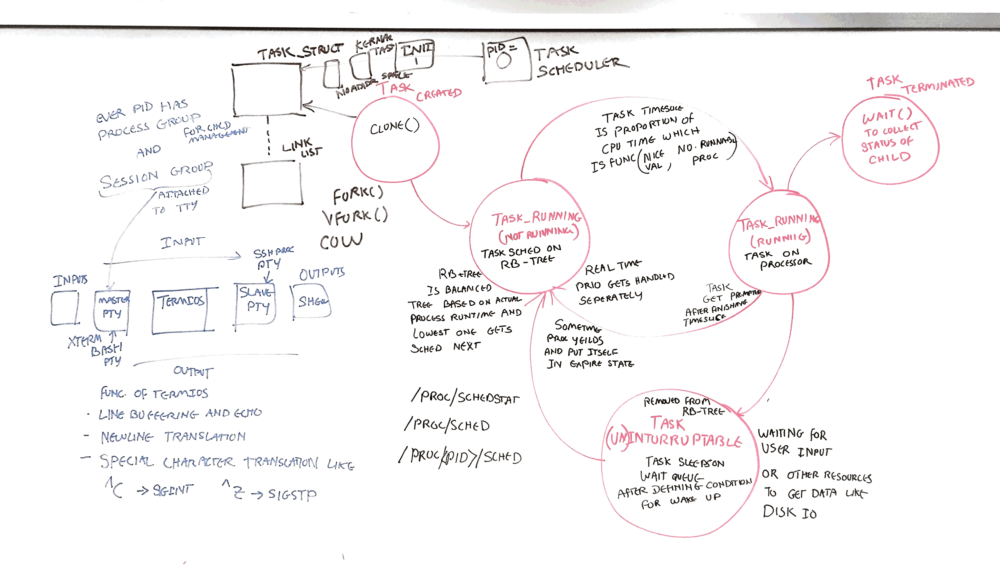
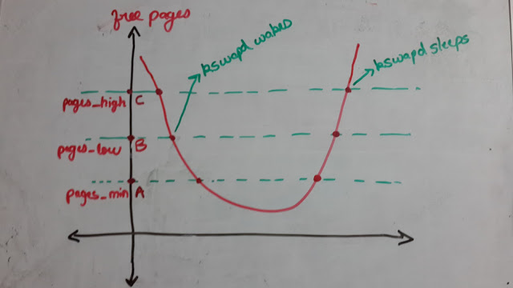
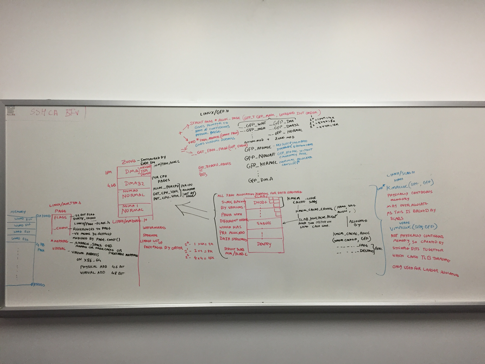
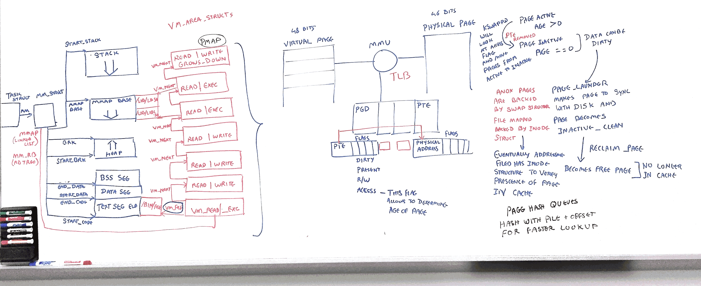
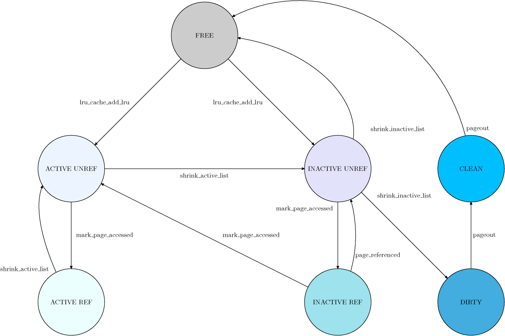
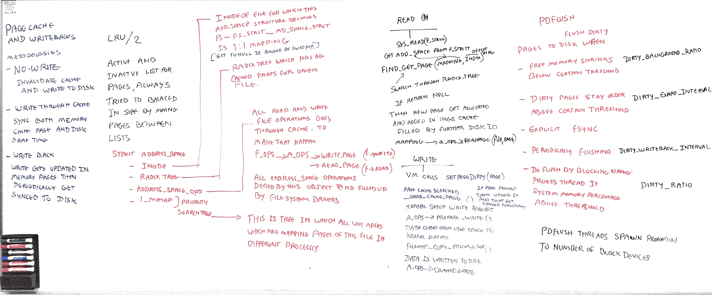
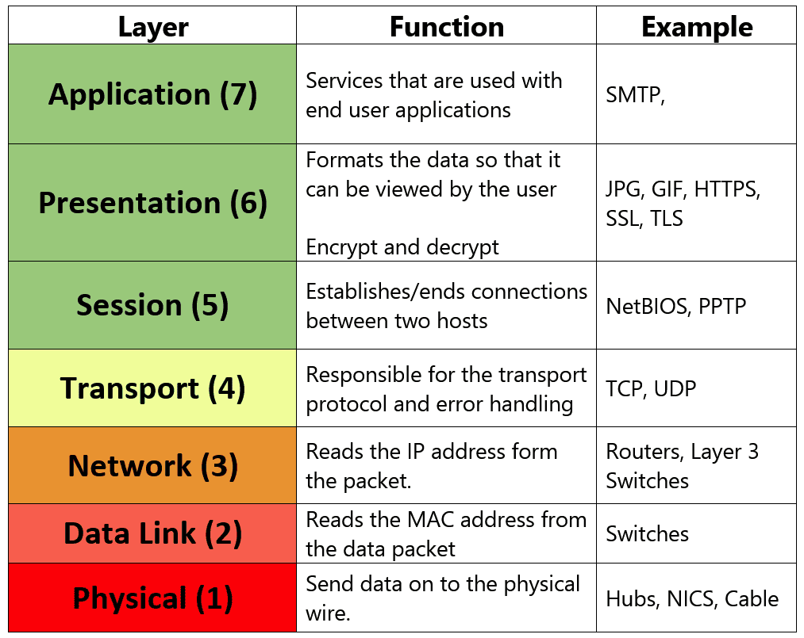
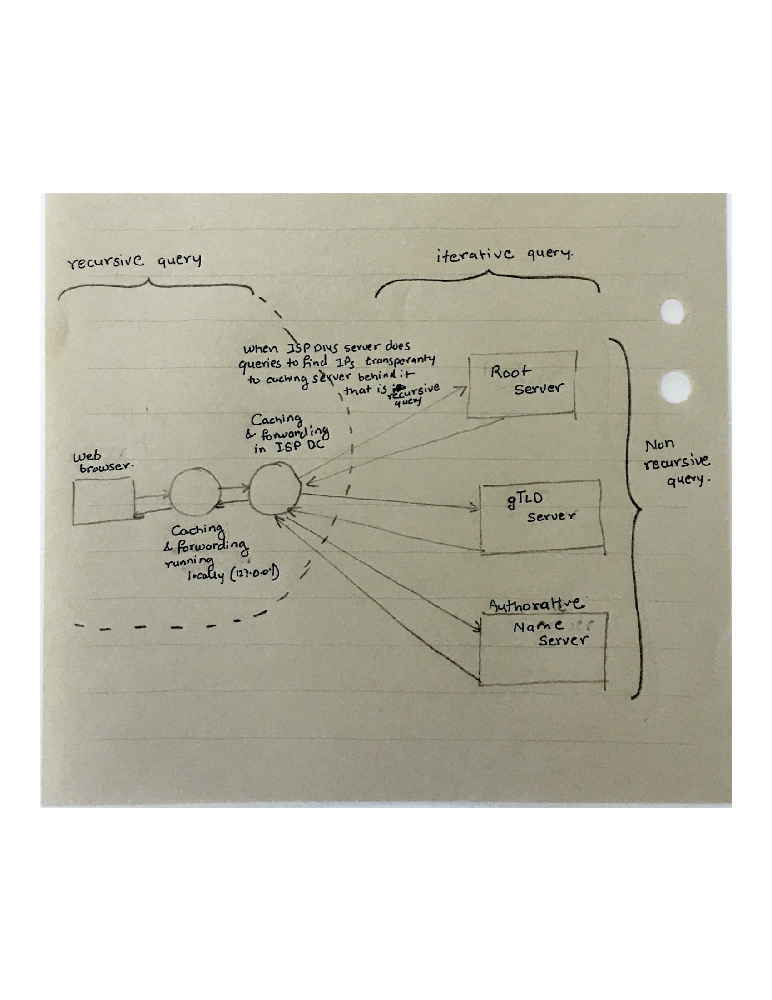
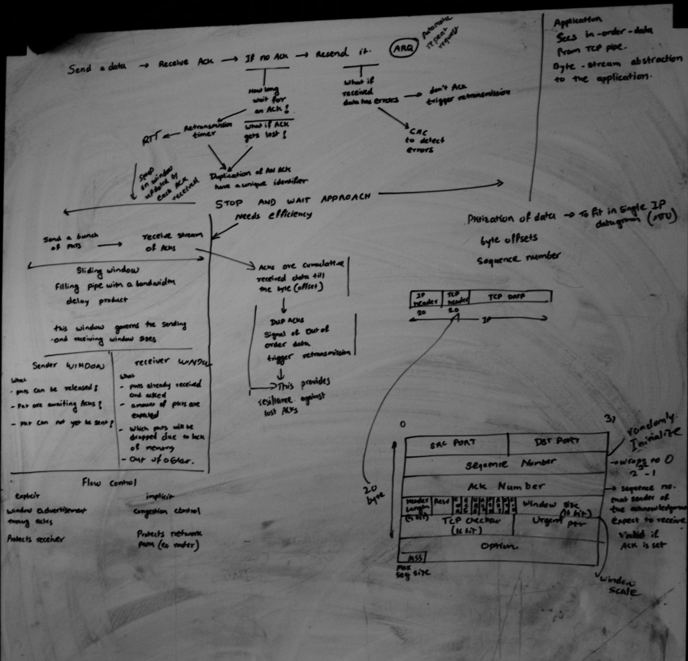
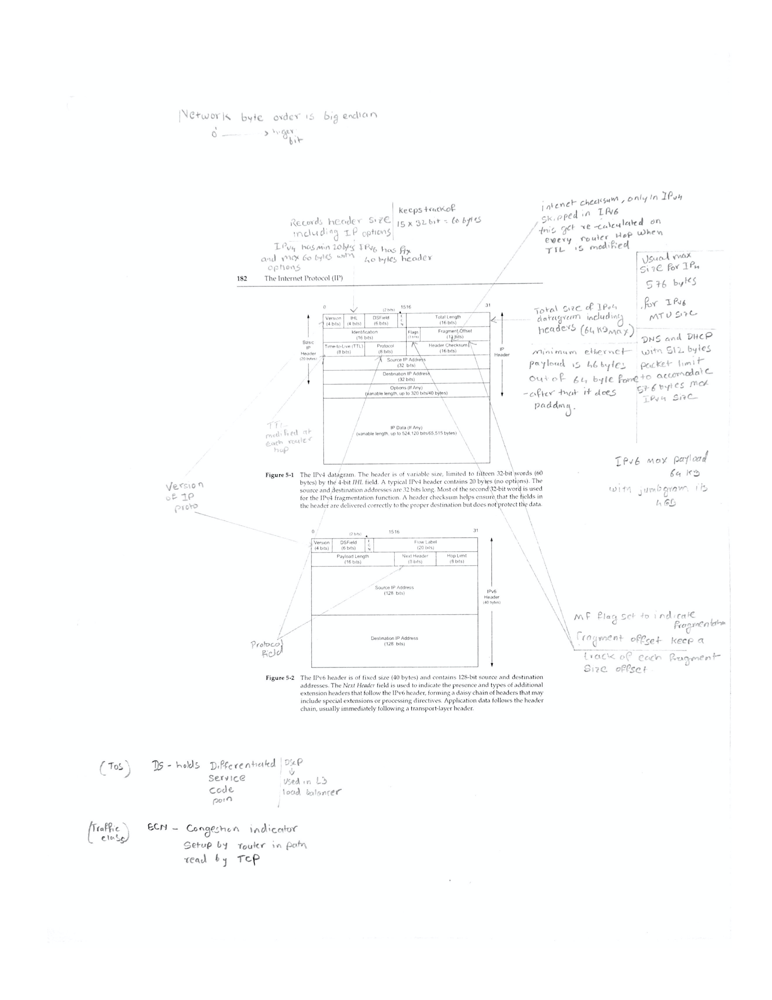

# Notes around using SAR analysis 

Using SAR would be first step towards troubleshooting any system. We will take a look at each subsystem at a time.


## CPU 

- `-m` provides CPU package related information, many of them do not work as they are very platform dependent.
- `-P <ALL/CPU number>` will provide standard places for CPU utilization.
- `-u <ALL/CPU number>` will provide advance view of CPU utilization like 
  - `irq` and `softirq` handling 
  - `steal` is involuntery wait for virtual CPU availability


## Scheduler

Scheduling is another subsystem which reflects health of the system

`-q` is complimenty to what we get through load average, it also provides number of tasks in the tasklist in  `plist-sz` column. It also shows count of runnable and blocked processes. This also provides load avergaes numbers which is even [complicated in linux](http://www.brendangregg.com/blog/2017-08-08/linux-load-averages.html) where it considers `TASK_UNINTERRUPTIBLE` also in under consideration which include uninterruptable lock and disk io waiting along with CPU resources. That means load average more than CPU counts in Linux might include threads which are blocked on the non-CPU type of resources. It is very confusing in Linux to decide on load average.


Because linux load averages can includes more than CPU, to know specific CPU demands, you can run 

- `mpstat`  for per CPU utilization 
- `pidstat -p <ALL/PID> 1` for per process CPU utilization 
- `/proc/PID/schedstats` for per thread CPU timings where you will find 3 numbers 
  - time spent on CPU 
  - time spent waiting in a runqueue 
  - count of time slices run on the CPU
- `/proc/schedstat` CPU run queue latency 
- `vmstat 1` can provide you run queue length 


You can run a full debug of each processes allocated time in scheduling with folllowing one liner 

``` 
$ awk 'NF > 7 { if ($1 == "task") { if (h == 0) { print; h=1 } } else { print } }' /proc/sched_debug

 S           task   PID         tree-key  switches  prio     wait-time             sum-exec        sum-sleep
 I         rcu_gp     3        21.995531         2   100         0.000000         0.002975         0.000000 0 0 /
 I     rcu_par_gp     4        23.496139         2   100         0.000000         0.001857         0.000000 0 0 /
 I   kworker/0:0H     6      1187.772800         6   100         0.000000         0.036662         0.000000 0 0 /
 I   mm_percpu_wq     9        29.066425         2   100         0.000000         0.002497         0.000000 0 0 /
 S    ksoftirqd/0    10    128714.543436      4792   120         0.000000        33.758851         0.000000 0 0 /
 S    migration/0    12         0.000000    198777     0         0.000000      1763.040884         0.000000 0 0 /
 S        cpuhp/0    13      3586.151423         8   120         0.000000         0.193625         0.000000 0 0 /
 S     khugepaged    60    128714.543436     58304   139         0.000000       629.884360         0.000000 0 0 /
 I     scsi_tmf_1   178      1115.471018         2   100         0.000000         0.025049         0.000000 0 0 /
 I   kworker/0:1H   223    128714.543436     38621   100         0.000000       100.824080         0.000000 0 0 /
 I         cryptd   326      1845.269827         2   100         0.000000         0.022569         0.000000 0 0 /
 S     multipathd   416         0.000000     25929     0         0.000000       467.263788         0.000000 0 0 /system.slice/multipathd.service
 S     multipathd   419         0.000000         6     0         0.000000         0.183746         0.000000 0 0 /system.slice/multipathd.service
 S          loop3   428    127770.543906       520   100         0.000000         8.003048         0.000000 0 0 /
```

Rough diagramatic representation on how kernel space proc scheduling happens 



## Memory 

- `sar -B`
```
09:35:01 AM  pgpgin/s pgpgout/s   fault/s  majflt/s  pgfree/s pgscank/s pgscand/s pgsteal/s    %vmeff
09:45:01 AM    550.82    629.41  67380.81      0.00 182789.00      0.00      0.00      0.00      0.00
09:55:01 AM   3924.61   1557.42  67804.17      0.00 186321.15      0.00      0.00      0.00      0.00
10:05:01 AM    577.42    659.43  68622.82      0.00 187206.07      0.00      0.00      0.00      0.00
10:15:01 AM    590.52    663.89  70290.50      0.00 190128.47      0.00      0.00      0.00      0.00
10:25:01 AM    608.76    675.59  70878.25      0.00 193471.10      0.00      0.00      0.00      0.00
10:35:01 AM    615.69    702.96  71677.72      0.00 195602.52      0.00      0.00      0.00      0.00
10:45:01 AM    625.39    698.00  72230.19      0.00 199102.83      0.00      0.00      0.00      0.00
10:55:01 AM   4388.83   1865.92  73875.07      0.00 204701.71      0.00      0.00      0.00      0.00
11:05:01 AM    648.40    869.32  75274.57      0.00 207472.02      0.00      0.00      0.00      0.00
11:15:01 AM    660.22    729.57  76614.26      0.00 211789.20      0.00      0.00      0.00      0.00
11:25:01 AM    671.43    742.83  77571.92      0.00 215410.96      0.00      0.00      0.00      0.00
11:35:01 AM    679.13    752.46  78134.20      0.00 217607.37      0.00      0.00      0.00      0.00
11:45:01 AM    698.52    760.63  78790.67      0.00 221150.22      0.00      0.00      0.00      0.00
11:55:01 AM   4816.39   1620.73  80107.70      0.02 228635.72      0.00      0.00     77.29      0.00 <<

```
Pgscank - Number of pages scanned by the kswapd daemon per second.

Pgscand - Number of pages scanned directly per second.

pgsteal/s - Number of pages the system has reclaimed from cache (pagecache and  swapcache)  per  second  to satisfy its memory demands.

- `sar -S`
```
09:35:01 AM kbswpfree kbswpused  %swpused  kbswpcad   %swpcad
09:45:01 AM   7968508     30976      0.39      1000      3.23
09:55:01 AM   7968508     30976      0.39      1000      3.23
10:05:01 AM   7968508     30976      0.39      1000      3.23
10:15:01 AM   7968508     30976      0.39      1000      3.23
10:25:01 AM   7968508     30976      0.39      1000      3.23
10:35:01 AM   7968508     30976      0.39      1000      3.23
10:45:01 AM   7968508     30976      0.39      1000      3.23
10:55:01 AM   7968508     30976      0.39      1000      3.23
11:05:01 AM   7968508     30976      0.39      1000      3.23
11:15:01 AM   7968508     30976      0.39      1000      3.23
11:25:01 AM   7968508     30976      0.39      1000      3.23
11:35:01 AM   7968508     30976      0.39      1000      3.23
11:45:01 AM   7968508     30976      0.39      1000      3.23
11:55:01 AM   7967996     31488      0.39      1484      4.71 <<
12:05:01 PM   7967996     31488      0.39      1484      4.71
12:15:01 PM   7967996     31488      0.39      1484      4.71
12:25:01 PM   7967996     31488      0.39      1484      4.71
12:35:01 PM   7968508     30976      0.39      1168      3.77
12:45:01 PM   7968508     30976      0.39      1168      3.77
12:55:01 PM   7968508     30976      0.39      1168      3.77
Average:      7968482     31002      0.39      1030      3.32

```
kbswpcad : Amount of cached swap memory in kilobytes.  This is  memory  that  once  was  swapped  out,  is swapped  back  in but still also is in the swap area (if memory is needed it doesn't need to be swapped out again because it is already in the swap area. This saves I/O).

- `sar -R`
```
09:15:01 AM   frmpg/s   bufpg/s   campg/s
09:25:01 AM   -550.64      0.00    134.69
09:35:01 AM   -252.31      0.00    139.26
09:45:01 AM   -374.95      0.00    137.65
09:55:01 AM    776.30      0.00   -745.74
10:05:01 AM   -416.63      0.00    147.68
10:15:01 AM   -403.32      0.00    146.84
10:25:01 AM   -322.58      0.00    150.67
10:35:01 AM   -294.70      0.00    155.98
10:45:01 AM   -215.79      0.00    158.61
10:55:01 AM    477.34      0.00   -832.49
11:05:01 AM   -554.04      0.00    161.00
11:15:01 AM   -619.24      0.00    163.25
11:25:01 AM    -14.84      0.00    169.01
11:35:01 AM   -504.22      0.00    167.76
11:45:01 AM   -308.36      0.00    170.76
11:55:01 AM   3350.31      0.00  -3270.30 <<
12:05:01 PM   -580.81      0.00    174.54
12:15:01 PM   -385.49      0.00    177.57
12:25:01 PM    -51.66      0.00    179.94
12:35:01 PM   -244.81      0.00    154.52
12:45:01 PM   -415.27      0.00    181.85
12:55:01 PM   1036.26      0.00   -939.86
01:05:01 PM   -489.08      0.00    184.65
Average:       -64.85      0.00    -34.59
```
frmpg/s : Number of memory pages freed by the system per second.  A negative value represents a number of pages allocated by the system.  Note that a page has a size of 4 kiB or 8 kiB according to  the machine architecture.

bufpg/s: Number  of  additional memory pages used as buffers by the system per second.  A negative value means fewer pages used as buffers by the system.

campg/s : Number of additional memory pages cached by the system per  second.   A  negative  value  means fewer pages in the cache.

- `sar -W`
```
09:15:01 AM  pswpin/s pswpout/s
09:25:01 AM      0.00      0.00
09:35:01 AM      0.00      0.00
09:45:01 AM      0.00      0.00
09:55:01 AM      0.00      0.00
10:05:01 AM      0.00      0.00
10:15:01 AM      0.00      0.00
10:25:01 AM      0.00      0.00
10:35:01 AM      0.00      0.00
10:45:01 AM      0.00      0.00
10:55:01 AM      0.00      0.00
11:05:01 AM      0.00      0.00
11:15:01 AM      0.00      0.00
11:25:01 AM      0.00      0.00
11:35:01 AM      0.00      0.00
11:45:01 AM      0.00      0.00
11:55:01 AM      0.00      0.29 <<
12:05:01 PM      0.00      0.00
12:15:01 PM      0.00      0.00
12:25:01 PM      0.00      0.00
12:35:01 PM      0.00      0.00
12:45:01 PM      0.00      0.00
12:55:01 PM      0.00      0.00
01:05:01 PM      0.00      0.00
Average:         0.00      0.00
```
- `sar -r ALL`
```
09:15:01 AM kbmemfree kbmemused  %memused kbbuffers  kbcached  kbcommit   %commit  kbactive   kbinact   kbdirty  kbanonpg    kbslab  kbkstack   kbpgtbl  kbvmused
09:25:01 AM  12980848  52948860     80.31      5028  25506636  55404888     74.94  25443020  24851140       696  24781428   1438048     41920    116556         0
09:35:01 AM  12375540  53554168     81.23      5028  25840720  55436396     74.99  25709504  25185144       936  25046760   1438996     41840    116516         0
09:45:01 AM  11476032  54453676     82.59      5028  26170940  55421904     74.97  26273440  25515320       928  25610804   1439836     42336    116368         0
09:55:01 AM  13340976  52588732     79.76      5028  24379400  55405352     74.94  26210576  23722160       632  25544528   1434700     42400    116428         0
10:05:01 AM  12341488  53588220     81.28      5028  24733668  55400144     74.94  26849828  24076312       748  26185380   1433380     44208    116660         0
10:15:01 AM  11374176  54555532     82.75      5028  25085852  55369476     74.90  27465732  24428416       696  26800264   1434352     42800    115828         0
10:25:01 AM  10600268  55329440     83.92      5028  25447332  55401024     74.94  27879084  24789888       636  27214508   1433976     44208    116512         0
10:35:01 AM   9892100  56037608     85.00      5028  25822152  55445960     75.00  28209968  25164628       988  27544864   1434712     44416    116596         0
10:45:01 AM   9374384  56555324     85.78      5028  26202684  55483632     75.05  28338792  25545156       444  27674112   1433956     46016    116632         0
10:55:01 AM  10519384  55410324     84.04      5028  24205768  55494164     75.06  29205224  23546032       376  28536956   1424864     46176    116100         0
11:05:01 AM   9190216  56739492     86.06      5028  24592024  55473336     75.04  30146252  23925604       120  29472972   1426408     46976    117032         0
11:15:01 AM   7702160  58227548     88.32      5028  24984312  55499684     75.07  31241992  24317828       760  30568908   1426864     46736    117196         0
11:25:01 AM   7666564  58263144     88.37      5028  25389756  55474756     75.04  30874372  24723192       120  30199476   1426480     46640    116800         0
11:35:01 AM   6456904  59472804     90.21      5028  25792236  55454720     75.01  31678256  25125648       380  31004688   1427440     48512    116768         0
11:45:01 AM   5717096  60212612     91.33      5028  26201924  55502972     75.08  32013288  25535280       760  31338532   1427564     47904    116584         0
11:55:01 AM  13768296  52161412     79.12      5028  18343012  55483588     75.05  31808480  17815356       196  31273288   1299288     48048    117116         0 <<
12:05:01 PM  12374888  53554820     81.23      5028  18761736  55503776     75.08  32782104  18234068       444  32246992   1297996     48336    117560         0
12:15:01 PM  11450564  54479144     82.63      5028  19187524  55492768     75.06  33275684  18657884       320  32738344   1300296     49408    116800         0
12:25:01 PM  11326420  54603288     82.82      5028  19619916  55498792     75.07  32958776  19090260      1044  32421592   1300900     49088    117288         0
12:35:01 PM  10739144  55190564     83.71      5028  19990592  55440936     74.99  33188996  19456100       184  32647356   1298904     49568    117060         0
12:45:01 PM   9742864  56186844     85.22      5028  20426880  55428044     74.97  33754140  19891436       232  33212244   1299496     50048    117620         0
12:55:01 PM  12229056  53700652     81.45      5028  18171976  55468396     75.03  33534152  17640368      1020  32995332   1282328     49312    117744         0
01:05:01 PM  11053784  54875924     83.23      5028  18615696  55498824     75.07  34263104  18081252       708  33721924   1281624     49920    118664         0
01:15:01 PM  10636404  55293304     83.87      5028  19068160  55459132     75.02  34225696  18533624       404  33683420   1281744     50864    118152         0
Average:     17934645  47995063     72.80      5028  24888771  55471470     75.03  21092870  24263861       563  20460698   1425706     38693    116688         0
```

KbSlab - slab data structure

kbstack - stack structure in kernel

Kbpgtbl - kernel page table size 

Kbnonpg - Amount of non-file backed pages in kilobytes mapped into userspace page tables. 

Above scenario in sar outputs was happening due watermark exhaustion, 


Here is a white boarding session where how linux kernel maps its physical pages to various data structures.


And here is mapping of VM process space to physical space


Linux memory page life cycle is defined in following diagram 


Above digram in certain extent explained in following white boarding session 



## Network
Before exploring each network protocols, make sure that you remember these basic OSI layers



Network connection handling is done by following system calls

- Create a socket to get fd 

  ```
  #include        <sys/types.h>
  #include        <sys/socket.h>
  
  int socket(int family, int type, int protocol);
  
  The family is one of
  	AF_UNIX		-- Unix internal protocols
  	AF_INET		-- Internet protocols
  	AF_NS		-- Xerox NS Protocols
  	AF_IMPLINK	-- IMP link layer
  The AF_ prefix stands for "address family." In the first project, we are going to use AF_INET.
  
  The socket type is one of the following:
  	SOCK_STREAM	stream socket
  	SOCK_DGRAM	datagram socket
  	SOCK_RAW	raw socket
  	SOCK_SEQPACKET	sequenced packet socket
  	SOCK_RDM	reliably delivered message socket (not implemented yet)
  ```

- Then Bind it to IP Port tuples defined in `sockaddr` structure 

  ```
  int bind(int sockfd, struct sockaddr *myaddr, int addrlen);
  ```

- Connet to other end of the server , this is a part of active open where other end is defined by `sockaddr` structure.

  ```
  int connect(int sockfd, struct sockaddr *servaddr, int addrlen);
  ```

- Or Listen as a server and allow others to connect 

  ```
  int listen(int sockfd, int backlog);
  ```

- If you are a server in listening state then you can accept the connection 

  ```
  int accept(int sockfd, struct sockaddr *peer, int *addrlen);
  ```

- Data transfer can be done with following 

  ```
  int send(int sockfd, char *buff, int nbytes, int flags);
  
  int sendto(int sockfd, char *buff, int nbytes, int flags, struct sockaddr *to, int addrlen);
  
  int recv(int sockfd, char *buff, int nbytes, int flags);
  
  int recvfrom(int sockfd, char *buff, int nbytes, int flags, struct sockaddr *from, int *addrlen);
  ```

- Final close on the socket 

  ```
  int close(int fd);
  ```

  

This section also combines notes from TCP/IP illustrated 


### DNS

- DNS port 53
- DNS query is either UDP or TCP based depedning on the response size.
- `.` in the end indicates that name is complete and nothing more need to be appended. It is max 255 chars availble in the FQDN and 63 max chars per label.
- DNS does various kind of caching which can be controlled with TTL, it can also do negative caching means caching of the unsuccessful FQDN resolution. Some of the local caching services like NSCD (nssswitch.conf) can be used to improve performance.

Here are two DNS query types



- There are flags in DNS query which indicates if recursion desired or recursion is availble.
- DNS has various type of text based compression to optimize the response size.
- `TC` bit in response is set to switch from UDP to TCP as response got trucated.
- Every DNS response has TTL value for caching purposes and you can see TTL decreasing between consecutive queries.
-  RRs - Resource Records Types - it is field in response of DNS query indicates category of information returned like A, NS, SOA, CNAME, PTR, MX ... etc.
- DNS was meant to be a database to fetch various type of information associated with query strings.
- IXFR and AXFR - Increamental and Full zone tranfer triggered by UDP based notification
- Reverse DNS entries are stored under special TLD `in-addr.arpa.`  These are PTR records
- `TXT`record was getting used to fetch extra infroamtion about subnets of the given domain to fight spam. Framework called SPF - Sender Policy Network.
- `SRV`  DNS records are the records which provides various services related infromation hosted under that domain. This was used by jabber at one point.
- Finally multicase DNS for auto discovery.


### DHCP

- DHCP is UDP/IP based protocol which helps to maintain IP address assignements are related configurations. 
- DHCP goes through following stages
  - DHCPDISCOVER or DHCPREQUEST sent from address `0.0.0.0` port `68` to the limited broadcast address `255.255.255.255 ` port `67` 
  - Above request get responses in the form of DHCPOFFER.
  - Client selects one of the offer and does DHCPREQUEST which get acknoledged by DHCPACK with delivery of IP and related configuration items.
- DHCP leases are something created after above offering which are stored on the disk. 


### TCP 
TCP in the nutshell is displayed in this crude whiteboarding 


- TCP connection establishment 
  - 3-way handshake SYN , ACK+SYN, ACK  and closing sequence FIN, ACK, FIN, ACK
  - These connection attempts has exponential backoff setup
  - Active open/close (Client initiated) , Passive open/close (Server initiated)
- ISN (initial sequence number) which is randomly generated for each connection and incremented every 4us to avoid any overlaps. This is only protection against forgery outside of TLS.


Here are various TCP options

- TCP header size is 20 bytes and IP header size is 20 bytes. MSS is maximum TCP payload size on the ethernet is 1460 bytes.
- TCP Selective ACK is in extension headers can ask for retrasmission of particualr lost segments.
- TCP window size gets scaled from 16bit to 32bit by using multipliers and few additional header fields.
- TCP timestamp options to detemine clock on the otherside

TCP does path MTU discovery based on ICMP reponse like "Destination Unreachable" (Fragmentation Required) message. 

Here is TCP state diagram 


TIME_WAIT state 

- 2MSL - Maximum segment lifetime , in linux defined by `net.ipv4.tcp_fin_timeout` arbiterily setup for  1min.
- TIME_WAIT state only happens in Active close when after sending of the last ACK to make sure there are not steal segments lurking around.
- This make sures last ACK reches to the passive end or it will resend the FIN.
- SO_REUSEADDR is using timestamp and seqence number combination to figure out steal segments.
- There is something called Quiet time after host crash/reboot which is set to MSL.


Incoming connections 

- `tcp_max_syn_backlog` keeps queue for SYN_RCVD connections 
- `net.core.somaxconn` keeps queue for 3-way handshake completed connections


TCP retrasmissions 

- Retrasmissions happens 
  - due to ACK timeout 
  - due to occurance of duplicate ACKs exceeding `dupthresh`, this is called fast retransmission.
-  This happens in exponential back off fashion
- Retransmission has two configuratble params 
  - R1 - `tcp_retries1`  this indicates number of retires before TCP will make to resend a segment before passing "negative advice" to IP layer to change routes.
  - R2 - `tcp_retries2` this indicates the point at which TCP should abandon the connection.
  - There are separate `syn` and `synack` retries settings.


TCP data flow and window management 

- over ssh each keystroke generates new TCP packet and `PSH` flag set on it to let other side know that buffer on sender side is empty.
- Delayed ACKs help to piggy back retrasmissions.
- Nagle avoids congestion due to tiny packets by creating a rule that small segments can not be sent until all outstanding data is acknowledged. It creates stop n wait behaviour.
- Nagle makes sender to wait one RTT before sending which increases overall time for completion but you can increase size of each packet.
- Delayed ACK and Nagle creates transmissions idle states because both sides are waiting other side to respond which eventually get removed due to delay ack time expiration. `TCP_NODELAY` disables Nagle.


Window size indicates how much data reciver is ready to accept from sender.

- Window size determined by reciever by looking at empty TCP recieve buffer.
- sometimes window size set to zero due to slow reciever to stop any more data send. There is time based window probe happens from sender side to know if window got opened or not.
- Window size field is offset relative to ACK number.
- Silly window syndrome where sender and reciever tried to reduce number of packets sent on the wire by controlling advertizement of window size until enough data get accumulated on both ends exceeding MSS or half of the TCP buffer. 
- TCP window sizes are auto tunned for the performance reason.
- URG bit for urgency , causes a confusion.


TCP Congestion control is divided into two phases, TCP Slow Start and Congestion Avoidance.

- SlowStart phase  where sender's TCP starts with 10 packets (initial congestion window `cwd`) and then scale up exponentially to receiver's advertize window size (`ssthresh`).  
- Congestion Avoidance starts after above criteria reached. After this point TCP window opens linearly and keeps a track of amount of unacknowledged data which is new `ssthresh`.
- Whenever TCP connection percieves the packet loss it will drop back to `ssthresh` to `max(flight size/2, 2*MSS)`. 
- Then congestion window `cwd` starts with `ssthresh + 10*MSS`  , increased by 1 for every good ACK.
- Once  `cwd` == `ssthresh` this single increment restriction has been removed and linear increase begins. 

All above is based on the simple TCP implementation and it gets more complicated with varoius TCP congestion avoidance algorithm.


- TCP BBR works with TCP pacing which is a technique which make packet transmission on each socket less bursty by using qdiscs.
- TCP BBR is dependent on the RTT more than the packet loss.


### UDP


- UDP is packet based vs TCP which is continues stream protocol. Which makes application to be aware of packet boundries. It has no congestion or a flow control.

- UDP header is 8 bytes 

  - 2 bytes source port and destination port each
  - 2 bytes length 
  - 2 bytes checksum

- UDP checksum is calculated at sender's end with pseudo header which incorporates dst and src IP information. This gets checked at the recieive end.

- This pseudo header makes NAT more challenging where UDP packet modification is involved along with IP header modification.

-  UDP-lite is something which provides you flexibility of having checksum for the limited are of the packet header.

- IP determines the need for the fragmentation based on availbile information of the path towards destination. IP starts a timer on the arrival of first fragment to assemble packet within that time. 

- UDP application has to do PMTU discovery by using ICMP to avoid fragmentation. Maximum size of UDP is limited by max IPv4 packet size which is 16bit (65,535 bytes).

- UDP packet do not have destination IP, so server receiving UDP packet need to fetch this infromation from the  IP layer. This is true for DNS server.

- With above logic, you can start multiple UDP services attached to the same port number using `SO_REUSEADDR` and still known to which service UDP datagram inteneded for looking at the IP layer infromation.

- Linux while opening IPv4:PORT socket it also provides you IPV6:PORT socket.


### ICMP

- ICMP protocol provides dignostics and control information for IP transport. ICMP is a part of extension headers in IPv6.

- IPv4 payload has no protection. Upper layer protocols has to manage their checksums.

- Some of the IPv4 messages 

  - Echo and Echo Reply (Ping Pong)
  - Destination Unreachable (this helps updating routes entry when last hop router fails to do ARP on the destination IP)
  - Time Exceeded (TTL exhausted)
  - Redirect (use alternate router)
  - Packet too big (used for Path MTU discovery)
  - Port not rechable (due to firewall blocking the port)

- Systems provide limited response to repeated ICMP query messages, it also uses bucket token to control flow of ICMP messages to avoid any abuse. `icmp_ratemask` and `icmp_ratelimit` are two linux sysctl params to control the flow.

- ICMP error packets contain fragment of original datagram which can be used to keep a track of path for which error has happened. 

- ICMP ECHO message also includes PID of sender process to identify Reply packet came for that particualr `ping`. This is because ICMP do not have any port like other protocols and it get responded by OS layer.     

- `connect()` has to be called on the socket for it to know incoming ICMP error messages for sent UDP packets.

- Traceroute got implemented based on ICMP message `TIme Exceeded` which gets generated when TTL count gets exhausted.

  
### IP




​    

