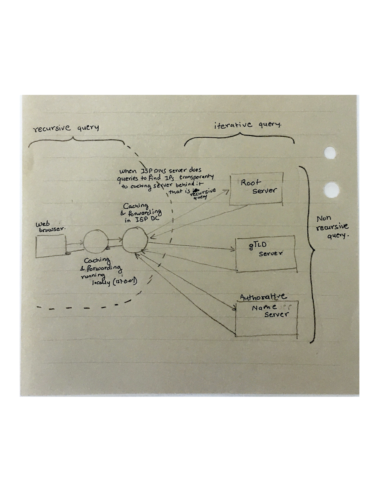
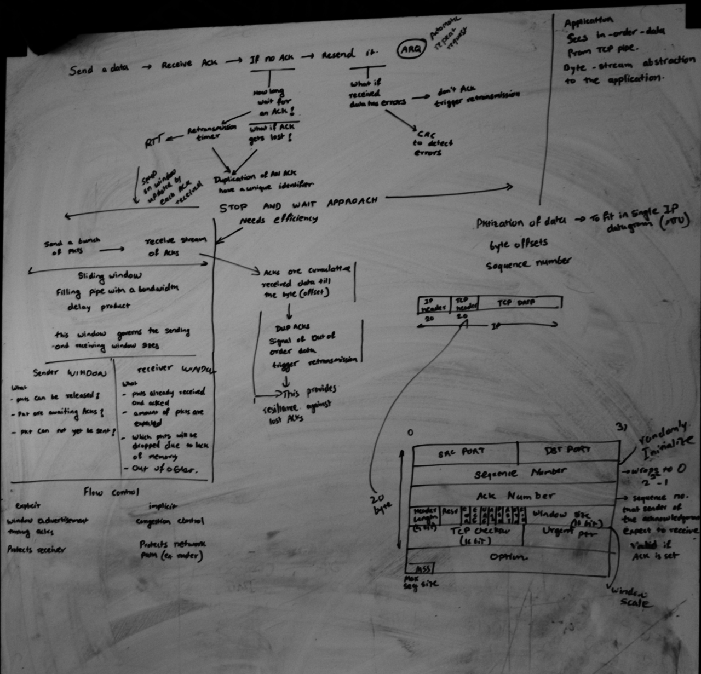

# Notes TCP IP Illustrated


## Network
Before exploring each network protocols, make sure that you remember these basic OSI layers


Network connection handling is done by following system calls

- Create a socket to get fd 

  ```
  #include        <sys/types.h>
  #include        <sys/socket.h>
  
  int socket(int family, int type, int protocol);
  
  The family is one of
  	AF_UNIX		-- Unix internal protocols
  	AF_INET		-- Internet protocols
  	AF_NS		-- Xerox NS Protocols
  	AF_IMPLINK	-- IMP link layer
  The AF_ prefix stands for "address family." In the first project, we are going to use AF_INET.
  
  The socket type is one of the following:
  	SOCK_STREAM	stream socket
  	SOCK_DGRAM	datagram socket
  	SOCK_RAW	raw socket
  	SOCK_SEQPACKET	sequenced packet socket
  	SOCK_RDM	reliably delivered message socket (not implemented yet)
  ```

- Then Bind it to IP Port tuples defined in `sockaddr` structure 

  ```
  int bind(int sockfd, struct sockaddr *myaddr, int addrlen);
  ```

- Connet to other end of the server , this is a part of active open where other end is defined by `sockaddr` structure.

  ```
  int connect(int sockfd, struct sockaddr *servaddr, int addrlen);
  ```

- Or Listen as a server and allow others to connect 

  ```
  int listen(int sockfd, int backlog);
  ```

- If you are a server in listening state then you can accept the connection 

  ```
  int accept(int sockfd, struct sockaddr *peer, int *addrlen);
  ```

- Data transfer can be done with following 

  ```
  int send(int sockfd, char *buff, int nbytes, int flags);
  
  int sendto(int sockfd, char *buff, int nbytes, int flags, struct sockaddr *to, int addrlen);
  
  int recv(int sockfd, char *buff, int nbytes, int flags);
  
  int recvfrom(int sockfd, char *buff, int nbytes, int flags, struct sockaddr *from, int *addrlen);
  ```

- Final close on the socket 

  ```
  int close(int fd);
  ```

  

This section also combines notes from TCP/IP illustrated 


### DNS

- DNS port 53
- DNS query is either UDP or TCP based depedning on the response size.
- `.` in the end indicates that name is complete and nothing more need to be appended. It is max 255 chars availble in the FQDN and 63 max chars per label.
- DNS does various kind of caching which can be controlled with TTL, it can also do negative caching means caching of the unsuccessful FQDN resolution. Some of the local caching services like NSCD (nssswitch.conf) can be used to improve performance.

Here are two DNS query types



- There are flags in DNS query which indicates if recursion desired or recursion is availble.
- DNS has various type of text based compression to optimize the response size.
- `TC` bit in response is set to switch from UDP to TCP as response got trucated.
- Every DNS response has TTL value for caching purposes and you can see TTL decreasing between consecutive queries. (BUT tarffic doesn't shift completely :-( )
-  RRs - Resource Records Types - it is field in response of DNS query indicates category of information returned like A, NS, SOA, CNAME, PTR, MX ... etc.
- DNS was meant to be a database to fetch various type of information associated with query strings.
- IXFR and AXFR - Increamental and Full zone tranfer triggered by UDP based notification
- Reverse DNS entries are stored under special TLD `in-addr.arpa.`  These are PTR records
- `TXT`record was getting used to fetch extra infroamtion about subnets of the given domain to fight spam. Framework called SPF - Sender Policy Network.
- `SRV`  DNS records are the records which provides various services related infromation hosted under that domain. This was used by jabber at one point.
- Finally multicase DNS for auto discovery.


### DHCP

- DHCP is UDP/IP based protocol which helps to maintain IP address assignements are related configurations. 
- DHCP goes through following stages
  - DHCPDISCOVER or DHCPREQUEST sent from address `0.0.0.0` port `68` to the limited broadcast address `255.255.255.255 ` port `67` 
  - Above request get responses in the form of DHCPOFFER.
  - Client selects one of the offer and does DHCPREQUEST which get acknoledged by DHCPACK with delivery of IP and related configuration items.
- DHCP leases are something created after above offering which are stored on the disk. 


### TCP 
TCP in the nutshell is displayed in this crude whiteboarding 


- TCP connection establishment 
  - 3-way handshake SYN , ACK+SYN, ACK  and closing sequence FIN, ACK, FIN, ACK
  - These connection attempts has exponential backoff setup
  - Active open/close (Client initiated) , Passive open/close (Server initiated)
- ISN (initial sequence number) which is randomly generated for each connection and incremented every 4us to avoid any overlaps. This is only protection against forgery outside of TLS.


Here are various TCP options

- TCP header size is 20 bytes and IP header size is 20 bytes. MSS is maximum TCP payload size on the ethernet is 1460 bytes.
- TCP Selective ACK is in extension headers can ask for retrasmission of particualr lost segments.
- TCP window size gets scaled from 16bit to 32bit by using multipliers and few additional header fields.
- TCP timestamp options to detemine clock on the otherside

TCP does path MTU discovery based on ICMP reponse like "Destination Unreachable" (Fragmentation Required) message. 

Here is TCP state diagram 


TIME_WAIT state 

- 2MSL - Maximum segment lifetime , in linux defined by `net.ipv4.tcp_fin_timeout` arbiterily setup for  1min.
- TIME_WAIT state only happens in Active close when after sending of the last ACK to make sure there are not steal segments lurking around.
- This make sures last ACK reches to the passive end or it will resend the FIN.
- SO_REUSEADDR is using timestamp and seqence number combination to figure out steal segments.
- There is something called Quiet time after host crash/reboot which is set to MSL.


Incoming connections 

- `tcp_max_syn_backlog` keeps queue for SYN_RCVD connections 
- `net.core.somaxconn` keeps queue for 3-way handshake completed connections


TCP retrasmissions 

- Retrasmissions happens 
  - due to ACK timeout 
  - due to occurance of duplicate ACKs exceeding `dupthresh`, this is called fast retransmission.
-  This happens in exponential back off fashion
- Retransmission has two configuratble params 
  - R1 - `tcp_retries1`  this indicates number of retires before TCP will make to resend a segment before passing "negative advice" to IP layer to change routes.
  - R2 - `tcp_retries2` this indicates the point at which TCP should abandon the connection.
  - There are separate `syn` and `synack` retries settings.


TCP data flow and window management 

- over ssh each keystroke generates new TCP packet and `PSH` flag set on it to let other side know that buffer on sender side is empty.
- Delayed ACKs help to piggy back retrasmissions.
- Nagle avoids congestion due to tiny packets by creating a rule that small segments can not be sent until all outstanding data is acknowledged. It creates stop n wait behaviour.
- Nagle makes sender to wait one RTT before sending which increases overall time for completion but you can increase size of each packet.
- Delayed ACK and Nagle creates transmissions idle states because both sides are waiting other side to respond which eventually get removed due to delay ack time expiration. `TCP_NODELAY` disables Nagle.


Window size indicates how much data reciver is ready to accept from sender.

- Window size determined by reciever by looking at empty TCP recieve buffer.
- sometimes window size set to zero due to slow reciever to stop any more data send. There is time based window probe happens from sender side to know if window got opened or not.
- Window size field is offset relative to ACK number.
- Silly window syndrome where sender and reciever tried to reduce number of packets sent on the wire by controlling advertizement of window size until enough data get accumulated on both ends exceeding MSS or half of the TCP buffer. 
- TCP window sizes are auto tunned for the performance reason.
- URG bit for urgency , causes a confusion.


TCP Congestion control is divided into two phases, TCP Slow Start and Congestion Avoidance.

- SlowStart phase  where sender's TCP starts with 10 packets (initial congestion window `cwd`) and then scale up exponentially to receiver's advertize window size (`ssthresh`).  
- Congestion Avoidance starts after above criteria reached. After this point TCP window opens linearly and keeps a track of amount of unacknowledged data which is new `ssthresh`.
- Whenever TCP connection percieves the packet loss it will drop back to `ssthresh` to `max(flight size/2, 2*MSS)`. 
- Then congestion window `cwd` starts with `ssthresh + 10*MSS`  , increased by 1 for every good ACK.
- Once  `cwd` == `ssthresh` this single increment restriction has been removed and linear increase begins. 

All above is based on the simple TCP implementation and it gets more complicated with varoius TCP congestion avoidance algorithm.


- TCP BBR works with TCP pacing which is a technique which makes packet transmission on each socket less bursty by using qdiscs.
- TCP BBR is dependent on the RTT more than the packet loss.


### UDP


- UDP is packet based vs TCP which is continues stream protocol. Which makes application to be aware of packet boundries. It has no congestion or a flow control.

- UDP header is 8 bytes 

  - 2 bytes source port and destination port each
  - 2 bytes length 
  - 2 bytes checksum

- UDP checksum is calculated at sender's end with pseudo header which incorporates dst and src IP information. This gets checked at the recieive end.

- This pseudo header makes NAT more challenging where UDP packet modification is involved along with IP header modification.

-  UDP-lite is something which provides you flexibility of having checksum for the limited are of the packet header.

- IP determines the need for the fragmentation based on availbile information of the path towards destination. IP starts a timer on the arrival of first fragment to assemble packet within that time. 

- UDP application has to do PMTU discovery by using ICMP to avoid fragmentation. Maximum size of UDP is limited by max IPv4 packet size which is 16bit (65,535 bytes) (same for TCP).

- UDP packet do not have destination IP, so server receiving UDP packet need to fetch this infromation from the  IP layer. This is true for DNS server.

- With above logic, you can start multiple UDP services attached to the same port number using `SO_REUSEADDR` and still known to which service UDP datagram inteneded for looking at the IP layer infromation.

- Linux while opening IPv4:PORT socket it also provides you IPV6:PORT socket.


### ICMP

- ICMP protocol provides dignostics and control information for IP transport. ICMP is a part of extension headers in IPv6.

- IPv4 payload has no protection. Upper layer protocols has to manage their checksums.

- Some of the IPv4 messages 

  - Echo and Echo Reply (Ping Pong)
  - Destination Unreachable (this helps updating routes entry when last hop router fails to do ARP on the destination IP)
  - Time Exceeded (TTL exhausted)
  - Redirect (use alternate router)
  - Packet too big (used for Path MTU discovery)
  - Port not rechable (due to firewall blocking the port)

- Systems provide limited response to repeated ICMP query messages, it also uses bucket token to control flow of ICMP messages to avoid any abuse. `icmp_ratemask` and `icmp_ratelimit` are two linux sysctl params to control the flow.

- ICMP error packets contain fragment of original datagram which can be used to keep a track of path for which error has happened. 

- ICMP ECHO message also includes PID of sender process to identify Reply packet came for that particualr `ping`. This is because ICMP do not have any port like other protocols and it get responded by OS layer.     

- `connect()` has to be called on the socket for it to know incoming ICMP error messages for sent UDP packets.

- Traceroute got implemented based on ICMP message `TIme Exceeded` which gets generated when TTL count gets exhausted.

- Slowness in ICMP response is something related to softirq.

  
### IP


